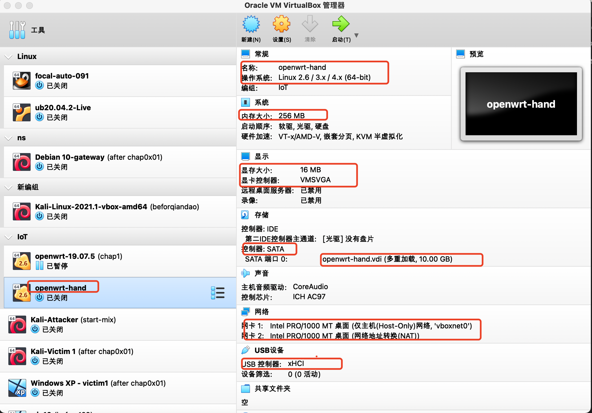
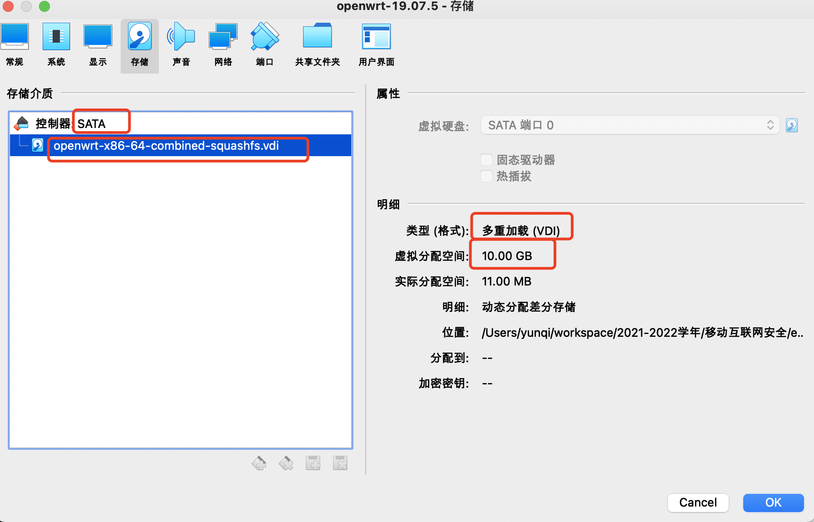

# 实验一  OpenWrt环境配置
*2019302120091 林韵祺 信息安全1班*
## 一、实验目的
- 在虚拟机中配置OpenWrt环境以备后续实验使用。

## 二、实验环境
- MacOS Big Sur 11.6
- VirtualBox 6.1
- openwrt 19.07.5

## 三、安装过程

### 方法一：手动安装
##### 1.下载固件并解压缩
- [openwrt-19.07.5-x86-64-combined-squashfs.img.gz](openwrt-19.07.5-x86-64-combined-squashfs.img.gz)
- 解压缩
```bash
gunzip openwrt-19.07.5-x86-64-combined-squashfs.img.gz
```
</b>

##### 2.格式转换
- 将 img 格式转换为 Virtualbox 虚拟硬盘格式 vdi
```

VBoxManage convertfromraw --format VDI openwrt.img openwrt.vdi
```

##### 3.创建虚拟机
</b></b></b>
- 将镜像类型更改为多重加载</b>
- 虚拟磁盘扩容</b>
- 启用 USB 3.0 接口</b>
- 虚拟机网卡配置</b></b>
- 总体配置一览</b>

##### 4.启动
</b>

### 方法二：编写自动化脚本安装
- 执行[脚本](setup-vm.sh)实现自动化安装过程如下
</b>
#### 一、下载与安装

##### 1. 选择下载版本为`19.07.5`的openwrt镜像,保存的镜像名为`openwrt-x86-64-combined-squashfs.vdi`
``` bash
VER="19.07.5" # openwrt version
VDI_BASE="openwrt-x86-64-combined-squashfs.vdi"
```
##### 2. 计算校验和与下载镜像
```bash
shasum -c img.sha256.sum -q >/dev/null 2>&1
```
- 如果本机之前未安装过镜像，则上一步执行出错，需要从官网**下载指定版本的固件**并解压缩
```bash
if [[ $? -ne 0 ]];then
  wget https://downloads.openwrt.org/releases/$VER/targets/x86/64/openwrt-$VER-x86-64-combined-squashfs.img.gz -O openwrt-x86-64-combined-squashfs.img.gz

  gunzip openwrt-x86-64-combined-squashfs.img.gz
fi
```

- 解压缩后得到文件`openwrt-x86-64-combined-squashfs.img`</b>

##### 3. 格式转换
-  将 `img` 格式的镜像转换为 `Virtualbox` 虚拟硬盘格式 `vdi`
```bash
  VBoxManage convertfromraw --format VDI openwrt-x86-64-combined-squashfs.img "$VDI_BASE" 2>/dev/null
```

#### 二、创建与配置
##### 1. 检查重名及创建
- 如果没有，就创建一个指定类型的虚拟机
  - 类型：Linux 
  - 版本：Linux 2.6 / 3.x / 4.x (64-bit)
  - 名称：openwrt-版本号
  - 分组：/IoT
```bash
if [[ $(VBoxManage list vms | cut -d ' ' -f 1 | grep -w "\"$VM\"" -c) -eq 0 ]];then
  echo "vm $VM not exsits, create it ..."
  VBoxManage createvm --name $VM --ostype "Linux26_64" --register --groups "/IoT"
```
##### 2. 创建SATA控制器并挂载vdi文件
- 创建,并将目标vdi修改为「多重加载」
```bash
VBoxManage storagectl "$VM" --name "SATA" --add sata --controller IntelAHCI

VBoxManage storageattach "$VM" --storagectl "SATA" --port 0 \
    --device 0 --type hdd --medium "$VDI_BASE"

VBoxManage storagectl "$VM" --name "SATA" --remove

VBoxManage modifymedium disk --type multiattach "$VDI_BASE"
```
- 扩容虚拟磁盘为10G
```bash
VBoxManage modifymedium disk --resize 10240 "$VDI_BASE"
```
- 挂载
```bash
VBoxManage storagectl "$VM" --name "SATA" --add sata --controller IntelAHCI
VBoxManage storageattach "$VM" --storagectl "SATA" --port 0 \
    --device 0 --type hdd --medium "$VDI_BASE"
```

##### 3.启用USB 3.0 接口
```bash
VBoxManage modifyvm "$VM" --usbxhci on
```

##### 4.修改虚拟机配置
- 内存：256MB
- 显示：16MB
- 显卡驱动：vmsvga
```bash
VBoxManage modifyvm "$VM" --memory 256 --vram 16
VBoxManage modifyvm "$VM" --graphicscontroller vmsvga
```
##### 5.修改虚拟机配置
- 添加 Host-Only 网卡为第 1 块虚拟网卡
  - 第 1 块网卡的界面名称：vboxnet0
  - 第 1 块网卡的控制芯片：ntel PRO/1000 MT 桌面 (82540EM)
- 第 2 块网卡配置为 NAT 模式

```bash
VBoxManage modifyvm "$VM" --nic1 "hostonly" --nictype1 "82540EM" --hostonlyadapter1 "vboxnet0"
VBoxManage modifyvm "$VM" --nic2 nat 
```
#### 三、参数确认
##### 安装成功后在图形化界面中确认参数正确
- IoT分组下，设置虚拟机类型为Linux，版本为Linux 2.6 / 3.x / 4.x (64-bit)，名称为openwrt-版本号（openwrt-19.07.5）</b>
- 内存256MB</b>
- 显示16MB，显卡驱动vmsvga</b>
- SATA控制器，虚拟磁盘10G，配置为多重加载</b>
- 第一块网卡</b>
- 第二块网卡</b>

##### 启动虚拟机进入欢迎页面
</b>
#### 至此，Openwrt环境已配置完毕。

## 四、`Openwrt`的基本使用
##### 1.设置远程管理专用网卡的 IP 地址
  - 编辑 `/etc/config/network` 配置文件
  - 修改`option ipaddr`的值如下</b>
  - 修改完网络配置之后，通过 `ifdown eth0 && ifup eth0` 完成指定网卡 `eth0` 的重新加载配置生效</b>
  - 通过`ip a`确认配置成功</b>

##### 2.进入Openwrt web界面
- 在浏览器中输入`192.168.56.11`直接访问web界面，默认情况下无口令，直接点击Login即可登录</b>

- 进入到管理系统界面</b>


## 五、问题及解决方法
1. 在下载好openwrt镜像后，需要进行格式转换时发生错误
- 问题：进行格式转换时报错如下</b>
```bash
VBoxManage: error: VD: The given disk size 19444018 is not aligned on a sector boundary (512 bytes)
VBoxManage: error: Error code VERR_VD_INVALID_SIZE at /Users/vbox/tinderbox/5.1-mac-rel/src/VBox/Storage/VD.cpp(7002) in function int VDCreateBase(PVBOXHDD, const char *, const char *, uint64_t, unsigned int, const char *, PCVDGEOMETRY, PCVDGEOMETRY, PCRTUUID, unsigned int, PVDINTERFACE, PVDINTERFACE)
VBoxManage: error: Cannot create the disk image "openwrt.vdi": VERR_VD_INVALID_SIZE
```
- 解决：利用`dd`工具进行磁盘格式的修复</b>
```bash
dd if=openwrt-x86-64-combined-ext4.img of=openwrt.img bs=128000 conv=sync
```
然后再执行如下命令，就可以得到能够被VirtualBox加载的vdi
```bash
  VBoxManage convertfromraw --format VDI openwrt-x86-64-combined-squashfs.img "$VDI_BASE" 2>/dev/null
```
- 将自动化脚本对应部分修改如下：
```bash
VBoxManage convertfromraw --format VDI openwrt-x86-64-combined-squashfs.img "$VDI_BASE" 2>/dev/null

  if [[ $? -eq 1 ]];then
 
    dd if=openwrt-x86-64-combined-squashfs.img of=openwrt-x86-64-combined-squashfs-padded.img bs=128000 conv=sync
    VBoxManage convertfromraw --format VDI openwrt-x86-64-combined-squashfs-padded.img "$VDI_BASE"
  fi
```


## 六、实验心得
- 学习了在报错时如何沉下心查明原因并在互联网上找到正确的解决方法；
- 复习了VirtualBox的配置与使用：
  - 查看虚拟机镜像列表
  - 如何设置虚拟机和宿主机的文件共享，实现宿主机和虚拟机的双向文件共享
  - 虚拟机镜像备份和还原的方法
  - 熟悉虚拟机基本网络配置，了解不同联网模式的典型应用场景

## 七、参考资料
- [OpenWrt 安装快速入门指南](https://openwrt.org/zh/docs/guide-quick-start/start)
- [OpenWrt on VirtualBox HowTo](https://openwrt.org/docs/guide-user/virtualization/virtualbox-vm#convert_openwrtimg_to_vbox_drive)
- [第一章 无线网络安全基础](https://c4pr1c3.github.io/cuc-mis/chap0x01/exp.html)
