# 实验五 Crack-APK

## 实验目标
- [x] 对`crackme02.apk`文件逆向工程后，找出用户名和密码
- [x] 破解成功后重新生成apk，弹出一个提示的信息，信息包括自己的姓名。
- [x] 全程记录破解过程

## 实验环境
- Mac OS Monterey
- Visual Studio Code 1.67.0
- APKLab v1.6.0
- Android Studio 2021.2.1 Patch 1


## 实验步骤
### 一、下载安装APKLab
- 进入 `VScode Extension`,搜索`APKLab`并点击安装,`APKLab`会自动安装下述依赖包</b>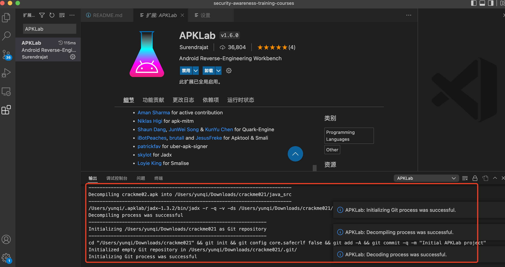
```bash
apktool_2.6.0.jar
uber-apk-signer-1.2.1.jar
jadx-1.3.2.zip
```
- 注意，如果在国内网络环境下自动下载依赖包可能会失败，需要手动下载，并将各安装包的绝对路径依次填入下图中的位置</b>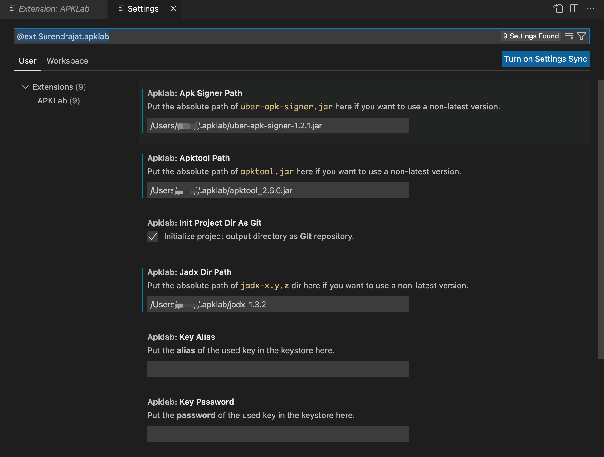
- 使用VScode的命令面板选择`Open an APK`并根据向导界面选择需要进行逆向的文件`crackme02.apk`</b>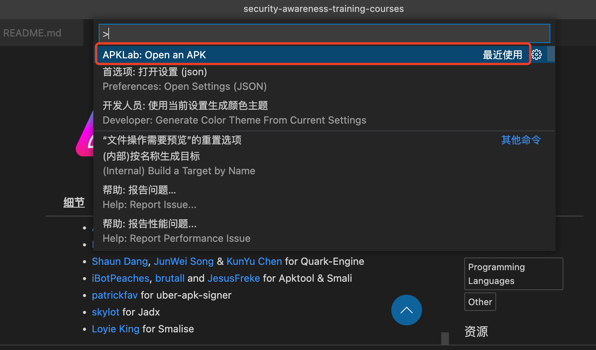
- 勾选下属两个选项以便后续逆向工作的进行</b>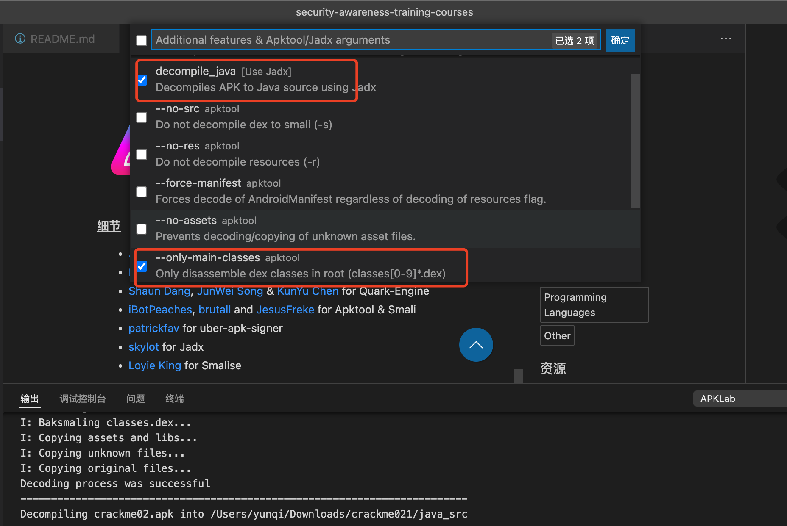

### 二、逆向文件并找到用户名与注册码
- 首先上传apk文件到`Android Studio`的模拟器中,运行应用后随便尝试输入用户名和注册码，提示「无效用户名或注册码」</b>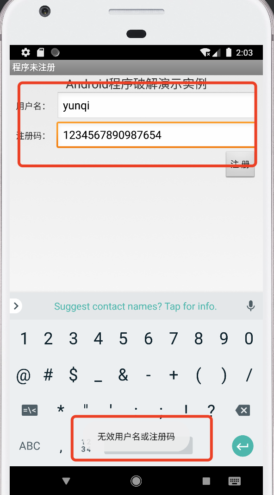
- 使用`APKLab`打开`crackme02.apk`，查看`MainActivity.java`文件，发现关键函数`checkSN`</b>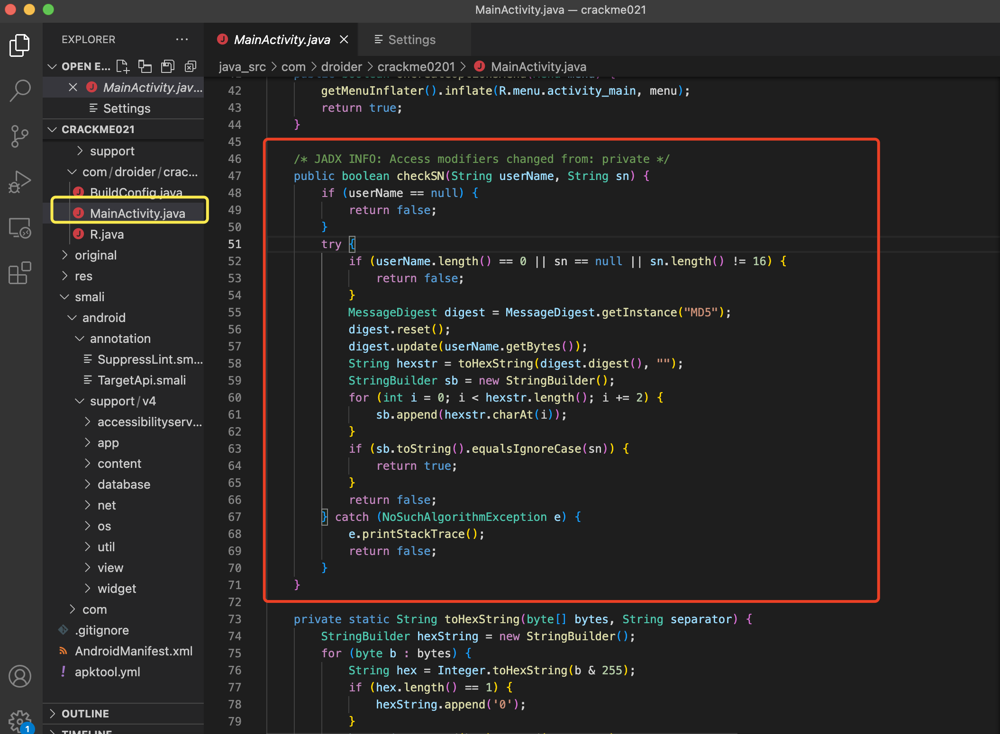

- 分析该函数得到程序对于用户输入的用户名和16位注冊码的处理流程如下：
  - 生成用户输入的用户名的32位MD5值；
  - 依次取MD5值的第i、i+2…(i从0开始取值，小于32)位处的字符，拼接成正确的注冊码
```java

    /* JADX INFO: Access modifiers changed from: private */
    public boolean checkSN(String userName, String sn) {
        if (userName == null) {
            return false;
        }
        try {
            if (userName.length() == 0 || sn == null || sn.length() != 16) {
                return false;
            }
            MessageDigest digest = MessageDigest.getInstance("MD5");
            digest.reset();
            digest.update(userName.getBytes());
            String hexstr = toHexString(digest.digest(), "");
            StringBuilder sb = new StringBuilder();
            for (int i = 0; i < hexstr.length(); i += 2) {
                sb.append(hexstr.charAt(i));
            }
            if (sb.toString().equalsIgnoreCase(sn)) {
                return true;
            }
            return false;
        } catch (NoSuchAlgorithmException e) {
            e.printStackTrace();
            return false;
        }
    }
```

### 三、修改Smali破解
- 以上述尝试注册失败的时候会弹一个「无效用户名或注册码」为突破口，全局搜索这个字符串，发现这个字符串定义在 `string.xml` 中的 `unsuccessd` </b>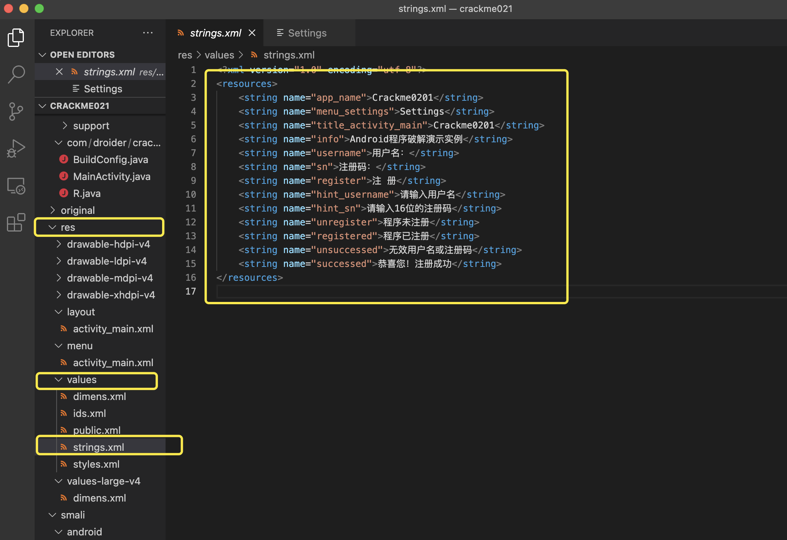
- 再全局搜索 `unsuccessd`,在 `public.xml` 中可以看到它的id为`0x7f05000b`,全局搜索查找其弹出的位置</b>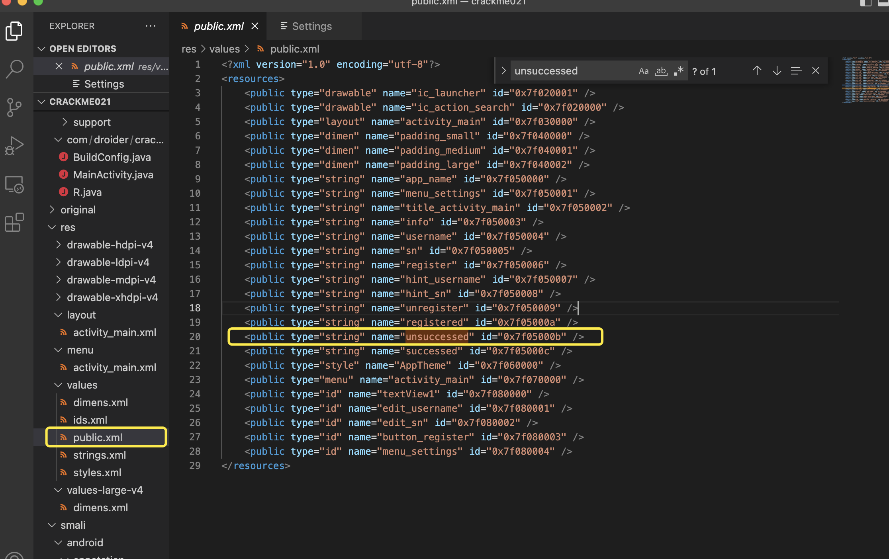
- 发现名为MainActivity$1.smali的文件夹内包含`0x7f05000b`,进入文件并查看详细信息</n>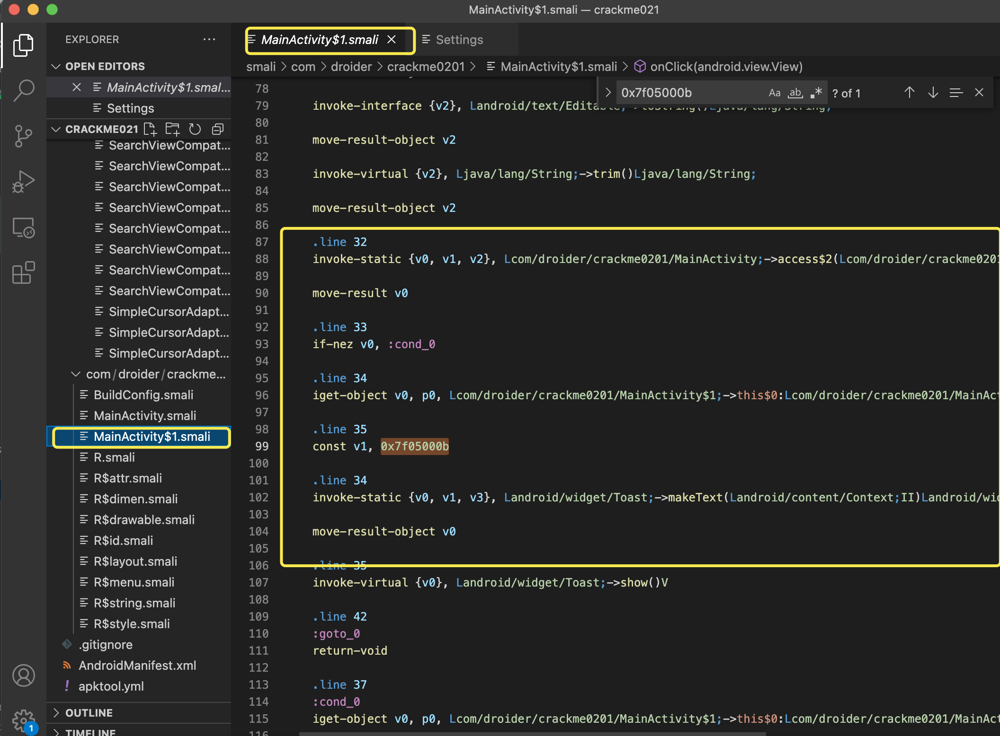
- `line33 if-nez v0, :cond_0`的逻辑：
  - 判断寄存器`v0`的值是否为`0`，
  - 不为 `0` 则弹出 「无效用户名或注册码」

- 逆向逻辑，当 v0 为 0 的时候弹出「无效用户名或注册码」，v0 不为 0 的时候弹出自己的信息
-  将`if-nez` 改为 `if-eqz`</b>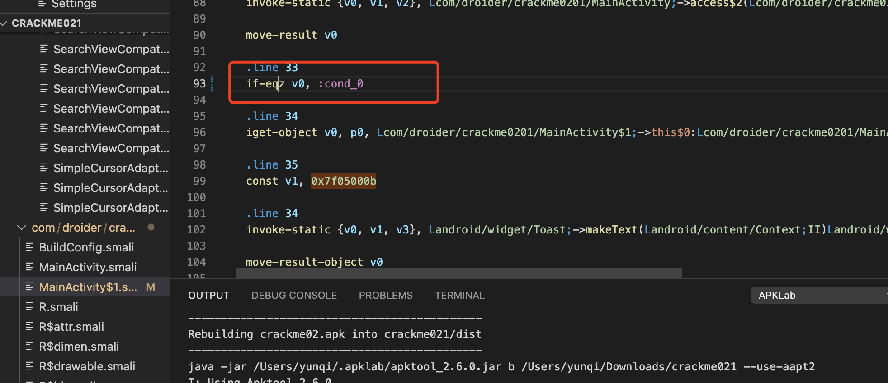
-  将`strings.xml`中的successed字符串改为自己的信息</b>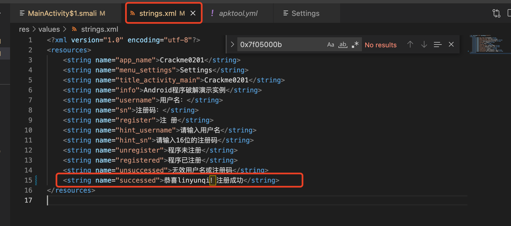
- 右键`apktool.yml`文件，点击`Rebuild the APK`</b>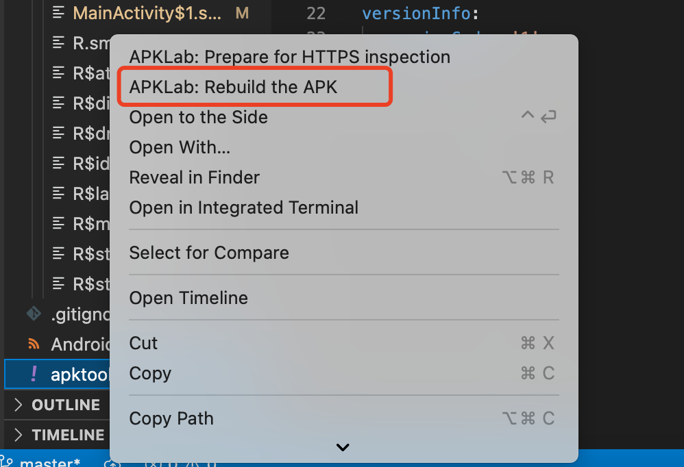
- 重新生成APK成功</b>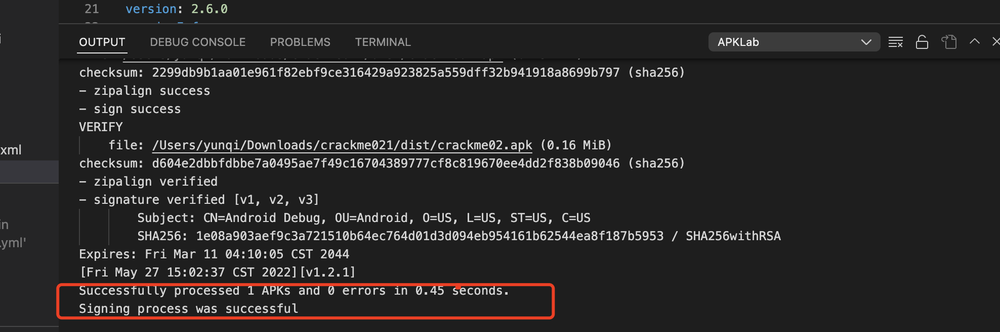
- 在模拟器上运行重新生成后的APK，实现任意输入用户名与注册码弹出带有个人信息弹窗的效果</b>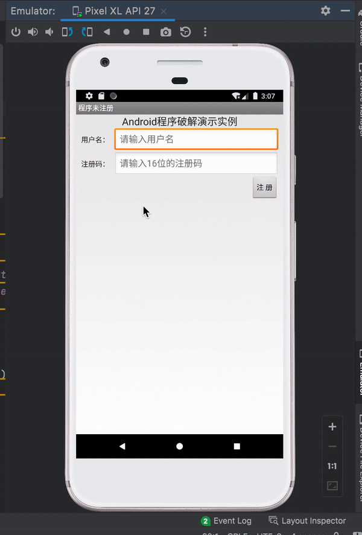


### 四、注入log代码打印注册码破解
- 已通过对`MainActivity.java`的分析找到了注册验证逻辑所在的函数`checkSN`，在`MainActivity.smali`中查找`checkSN`</b>

- 对checkSN进行分析
```java
.method private checkSN(Ljava/lang/String;Ljava/lang/String;)Z
    .locals 10
    .param p1, "userName"    # Ljava/lang/String; 用户名存在寄存器p1中
    .param p2, "sn"    # Ljava/lang/String; 注册码存在寄存器p2中

    .prologue
    const/4 v7, 0x0

    # 如果userName等于0，则跳转至cond_0处
    .line 54
    if-eqz p1, :cond_0  
    
    # 调用 userName.length()，即计算username的长度
    :try_start_0
    invoke-virtual {p1}, Ljava/lang/String;->length()I  

    # 将上述计算结果存入寄存器v8中
    move-result v8

    # 如果v8中的值即username长度不等于 0，则跳转至cond_1处
    if-nez v8, :cond_1

    .line 76
    :cond_0
    :goto_0
    return v7

    # 如果注册码sn等于0，则跳转至cond_0处
    .line 56
    :cond_1
    if-eqz p2, :cond_0

    invoke-virtual {p2}, Ljava/lang/String;->length()I
    
    # 将上述计算结果存入寄存器v8中
    move-result v8

    const/16 v9, 0x10

    # 如果注册码长度不等于16 ，跳转至cond_0处
    if-ne v8, v9, :cond_0

    # 将字符串 "MD5" 存入寄存器v8
    .line 58
    const-string v8, "MD5"

    invoke-static {v8}, Ljava/security/MessageDigest;->getInstance(Ljava/lang/String;)Ljava/security/MessageDigest;

    # 将上一步执行返回结果存入寄存器v1
    move-result-object v1

    .line 59
    .local v1, "digest":Ljava/security/MessageDigest;
    invoke-virtual {v1}, Ljava/security/MessageDigest;->reset()V

    .line 60
    invoke-virtual {p1}, Ljava/lang/String;->getBytes()[B

    # 上一步得到的字节数组存入寄存器v8
    move-result-object v8

    invoke-virtual {v1, v8}, Ljava/security/MessageDigest;->update([B)V

    .line 61
    invoke-virtual {v1}, Ljava/security/MessageDigest;->digest()[B

    # 上一步的执行结果存入寄存器v0
    move-result-object v0

    # 将字符串 "" 存入寄存器v8
    .line 62
    .local v0, "bytes":[B
    const-string v8, ""

    invoke-static {v0, v8}, Lcom/droider/crackme0201/MainActivity;->toHexString([BLjava/lang/String;)Ljava/lang/String;

    # 上一步方法返回的字符串存入寄存器v3
    move-result-object v3

    .line 63
    .local v3, "hexstr":Ljava/lang/String;
    new-instance v5, Ljava/lang/StringBuilder;

    invoke-direct {v5}, Ljava/lang/StringBuilder;-><init>()V

    .line 64
    .local v5, "sb":Ljava/lang/StringBuilder;
    const/4 v4, 0x0

    # 循环，获取字符串的长度
    .local v4, "i":I
    :goto_1
    invoke-virtual {v3}, Ljava/lang/String;->length()I

    move-result v8

    # 如果寄存器v4中的值得小于寄存器v8中的值，则跳转至cond_2处
    if-lt v4, v8, :cond_2

    .line 67
    invoke-virtual {v5}, Ljava/lang/StringBuilder;->toString()Ljava/lang/String;

    move-result-object v6

    .line 70
    .local v6, "userSN":Ljava/lang/String;
    invoke-virtual {v6, p2}, Ljava/lang/String;->equalsIgnoreCase(Ljava/lang/String;)Z

    move-result v8

    # 如果寄存器v8中的值等于0，则跳转至cond_0
    if-eqz v8, :cond_0

    .line 76
    const/4 v7, 0x1

    # 跳转至goto_0，结束 checkSN() 并返回 v7
    goto :goto_0

    .line 65
    .end local v6    # "userSN":Ljava/lang/String;
    :cond_2
    invoke-virtual {v3, v4}, Ljava/lang/String;->charAt(I)C

    move-result v8

    invoke-virtual {v5, v8}, Ljava/lang/StringBuilder;->append(C)Ljava/lang/StringBuilder;
    :try_end_0
    .catch Ljava/security/NoSuchAlgorithmException; {:try_start_0 .. :try_end_0} :catch_0

    .line 64
    add-int/lit8 v4, v4, 0x2

    goto :goto_1

    .line 72
    .end local v0    # "bytes":[B
    .end local v1    # "digest":Ljava/security/MessageDigest;
    .end local v3    # "hexstr":Ljava/lang/String;
    .end local v4    # "i":I
    .end local v5    # "sb":Ljava/lang/StringBuilder;
    :catch_0
    move-exception v2

    .line 73
    .local v2, "e":Ljava/security/NoSuchAlgorithmException;
    invoke-virtual {v2}, Ljava/security/NoSuchAlgorithmException;->printStackTrace()V

    goto :goto_0
.end method
```
- 上述方法对用户输入的用户名进行MD5运算的结果转成十六进制字符串，形成注册码

#### 通过打印 log 日志来获取注册码
- 在smail中打印 log 日志的命令如下（vX代表寄存器）
```smail
const-string vX, "TAG"
invoke-static {vX,vX}, Landroid/util/Log;->e(Ljava/lang/String;Ljava/lang/String;)I
```
- 如图，在对注册码的检验操作之前添加打印log日志的命令</b>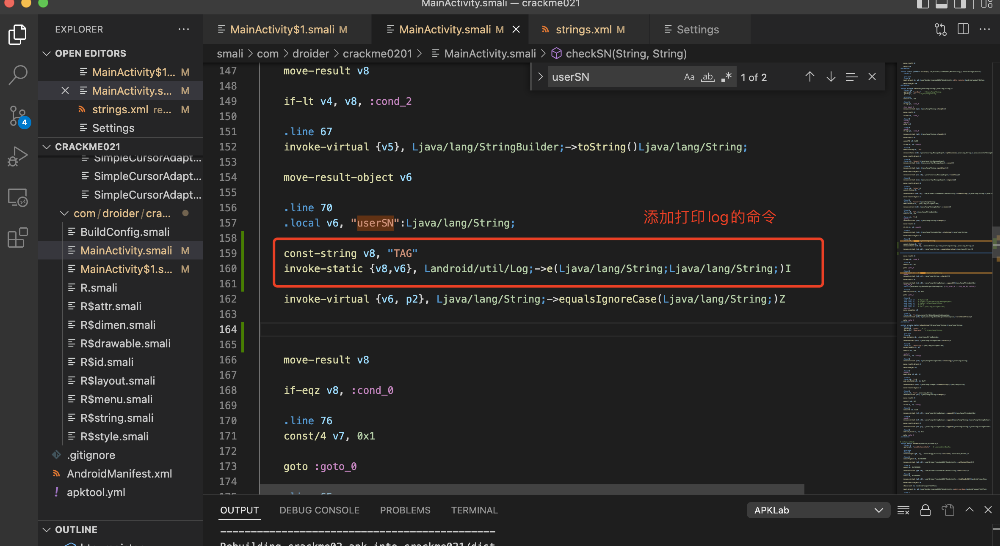
- 同样重新编译得到APK并拖入模拟器中，输入用户名及任意16位的注册码，点击注册后出现如下日志，日志中包含正确的注册码</b>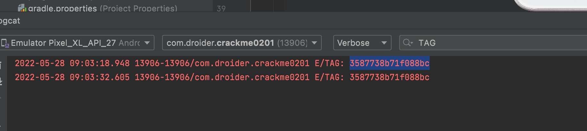
- 完整演示如下</b>
## 参考资料
- [简单apk逆向](https://icode.best/i/63188847123876)
- [APKLab](https://github.com/APKLab/APKLab)
- [Android 逆向代码调试及smali文件结构](https://blog.csdn.net/qq_32365567/article/details/105545453)